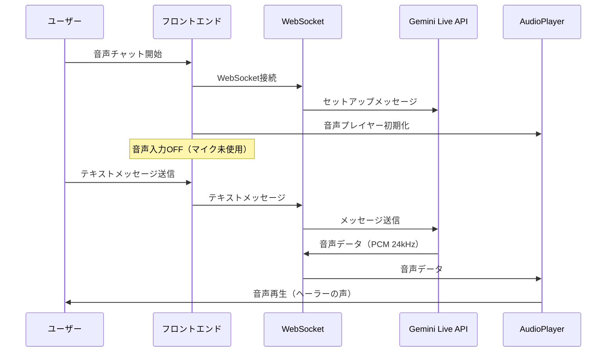
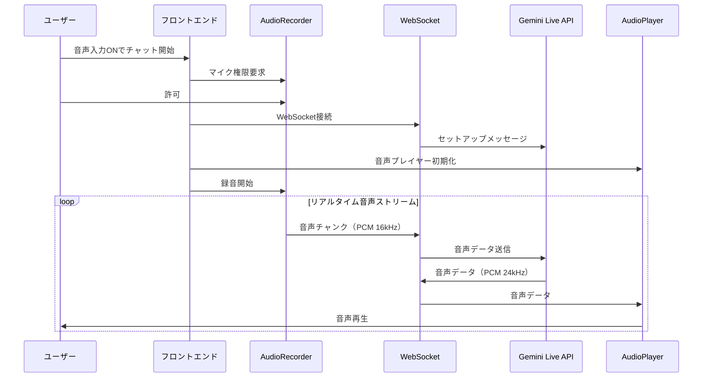

# 音声入力/出力の設計仕様

**作成日**: 2025-11-10
**重要な設計変更**: 音声入力はデフォルトOFF、音声出力はデフォルトON

---

## 🎯 基本方針

### デフォルト設定
- **音声出力**: 常にON（ヘーラーの音声応答を常に聞ける）
- **音声入力**: デフォルトOFF（ユーザーが明示的に有効化）

### 理由
1. **ユーザー体験の向上**
   - 初回アクセス時にマイク権限を要求しない（侵入的でない）
   - まずは音声出力だけで体験してもらう
   - テキスト入力 + 音声出力でスムーズに開始

2. **段階的な機能開放**
   - Step 1: テキスト入力 + 音声出力（デフォルト）
   - Step 2: ユーザーが希望すれば音声入力を有効化
   - Step 3: 音声入力 + 音声出力でフル機能

3. **プライバシー配慮**
   - マイクアクセスはユーザーの明示的な同意が必要
   - まずは安心して使える状態から開始

---

## 📊 ユーザーフロー

### シナリオ1: デフォルト（音声出力のみ）

```
ユーザー: 音声チャット開始をクリック
    ↓
システム: WebSocket接続確立
    ↓
システム: 音声プレイヤー初期化（音声出力準備）
    ↓
ユーザー: テキストでメッセージ入力
    ↓
ヘーラー: 音声で応答（音声出力）
    ↓
ユーザー: ヘーラーの声を聞きながらテキストで対話
```

### シナリオ2: 音声入力を有効化

```
ユーザー: 「音声入力を有効にする」にチェック
    ↓
ユーザー: 音声チャット開始をクリック
    ↓
システム: マイク権限を要求
    ↓
ユーザー: マイクアクセスを許可
    ↓
システム: WebSocket接続 + 音声プレイヤー + マイク録音開始
    ↓
ユーザー: 音声で話しかける
    ↓
ヘーラー: 音声で応答
    ↓
ユーザー: ヘーラーと音声で対話
```

---

## 🔧 実装仕様

### 1. 環境変数

```bash
# backend/.env
GEMINI_LIVE_MODE=enabled
AUDIO_INPUT_ENABLED=false           # 音声入力デフォルトOFF
AUDIO_INPUT_SAMPLE_RATE=16000
AUDIO_OUTPUT_SAMPLE_RATE=24000
AUDIO_CHUNK_SIZE_MS=100
```

### 2. LiveSessionManager（TypeScript）

```typescript
interface LiveSessionStartOptions {
  enableAudioInput?: boolean;  // デフォルト: false
}

class LiveSessionManager {
  async start(options: LiveSessionStartOptions = {}): Promise<void> {
    // 1. Ephemeralトークン取得
    await this.fetchEphemeralToken();

    // 2. WebSocket接続
    await this.connectWebSocket();

    // 3. 音声プレイヤー初期化（常に有効）
    await this.player.init();

    // 4. 録音開始（オプション）
    if (options.enableAudioInput) {
      await this.recorder.start((pcmData) => {
        this.sendAudioChunk(pcmData);
      });
      console.log('[音声入力: 有効]');
    } else {
      console.log('[音声入力: 無効（テキスト入力のみ）]');
    }
  }
}
```

### 3. UI実装（React）

```tsx
function LiveChatInterface() {
  const [audioInputEnabled, setAudioInputEnabled] = useState(false);  // デフォルトOFF

  return (
    <div>
      {/* セッション開始前の設定 */}
      {state === 'IDLE' && (
        <div>
          <label>
            <input
              type="checkbox"
              checked={audioInputEnabled}
              onChange={() => setAudioInputEnabled(!audioInputEnabled)}
            />
            音声入力を有効にする（マイク使用）
          </label>
        </div>
      )}

      {/* 開始ボタン */}
      <button onClick={() => sessionManager.start({ enableAudioInput: audioInputEnabled })}>
        音声チャット開始
      </button>

      {/* 状態表示 */}
      {state === 'STREAMING' && (
        <div>
          <StatusIndicator label="音声入力" enabled={audioInputEnabled} />
          <StatusIndicator label="音声出力" enabled={true} />
        </div>
      )}
    </div>
  );
}
```

---

## 🎨 UI/UXデザイン

### セッション開始前の画面

```
┌─────────────────────────────────────────┐
│         音声チャット                     │
│  状態: IDLE                              │
├─────────────────────────────────────────┤
│                                          │
│        [音声可視化（待機中）]            │
│                                          │
│  ☐ 音声入力を有効にする（マイク使用）   │
│                                          │
│    [音声チャット開始]                    │
│                                          │
└─────────────────────────────────────────┘
```

### セッション中の画面（音声入力OFF）

```
┌─────────────────────────────────────────┐
│         音声チャット                     │
│  状態: STREAMING                         │
├─────────────────────────────────────────┤
│                                          │
│        [音声可視化（再生中）]            │
│                                          │
│  ⚫ 音声入力: OFF   ● 音声出力: ON      │
│                                          │
│    [音声チャット停止]                    │
│                                          │
│  ┌─────────────────────────────────┐   │
│  │ 会話履歴                         │   │
│  │ ユーザー: こんにちは             │   │
│  │ ヘーラー: こんにちは！...        │   │
│  └─────────────────────────────────┘   │
└─────────────────────────────────────────┘
```

### セッション中の画面（音声入力ON）

```
┌─────────────────────────────────────────┐
│         音声チャット                     │
│  状態: STREAMING                         │
├─────────────────────────────────────────┤
│                                          │
│    [音声可視化（録音中/再生中）]        │
│                                          │
│  ● 音声入力: ON   ● 音声出力: ON       │
│                                          │
│    [音声チャット停止]                    │
│                                          │
│  ┌─────────────────────────────────┐   │
│  │ 会話履歴                         │   │
│  │ ユーザー: こんにちは（音声）     │   │
│  │ ヘーラー: こんにちは！...（音声）│   │
│  └─────────────────────────────────┘   │
└─────────────────────────────────────────┘
```

---

## ⚡ 動作フロー

### 音声出力のみ（デフォルト）



### 音声入力+出力



---

## 🎓 ユーザーガイダンス

### 初回アクセス時の説明

```
「AIファミリー・シミュレーターへようこそ！」

ヘーラーとの対話方法を選んでください：

【推奨】テキスト入力 + 音声出力
  - キーボードで入力、ヘーラーの音声を聞く
  - マイクアクセス不要
  - すぐに始められます

【オプション】音声入力 + 音声出力
  - 音声で話しかけられます
  - より自然な対話体験
  - マイクアクセスが必要です
```

### マイク権限要求時の説明

```
「音声入力を有効にしますか？」

音声入力を有効にすると：
✓ ヘーラーと音声で対話できます
✓ より自然な会話体験
✓ ハンズフリーで操作可能

マイクアクセスを許可してください
```

---

## 📊 メトリクス・分析

### 追跡する指標

| 指標 | 説明 | 目標値 |
|------|------|--------|
| **音声入力有効化率** | 音声入力をONにしたユーザーの割合 | 40% |
| **音声入力利用時間** | 音声入力ONでの平均利用時間 | 5分以上 |
| **テキスト入力利用率** | 音声出力のみでの利用率 | 60% |
| **マイク許可率** | マイク権限を許可したユーザーの割合 | 80% |
| **完了率（音声入力ON）** | 音声入力ONでの情報収集完了率 | 85% |
| **完了率（音声入力OFF）** | テキスト入力での情報収集完了率 | 75% |

---

## ✅ チェックリスト

### 実装チェックリスト

- [ ] 環境変数 `AUDIO_INPUT_ENABLED=false` を設定
- [ ] `LiveSessionManager.start()` に `enableAudioInput` オプションを追加
- [ ] UIに音声入力のトグルチェックボックスを追加
- [ ] 音声入力/出力の状態インジケーターを追加
- [ ] マイク権限要求時のガイダンスメッセージを表示
- [ ] 音声入力OFF時の動作テスト
- [ ] 音声入力ON時の動作テスト

### ドキュメント更新チェックリスト

- [x] `GEMINI_LIVE_API_CONTEXT_SUMMARY.md` 更新
- [x] `GEMINI_LIVE_API_INTEGRATION_PLAN.md` 更新
- [x] `QUICK_START_GUIDE.md` 更新
- [x] `AUDIO_INPUT_OUTPUT_DESIGN.md` 作成（このドキュメント）

---

**この設計により、ユーザーは安心して音声チャット機能を体験できます！**
