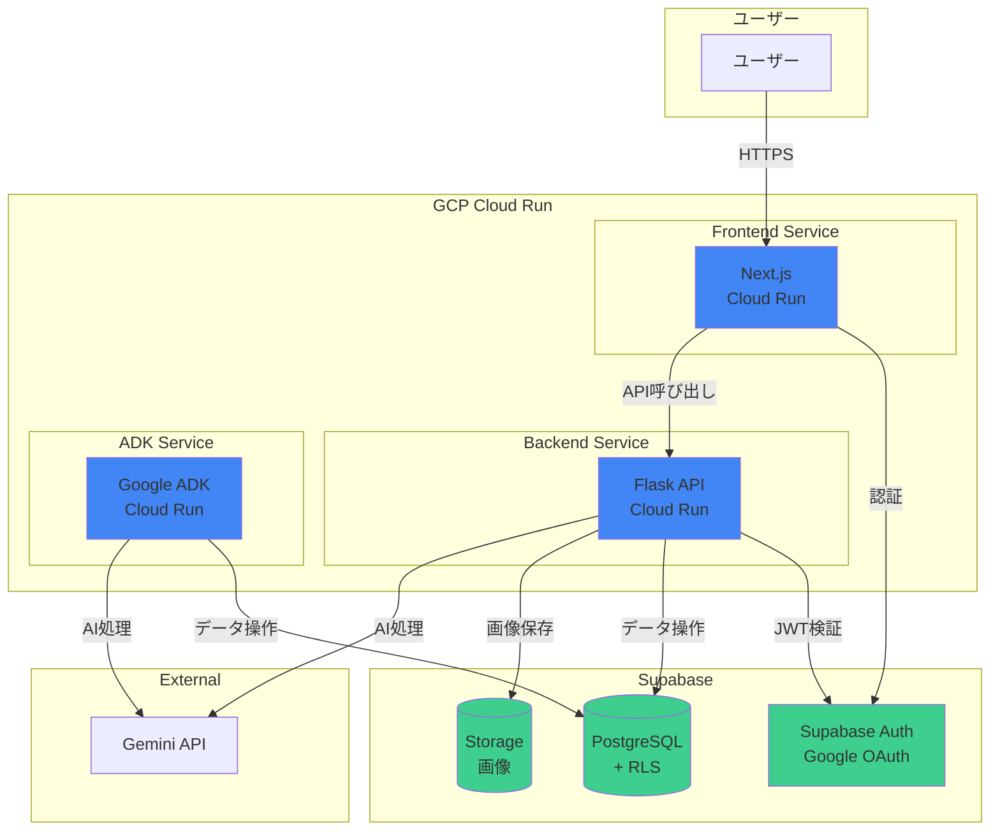

# GCP Cloud Run デプロイ計画

**作成日**: 2025-10-28
**構成**: GCP Cloud Run + Supabase
**目的**: 3サービス（Frontend、Backend、ADK）をCloud Runにデプロイ

---

## 📋 目次

1. [最終アーキテクチャ](#1-最終アーキテクチャ)
2. [コスト詳細](#2-コスト詳細)
3. [実装ロードマップ](#3-実装ロードマップ)
4. [Phase 1: Supabaseセットアップ](#phase-1-supabaseセットアップ)
5. [Phase 2: GCPセットアップ](#phase-2-gcpセットアップ)
6. [Phase 3: コード実装](#phase-3-コード実装)
7. [Phase 4: Cloud Runデプロイ](#phase-4-cloud-runデプロイ)
8. [次のステップ](#次のステップ)

---

## 1. 最終アーキテクチャ



---

## 2. コスト詳細

### 月額コスト

| サービス | 用途 | スペック | 月額 |
|---------|------|---------|------|
| **Cloud Run - Frontend** | Next.js | 1 vCPU, 512MB | $5 |
| **Cloud Run - Backend** | Flask API | 1 vCPU, 512MB | $5 |
| **Cloud Run - ADK** | Google ADK | 1 vCPU, 512MB | $5 |
| **Supabase Pro** | DB + Storage + Auth | 8GB DB, 100GB Storage | $25 |
| **合計** | | | **$40/月** |

### 無料枠（初月）

Cloud Runの無料枠:
- 2百万リクエスト/月
- 360,000 vCPU秒/月
- 180,000 GiB秒/月

**初月の実質コスト**: **$25**（Supabaseのみ）

---

## 3. 実装ロードマップ

### 全体スケジュール（3-4日）

```
Day 1: Supabase + GCPセットアップ（4-6時間）
Day 2: コード実装（6-8時間）
Day 3: Cloud Runデプロイ（4-6時間）
Day 4: テスト・本番化（2-4時間）
```

---

## Phase 1: Supabaseセットアップ

### ステップ1: Supabaseプロジェクト作成（15分）

**やること**:

1. https://supabase.com にアクセス
2. GitHubアカウントでサインアップ
3. 「New Project」をクリック
4. 以下を入力：
   ```
   Name: Hera Production
   Database Password: （強力なパスワードを生成）
   Region: Northeast Asia (Tokyo)
   Pricing Plan: Free → Pro（後でアップグレード）
   ```
5. 「Create new project」をクリック

**取得する情報**:
```bash
NEXT_PUBLIC_SUPABASE_URL=https://xxxxx.supabase.co
NEXT_PUBLIC_SUPABASE_ANON_KEY=eyJhbGc...
SUPABASE_SERVICE_ROLE_KEY=eyJhbGc...
```

---

### ステップ2: データベーススキーマ作成（30分）

Supabase Dashboard → SQL Editor で以下を実行：

```sql
-- 1. sessions テーブル
CREATE TABLE sessions (
    id UUID PRIMARY KEY DEFAULT uuid_generate_v4(),
    session_id TEXT UNIQUE NOT NULL,
    user_id UUID REFERENCES auth.users(id) ON DELETE CASCADE,
    created_at TIMESTAMP WITH TIME ZONE DEFAULT NOW(),
    updated_at TIMESTAMP WITH TIME ZONE DEFAULT NOW(),
    status TEXT DEFAULT 'active',

    INDEX idx_session_id (session_id),
    INDEX idx_user_id (user_id),
    INDEX idx_created_at (created_at)
);

-- 自動更新トリガー
CREATE OR REPLACE FUNCTION update_updated_at_column()
RETURNS TRIGGER AS $$
BEGIN
    NEW.updated_at = NOW();
    RETURN NEW;
END;
$$ LANGUAGE plpgsql;

CREATE TRIGGER update_sessions_updated_at
    BEFORE UPDATE ON sessions
    FOR EACH ROW
    EXECUTE FUNCTION update_updated_at_column();

-- 2. user_profiles テーブル
CREATE TABLE user_profiles (
    id UUID PRIMARY KEY DEFAULT uuid_generate_v4(),
    session_id TEXT NOT NULL REFERENCES sessions(session_id) ON DELETE CASCADE,
    name TEXT,
    age INTEGER,
    partner_name TEXT,
    hobbies JSONB DEFAULT '[]',
    created_at TIMESTAMP WITH TIME ZONE DEFAULT NOW(),
    updated_at TIMESTAMP WITH TIME ZONE DEFAULT NOW(),

    UNIQUE(session_id),
    INDEX idx_session_id (session_id)
);

-- 3. conversation_history テーブル
CREATE TABLE conversation_history (
    id UUID PRIMARY KEY DEFAULT uuid_generate_v4(),
    session_id TEXT NOT NULL REFERENCES sessions(session_id) ON DELETE CASCADE,
    speaker TEXT NOT NULL,
    message TEXT NOT NULL,
    extracted_fields JSONB DEFAULT '{}',
    timestamp TIMESTAMP WITH TIME ZONE DEFAULT NOW(),

    INDEX idx_session_id (session_id),
    INDEX idx_timestamp (timestamp)
);

-- 4. family_conversations テーブル
CREATE TABLE family_conversations (
    id UUID PRIMARY KEY DEFAULT uuid_generate_v4(),
    session_id TEXT NOT NULL REFERENCES sessions(session_id) ON DELETE CASCADE,
    speaker TEXT NOT NULL,
    message TEXT NOT NULL,
    timestamp TIMESTAMP WITH TIME ZONE DEFAULT NOW(),

    INDEX idx_session_id (session_id),
    INDEX idx_timestamp (timestamp)
);

-- 5. family_trip_info テーブル
CREATE TABLE family_trip_info (
    id UUID PRIMARY KEY DEFAULT uuid_generate_v4(),
    session_id TEXT NOT NULL REFERENCES sessions(session_id) ON DELETE CASCADE,
    destination TEXT,
    duration_days INTEGER,
    budget INTEGER,
    activities JSONB DEFAULT '[]',
    preferences JSONB DEFAULT '{}',
    created_at TIMESTAMP WITH TIME ZONE DEFAULT NOW(),
    updated_at TIMESTAMP WITH TIME ZONE DEFAULT NOW(),

    UNIQUE(session_id)
);

-- 6. family_plans テーブル
CREATE TABLE family_plans (
    id UUID PRIMARY KEY DEFAULT uuid_generate_v4(),
    session_id TEXT NOT NULL REFERENCES sessions(session_id) ON DELETE CASCADE,
    story TEXT,
    letters JSONB DEFAULT '{}',
    itinerary JSONB DEFAULT '[]',
    generated_at TIMESTAMP WITH TIME ZONE DEFAULT NOW(),

    UNIQUE(session_id)
);

-- 7. session_images テーブル
CREATE TABLE session_images (
    id UUID PRIMARY KEY DEFAULT uuid_generate_v4(),
    session_id TEXT NOT NULL REFERENCES sessions(session_id) ON DELETE CASCADE,
    image_type TEXT NOT NULL,
    storage_path TEXT NOT NULL,
    public_url TEXT,
    file_size INTEGER,
    mime_type TEXT,
    created_at TIMESTAMP WITH TIME ZONE DEFAULT NOW(),

    INDEX idx_session_id (session_id),
    UNIQUE(session_id, image_type)
);
```

---

### ステップ3: RLS（Row Level Security）設定（15分）

```sql
-- RLSを有効化
ALTER TABLE sessions ENABLE ROW LEVEL SECURITY;
ALTER TABLE user_profiles ENABLE ROW LEVEL SECURITY;
ALTER TABLE conversation_history ENABLE ROW LEVEL SECURITY;
ALTER TABLE family_conversations ENABLE ROW LEVEL SECURITY;
ALTER TABLE family_trip_info ENABLE ROW LEVEL SECURITY;
ALTER TABLE family_plans ENABLE ROW LEVEL SECURITY;
ALTER TABLE session_images ENABLE ROW LEVEL SECURITY;

-- ポリシー: ユーザーは自分のセッションのみアクセス可能
CREATE POLICY "Users can view own sessions"
ON sessions FOR SELECT
USING (auth.uid() = user_id);

CREATE POLICY "Users can insert own sessions"
ON sessions FOR INSERT
WITH CHECK (auth.uid() = user_id);

-- user_profiles ポリシー
CREATE POLICY "Users can view own profiles"
ON user_profiles FOR SELECT
USING (
  auth.uid() = (
    SELECT user_id FROM sessions WHERE session_id = user_profiles.session_id
  )
);

CREATE POLICY "Users can update own profiles"
ON user_profiles FOR UPDATE
USING (
  auth.uid() = (
    SELECT user_id FROM sessions WHERE session_id = user_profiles.session_id
  )
);

-- conversation_history ポリシー
CREATE POLICY "Users can view own conversations"
ON conversation_history FOR SELECT
USING (
  auth.uid() = (
    SELECT user_id FROM sessions WHERE session_id = conversation_history.session_id
  )
);

CREATE POLICY "Users can insert own conversations"
ON conversation_history FOR INSERT
WITH CHECK (
  auth.uid() = (
    SELECT user_id FROM sessions WHERE session_id = conversation_history.session_id
  )
);

-- 同様に他のテーブルにもポリシーを設定...
```

---

### ステップ4: Supabase Storage設定（10分）

1. Supabase Dashboard → Storage
2. 「Create a new bucket」をクリック
3. 以下を入力：
   ```
   Name: session-images
   Public bucket: はい
   ```
4. 「Create bucket」をクリック

**バケットポリシー設定**:
- Storage → session-images → Policies
- 「New Policy」をクリック
- 以下を追加：

```sql
-- Read policy (Public)
CREATE POLICY "Public Access"
ON storage.objects FOR SELECT
USING (bucket_id = 'session-images');

-- Upload policy (Authenticated)
CREATE POLICY "Authenticated users can upload"
ON storage.objects FOR INSERT
WITH CHECK (
  bucket_id = 'session-images'
  AND auth.role() = 'authenticated'
);
```

---

### ステップ5: Google OAuth設定（30分）

#### 5-1. Google Cloud Console設定

1. https://console.cloud.google.com/ にアクセス
2. 新しいプロジェクト作成「Hera」
3. 「APIとサービス」→「認証情報」
4. 「OAuth同意画面」を設定
   - User Type: 外部
   - アプリ名: Hera
   - サポートメール: あなたのメール
   - スコープ: email, profile
5. 「認証情報を作成」→「OAuth 2.0 クライアント ID」
   - アプリケーションの種類: ウェブアプリケーション
   - 承認済みのリダイレクト URI:
     ```
     https://xxxxx.supabase.co/auth/v1/callback
     ```
6. クライアント ID と クライアントシークレット を取得

#### 5-2. Supabase Auth設定

1. Supabase Dashboard → Authentication → Providers
2. Google を有効化
3. 以下を入力：
   ```
   Client ID: （Google Cloud Consoleで取得）
   Client Secret: （Google Cloud Consoleで取得）
   ```
4. 「Save」をクリック

---

## Phase 2: GCPセットアップ

### ステップ1: Google Cloud Project作成（10分）

```bash
# gcloud CLI インストール（既にある場合はスキップ）
# https://cloud.google.com/sdk/docs/install

# ログイン
gcloud auth login

# プロジェクト作成
gcloud projects create hera-production --name="Hera Production"

# プロジェクトを設定
gcloud config set project hera-production

# 必要なAPIを有効化
gcloud services enable \
  run.googleapis.com \
  artifactregistry.googleapis.com \
  cloudbuild.googleapis.com
```

---

### ステップ2: Artifact Registry作成（5分）

```bash
# Docker イメージ用のリポジトリ作成
gcloud artifacts repositories create hera-images \
  --repository-format=docker \
  --location=asia-northeast1 \
  --description="Hera Docker images"

# Docker認証設定
gcloud auth configure-docker asia-northeast1-docker.pkg.dev
```

---

## Phase 3: コード実装

### Backend: Supabase統合

**backend/utils/supabase_manager.py** を作成します（既存のファイルを更新）

実装は次のメッセージで提供します。

---

## Phase 4: Cloud Runデプロイ

### デプロイスクリプト

**deploy.sh** を作成します：

```bash
#!/bin/bash

PROJECT_ID="hera-production"
REGION="asia-northeast1"
REPO="hera-images"

# 1. Frontend デプロイ
echo "Deploying Frontend..."
gcloud run deploy hera-frontend \
  --source ./frontend \
  --region $REGION \
  --allow-unauthenticated \
  --set-env-vars="NEXT_PUBLIC_SUPABASE_URL=$NEXT_PUBLIC_SUPABASE_URL" \
  --set-env-vars="NEXT_PUBLIC_SUPABASE_ANON_KEY=$NEXT_PUBLIC_SUPABASE_ANON_KEY" \
  --memory=512Mi \
  --cpu=1

# 2. Backend デプロイ
echo "Deploying Backend..."
gcloud run deploy hera-backend \
  --source ./backend \
  --region $REGION \
  --allow-unauthenticated \
  --set-env-vars="SUPABASE_URL=$SUPABASE_URL" \
  --set-env-vars="SUPABASE_SERVICE_ROLE_KEY=$SUPABASE_SERVICE_ROLE_KEY" \
  --set-env-vars="GEMINI_API_KEY=$GEMINI_API_KEY" \
  --memory=512Mi \
  --cpu=1

# 3. ADK デプロイ
echo "Deploying ADK..."
gcloud run deploy hera-adk \
  --source ./backend \
  --region $REGION \
  --allow-unauthenticated \
  --set-env-vars="SUPABASE_URL=$SUPABASE_URL" \
  --set-env-vars="SUPABASE_SERVICE_ROLE_KEY=$SUPABASE_SERVICE_ROLE_KEY" \
  --set-env-vars="GEMINI_API_KEY=$GEMINI_API_KEY" \
  --command="python,-m,google.adk,dev,--port,8080,--host,0.0.0.0" \
  --memory=512Mi \
  --cpu=1

echo "Deployment complete!"
```

---

## 次のステップ

### ✅ 今すぐやること

**ステップ1: Supabaseプロジェクト作成**

1. https://supabase.com にアクセス
2. プロジェクト作成
3. API認証情報を取得

---

**準備ができたら「Supabase作成完了」と教えてください。次のステップに進みます！**
