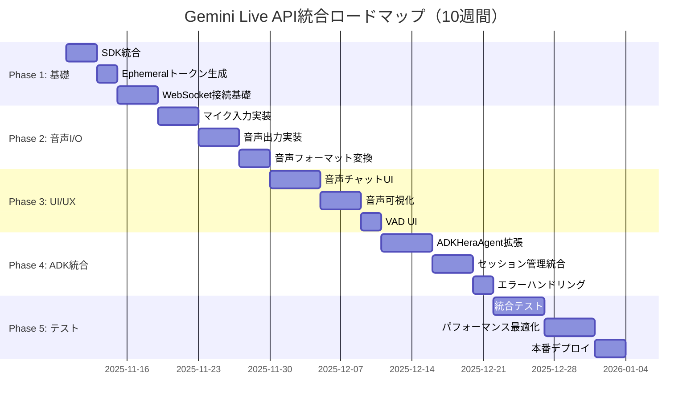

# Gemini Live API統合 - 詳細実装計画

**作成日**: 2025-11-10
**プロジェクト**: AIファミリー・シミュレーター「未来の家族を体験」
**目標**: Gemini Live APIによるリアルタイム音声対話機能の実装

---

## 📋 目次

1. [全体ロードマップ](#全体ロードマップ)
2. [Phase 1: 基礎実装](#phase-1-基礎実装week-1-2)
3. [Phase 2: 音声I/O](#phase-2-音声ioweek-3-4)
4. [Phase 3: UI/UX](#phase-3-uiuxweek-5-6)
5. [Phase 4: ADKエージェント統合](#phase-4-adkエージェント統合week-7-8)
6. [Phase 5: テスト・最適化](#phase-5-テスト最適化week-9-10)
7. [リスク管理](#リスク管理)
8. [成功指標](#成功指標)

---

## 🗓️ 全体ロードマップ



---

## Phase 1: 基礎実装（Week 1-2）

### 🎯 目標
- Gemini Live API SDKの統合
- Ephemeralトークン生成機能の実装
- 基本的なWebSocket接続の確立

### 📝 タスクリスト

#### Task 1.1: 依存関係の追加（Day 1）

**backend/requirements.txt**
```python
# 既存の依存関係は維持

# Gemini Live API関連を追加
websockets==12.0           # WebSocketクライアント
google-genai>=0.8.0        # Gemini Live API SDK（既存だが念のため）
pyaudio==0.2.14            # 音声I/O（開発・テスト用）
pydub==0.25.1              # 音声処理ユーティリティ
numpy==1.26.0              # 音声データ処理
```

**frontend/package.json**
```json
{
  "dependencies": {
    // 既存の依存関係は維持

    // Gemini Live API関連を追加
    "wavesurfer.js": "^7.0.0",  // 音声可視化
    "@types/dom-mediacapture-record": "^1.0.0"  // MediaRecorder型定義
  }
}
```

**インストール**
```bash
# バックエンド
cd backend
pip install -r requirements.txt

# フロントエンド
cd frontend
npm install
```

#### Task 1.2: 環境変数の追加（Day 1）

**backend/.env.example**
```bash
# 既存の環境変数は維持

# ===================================
# Gemini Live API設定
# ===================================
# Live APIモード: enabled (音声有効) | disabled (テキストのみ)
GEMINI_LIVE_MODE=enabled

# Live APIモデル
GEMINI_LIVE_MODEL=gemini-2.0-flash-live-preview-04-09

# Ephemeralトークン設定
EPHEMERAL_TOKEN_EXPIRE_MINUTES=30
EPHEMERAL_TOKEN_NEW_SESSION_EXPIRE_MINUTES=1

# WebSocket設定
WS_TIMEOUT_SECONDS=300
WS_MAX_RECONNECT_ATTEMPTS=3

# 音声設定
AUDIO_INPUT_SAMPLE_RATE=16000
AUDIO_OUTPUT_SAMPLE_RATE=24000
AUDIO_CHUNK_SIZE_MS=100
```

#### Task 1.3: Ephemeralトークン生成API（Day 2-3）

**backend/utils/ephemeral_token_manager.py**（新規作成）
```python
"""
Ephemeralトークン管理モジュール
"""
import os
import datetime
from typing import Dict, Any
import google.genai as genai
from utils.logger import setup_logger

logger = setup_logger(__name__)


class EphemeralTokenManager:
    """Ephemeralトークンの生成と管理"""

    def __init__(self, api_key: str = None):
        """
        Args:
            api_key: Gemini API Key（環境変数から取得）
        """
        self.api_key = api_key or os.getenv("GEMINI_API_KEY")
        if not self.api_key:
            raise ValueError("GEMINI_API_KEY環境変数が設定されていません")

        # Gemini Clientの初期化
        self.client = genai.Client(
            api_key=self.api_key,
            http_options={'api_version': 'v1alpha'}
        )

        # 設定の読み込み
        self.expire_minutes = int(os.getenv("EPHEMERAL_TOKEN_EXPIRE_MINUTES", "30"))
        self.new_session_expire_minutes = int(os.getenv("EPHEMERAL_TOKEN_NEW_SESSION_EXPIRE_MINUTES", "1"))

    def create_token(self, model: str = None, **config) -> Dict[str, Any]:
        """Ephemeralトークンを生成

        Args:
            model: 使用するモデル名（デフォルト: 環境変数から取得）
            **config: 追加設定（temperature, top_pなど）

        Returns:
            Dict containing:
                - token: Ephemeralトークン
                - expire_time: 有効期限
                - model: 使用モデル
        """
        try:
            now = datetime.datetime.now(tz=datetime.timezone.utc)
            model = model or os.getenv("GEMINI_LIVE_MODEL", "gemini-2.0-flash-live-preview-04-09")

            # トークン設定
            token_config = {
                'uses': 1,  # 1回のみ使用可能
                'expire_time': now + datetime.timedelta(minutes=self.expire_minutes),
                'new_session_expire_time': now + datetime.timedelta(minutes=self.new_session_expire_minutes),
                'http_options': {'api_version': 'v1alpha'},
                'model': model,
                **config
            }

            # トークン生成
            token_response = self.client.auth_tokens.create(config=token_config)

            logger.info(f"Ephemeralトークン生成成功: model={model}, expire_minutes={self.expire_minutes}")

            return {
                'token': token_response.token,
                'expire_time': token_config['expire_time'].isoformat(),
                'model': model,
            }

        except Exception as e:
            logger.error(f"Ephemeralトークン生成エラー: {e}")
            raise


# グローバルインスタンス
_ephemeral_token_manager = None


def get_ephemeral_token_manager() -> EphemeralTokenManager:
    """グローバルEphemeralTokenManagerを取得"""
    global _ephemeral_token_manager
    if _ephemeral_token_manager is None:
        _ephemeral_token_manager = EphemeralTokenManager()
    return _ephemeral_token_manager
```

**backend/api/app.py**（エンドポイント追加）
```python
# 既存のimportは維持

from utils.ephemeral_token_manager import get_ephemeral_token_manager

# ... 既存のコード ...

# Ephemeralトークン管理の初期化
try:
    ephemeral_token_mgr = get_ephemeral_token_manager()
    logger.info("Ephemeralトークン管理初期化完了")
except Exception as e:
    logger.warning(f"Ephemeralトークン管理初期化失敗（Live API無効）: {e}")
    ephemeral_token_mgr = None

# ... 既存のコード ...

# Ephemeralトークン生成API
@app.route('/api/sessions/<session_id>/ephemeral-token', methods=['POST'])
@optional_auth
def create_ephemeral_token(session_id):
    """Ephemeralトークンを生成して返す"""
    if not ephemeral_token_mgr:
        return jsonify({'error': 'Gemini Live API機能が無効です'}), 503

    # セッション存在確認
    if not session_exists(session_id):
        logger.warning(f"存在しないセッション: {session_id}")
        return jsonify({'error': 'セッションが存在しません'}), 404

    try:
        # トークン生成
        token_data = ephemeral_token_mgr.create_token()

        logger.info(f"Ephemeralトークン発行: session={session_id}")

        return jsonify({
            'token': token_data['token'],
            'expire_time': token_data['expire_time'],
            'model': token_data['model'],
            'ws_endpoint': 'wss://generativelanguage.googleapis.com/ws/google.ai.generativelanguage.v1beta.GenerativeService.BidiGenerateContent'
        })

    except Exception as e:
        logger.error(f"Ephemeralトークン生成エラー: {session_id} - {e}")
        return jsonify({'error': 'トークン生成に失敗しました'}), 500
```

#### Task 1.4: WebSocket接続テスト（Day 4-5）

**tests/test_live_api_connection.py**（新規作成）
```python
"""
Gemini Live API接続テスト
"""
import asyncio
import os
import json
from typing import AsyncGenerator
import websockets
from utils.ephemeral_token_manager import get_ephemeral_token_manager


async def test_websocket_connection():
    """WebSocket接続の基本テスト"""
    print("[TEST] Gemini Live API接続テスト開始...")

    # Ephemeralトークン生成
    token_mgr = get_ephemeral_token_manager()
    token_data = token_mgr.create_token()
    token = token_data['token']

    print(f"[TEST] Ephemeralトークン取得: {token[:20]}...")

    # WebSocket接続
    ws_url = f"wss://generativelanguage.googleapis.com/ws/google.ai.generativelanguage.v1beta.GenerativeService.BidiGenerateContent?key={token}"

    try:
        async with websockets.connect(ws_url) as websocket:
            print("[TEST] WebSocket接続成功！")

            # セットアップメッセージ送信
            setup_message = {
                "setup": {
                    "model": token_data['model']
                }
            }
            await websocket.send(json.dumps(setup_message))
            print(f"[TEST] セットアップメッセージ送信: {setup_message}")

            # レスポンス受信
            response = await websocket.recv()
            print(f"[TEST] サーバーレスポンス: {response}")

            # テキストメッセージ送信
            text_message = {
                "clientContent": {
                    "turns": [
                        {
                            "role": "user",
                            "parts": [{"text": "こんにちは！"}]
                        }
                    ],
                    "turnComplete": True
                }
            }
            await websocket.send(json.dumps(text_message))
            print(f"[TEST] テキストメッセージ送信: こんにちは！")

            # レスポンス受信
            response = await websocket.recv()
            response_data = json.loads(response)
            print(f"[TEST] AIレスポンス: {response_data}")

            print("[TEST] 接続テスト成功！")

    except Exception as e:
        print(f"[TEST] 接続テストエラー: {e}")
        raise


if __name__ == "__main__":
    asyncio.run(test_websocket_connection())
```

**実行**
```bash
cd backend
python tests/test_live_api_connection.py
```

### ✅ Phase 1 完了チェックリスト

- [ ] 依存関係のインストール完了
- [ ] 環境変数の設定完了
- [ ] EphemeralTokenManager実装完了
- [ ] Ephemeralトークン生成API実装完了
- [ ] WebSocket接続テスト成功

---

## Phase 2: 音声I/O（Week 3-4）

### 🎯 目標
- マイク入力の実装（16kHz PCM）
- 音声出力の実装（24kHz PCM）
- Web Audio APIの統合

### 📝 タスクリスト

#### Task 2.1: 音声ユーティリティ（Day 1-2）

**backend/utils/audio_utils.py**（新規作成）
```python
"""
音声処理ユーティリティ
"""
import base64
import numpy as np
from typing import bytes
from utils.logger import setup_logger

logger = setup_logger(__name__)


def pcm_to_base64(pcm_data: bytes) -> str:
    """PCMバイナリデータをBase64エンコード

    Args:
        pcm_data: Raw PCM bytes (16-bit, little-endian)

    Returns:
        Base64エンコードされた文字列
    """
    return base64.b64encode(pcm_data).decode('utf-8')


def base64_to_pcm(base64_str: str) -> bytes:
    """Base64文字列をPCMバイナリデータにデコード

    Args:
        base64_str: Base64エンコードされた文字列

    Returns:
        Raw PCM bytes (16-bit, little-endian)
    """
    return base64.b64decode(base64_str)


def resample_audio(audio_data: np.ndarray, source_rate: int, target_rate: int) -> np.ndarray:
    """音声データをリサンプリング

    Args:
        audio_data: 音声データ（numpy配列）
        source_rate: 元のサンプルレート
        target_rate: 目標サンプルレート

    Returns:
        リサンプリングされた音声データ
    """
    from scipy import signal

    if source_rate == target_rate:
        return audio_data

    # リサンプリング比率
    ratio = target_rate / source_rate
    num_samples = int(len(audio_data) * ratio)

    # リサンプリング実行
    resampled = signal.resample(audio_data, num_samples)

    return resampled


def convert_float32_to_int16(audio_data: np.ndarray) -> bytes:
    """Float32音声データをInt16 PCMに変換

    Args:
        audio_data: Float32音声データ（-1.0 ~ 1.0）

    Returns:
        Int16 PCM bytes
    """
    # Float32 (-1.0 ~ 1.0) を Int16 (-32768 ~ 32767) に変換
    audio_int16 = (audio_data * 32767).astype(np.int16)

    # バイト列に変換（little-endian）
    return audio_int16.tobytes()


def convert_int16_to_float32(pcm_bytes: bytes) -> np.ndarray:
    """Int16 PCMをFloat32音声データに変換

    Args:
        pcm_bytes: Int16 PCM bytes

    Returns:
        Float32音声データ（-1.0 ~ 1.0）
    """
    # バイト列をInt16配列に変換
    audio_int16 = np.frombuffer(pcm_bytes, dtype=np.int16)

    # Int16 (-32768 ~ 32767) を Float32 (-1.0 ~ 1.0) に変換
    audio_float32 = audio_int16.astype(np.float32) / 32767.0

    return audio_float32
```

#### Task 2.2: フロントエンド音声入力（Day 3-5）

**frontend/lib/audio/AudioRecorder.ts**（新規作成）
```typescript
/**
 * 音声録音マネージャー
 * マイク入力を16kHz PCMに変換してストリーミング
 */

export interface AudioRecorderConfig {
  sampleRate?: number;  // デフォルト: 16000
  channelCount?: number;  // デフォルト: 1 (mono)
  chunkDurationMs?: number;  // デフォルト: 100ms
}

export class AudioRecorder {
  private audioContext: AudioContext | null = null;
  private mediaStream: MediaStream | null = null;
  private scriptProcessor: ScriptProcessorNode | null = null;
  private isRecording = false;
  private config: Required<AudioRecorderConfig>;

  constructor(config: AudioRecorderConfig = {}) {
    this.config = {
      sampleRate: config.sampleRate ?? 16000,
      channelCount: config.channelCount ?? 1,
      chunkDurationMs: config.chunkDurationMs ?? 100,
    };
  }

  /**
   * 録音開始
   */
  async start(onAudioData: (pcmData: Int16Array) => void): Promise<void> {
    try {
      // マイクアクセス許可
      this.mediaStream = await navigator.mediaDevices.getUserMedia({
        audio: {
          channelCount: this.config.channelCount,
          sampleRate: this.config.sampleRate,
          echoCancellation: true,
          noiseSuppression: true,
          autoGainControl: true,
        },
      });

      // AudioContext作成（16kHz）
      this.audioContext = new AudioContext({
        sampleRate: this.config.sampleRate,
      });

      const source = this.audioContext.createMediaStreamSource(this.mediaStream);

      // ScriptProcessorNodeでリアルタイム音声処理
      const bufferSize = Math.floor(
        (this.config.sampleRate * this.config.chunkDurationMs) / 1000
      );
      this.scriptProcessor = this.audioContext.createScriptProcessor(bufferSize, 1, 1);

      this.scriptProcessor.onaudioprocess = (event) => {
        if (!this.isRecording) return;

        const inputBuffer = event.inputBuffer;
        const audioData = inputBuffer.getChannelData(0);  // Float32Array

        // Float32 (-1.0 ~ 1.0) を Int16 (-32768 ~ 32767) に変換
        const pcmData = this.convertFloat32ToInt16(audioData);

        onAudioData(pcmData);
      };

      source.connect(this.scriptProcessor);
      this.scriptProcessor.connect(this.audioContext.destination);

      this.isRecording = true;

      console.log('[AudioRecorder] 録音開始', {
        sampleRate: this.config.sampleRate,
        channelCount: this.config.channelCount,
        chunkDurationMs: this.config.chunkDurationMs,
      });
    } catch (error) {
      console.error('[AudioRecorder] 録音開始エラー:', error);
      throw error;
    }
  }

  /**
   * 録音停止
   */
  stop(): void {
    this.isRecording = false;

    if (this.scriptProcessor) {
      this.scriptProcessor.disconnect();
      this.scriptProcessor = null;
    }

    if (this.mediaStream) {
      this.mediaStream.getTracks().forEach((track) => track.stop());
      this.mediaStream = null;
    }

    if (this.audioContext) {
      this.audioContext.close();
      this.audioContext = null;
    }

    console.log('[AudioRecorder] 録音停止');
  }

  /**
   * Float32ArrayをInt16Arrayに変換
   */
  private convertFloat32ToInt16(float32Data: Float32Array): Int16Array {
    const int16Data = new Int16Array(float32Data.length);

    for (let i = 0; i < float32Data.length; i++) {
      // Float32 (-1.0 ~ 1.0) を Int16 (-32768 ~ 32767) にマッピング
      const val = Math.max(-1, Math.min(1, float32Data[i]));  // クリッピング
      int16Data[i] = val < 0 ? val * 32768 : val * 32767;
    }

    return int16Data;
  }
}
```

#### Task 2.3: フロントエンド音声出力（Day 6-8）

**frontend/lib/audio/AudioPlayer.ts**（新規作成）
```typescript
/**
 * 音声再生マネージャー
 * 24kHz PCMをデコードして再生
 */

export interface AudioPlayerConfig {
  sampleRate?: number;  // デフォルト: 24000
  channelCount?: number;  // デフォルト: 1 (mono)
}

export class AudioPlayer {
  private audioContext: AudioContext | null = null;
  private config: Required<AudioPlayerConfig>;
  private audioQueue: AudioBufferSourceNode[] = [];
  private nextStartTime = 0;

  constructor(config: AudioPlayerConfig = {}) {
    this.config = {
      sampleRate: config.sampleRate ?? 24000,
      channelCount: config.channelCount ?? 1,
    };
  }

  /**
   * 初期化
   */
  async init(): Promise<void> {
    if (!this.audioContext) {
      this.audioContext = new AudioContext({
        sampleRate: this.config.sampleRate,
      });

      console.log('[AudioPlayer] 初期化完了', {
        sampleRate: this.config.sampleRate,
        channelCount: this.config.channelCount,
      });
    }
  }

  /**
   * PCMデータを再生
   */
  async play(pcmData: Int16Array): Promise<void> {
    if (!this.audioContext) {
      await this.init();
    }

    try {
      // Int16ArrayをFloat32Arrayに変換
      const float32Data = this.convertInt16ToFloat32(pcmData);

      // AudioBufferを作成
      const audioBuffer = this.audioContext!.createBuffer(
        this.config.channelCount,
        float32Data.length,
        this.config.sampleRate
      );

      // データをコピー
      audioBuffer.copyToChannel(float32Data, 0);

      // AudioBufferSourceNodeを作成
      const source = this.audioContext!.createBufferSource();
      source.buffer = audioBuffer;
      source.connect(this.audioContext!.destination);

      // 次の開始時刻を計算（シームレスな再生）
      const currentTime = this.audioContext!.currentTime;
      const startTime = Math.max(currentTime, this.nextStartTime);
      source.start(startTime);

      // 次の開始時刻を更新
      this.nextStartTime = startTime + audioBuffer.duration;

      // キューに追加
      this.audioQueue.push(source);

      // 再生終了後にキューから削除
      source.onended = () => {
        const index = this.audioQueue.indexOf(source);
        if (index > -1) {
          this.audioQueue.splice(index, 1);
        }
      };

      console.log('[AudioPlayer] 音声再生', {
        dataLength: pcmData.length,
        duration: audioBuffer.duration,
        startTime,
      });
    } catch (error) {
      console.error('[AudioPlayer] 再生エラー:', error);
      throw error;
    }
  }

  /**
   * 再生停止
   */
  stop(): void {
    // 全てのソースを停止
    this.audioQueue.forEach((source) => {
      try {
        source.stop();
      } catch (e) {
        // Already stopped
      }
    });

    this.audioQueue = [];
    this.nextStartTime = 0;

    console.log('[AudioPlayer] 再生停止');
  }

  /**
   * クリーンアップ
   */
  dispose(): void {
    this.stop();

    if (this.audioContext) {
      this.audioContext.close();
      this.audioContext = null;
    }

    console.log('[AudioPlayer] クリーンアップ完了');
  }

  /**
   * Int16ArrayをFloat32Arrayに変換
   */
  private convertInt16ToFloat32(int16Data: Int16Array): Float32Array {
    const float32Data = new Float32Array(int16Data.length);

    for (let i = 0; i < int16Data.length; i++) {
      // Int16 (-32768 ~ 32767) を Float32 (-1.0 ~ 1.0) にマッピング
      float32Data[i] = int16Data[i] / (int16Data[i] < 0 ? 32768 : 32767);
    }

    return float32Data;
  }
}
```

### ✅ Phase 2 完了チェックリスト

- [ ] 音声ユーティリティ実装完了
- [ ] AudioRecorder実装完了
- [ ] AudioPlayer実装完了
- [ ] マイク入力テスト成功
- [ ] 音声出力テスト成功

---

## Phase 3: UI/UX（Week 5-6）

### 🎯 目標
- 音声チャットインターフェースの実装
- 音声可視化（波形表示）
- VAD UI（話している/聞いているの表示）

### 📝 タスクリスト

#### Task 3.1: LiveSessionManager（Day 1-3）

**frontend/lib/live/LiveSessionManager.ts**（新規作成）
```typescript
/**
 * Gemini Live APIセッション管理
 * WebSocket接続、音声送受信、状態管理を統合
 */

import { AudioRecorder } from '../audio/AudioRecorder';
import { AudioPlayer } from '../audio/AudioPlayer';

export enum LiveSessionState {
  IDLE = 'idle',
  CONNECTING = 'connecting',
  CONNECTED = 'connected',
  STREAMING = 'streaming',
  ERROR = 'error',
  CLOSED = 'closed',
}

export interface LiveSessionConfig {
  sessionId: string;
  apiBaseUrl: string;  // バックエンドAPIのURL
}

export interface LiveSessionEvents {
  onStateChange?: (state: LiveSessionState) => void;
  onTranscript?: (text: string, isFinal: boolean) => void;
  onAudioData?: (audioData: Int16Array) => void;
  onError?: (error: Error) => void;
}

export class LiveSessionManager {
  private config: LiveSessionConfig;
  private events: LiveSessionEvents;
  private state: LiveSessionState = LiveSessionState.IDLE;
  private ws: WebSocket | null = null;
  private recorder: AudioRecorder;
  private player: AudioPlayer;
  private ephemeralToken: string | null = null;

  constructor(config: LiveSessionConfig, events: LiveSessionEvents = {}) {
    this.config = config;
    this.events = events;
    this.recorder = new AudioRecorder({ sampleRate: 16000, chunkDurationMs: 100 });
    this.player = new AudioPlayer({ sampleRate: 24000 });
  }

  /**
   * セッション開始
   */
  async start(): Promise<void> {
    try {
      this.setState(LiveSessionState.CONNECTING);

      // 1. Ephemeralトークンを取得
      await this.fetchEphemeralToken();

      // 2. WebSocket接続
      await this.connectWebSocket();

      // 3. 音声プレイヤー初期化
      await this.player.init();

      // 4. 録音開始
      await this.recorder.start((pcmData) => {
        this.sendAudioChunk(pcmData);
      });

      this.setState(LiveSessionState.STREAMING);

      console.log('[LiveSessionManager] セッション開始成功');
    } catch (error) {
      console.error('[LiveSessionManager] セッション開始エラー:', error);
      this.setState(LiveSessionState.ERROR);
      this.events.onError?.(error as Error);
      throw error;
    }
  }

  /**
   * セッション停止
   */
  stop(): void {
    // 録音停止
    this.recorder.stop();

    // 音声プレイヤー停止
    this.player.stop();

    // WebSocket切断
    if (this.ws) {
      this.ws.close();
      this.ws = null;
    }

    this.setState(LiveSessionState.CLOSED);

    console.log('[LiveSessionManager] セッション停止');
  }

  /**
   * Ephemeralトークンを取得
   */
  private async fetchEphemeralToken(): Promise<void> {
    const response = await fetch(
      `${this.config.apiBaseUrl}/api/sessions/${this.config.sessionId}/ephemeral-token`,
      {
        method: 'POST',
        headers: { 'Content-Type': 'application/json' },
        credentials: 'include',  // Cookie送信
      }
    );

    if (!response.ok) {
      throw new Error(`Ephemeralトークン取得失敗: ${response.statusText}`);
    }

    const data = await response.json();
    this.ephemeralToken = data.token;

    console.log('[LiveSessionManager] Ephemeralトークン取得成功');
  }

  /**
   * WebSocket接続
   */
  private async connectWebSocket(): Promise<void> {
    return new Promise((resolve, reject) => {
      if (!this.ephemeralToken) {
        reject(new Error('Ephemeralトークンが未取得です'));
        return;
      }

      const wsUrl = `wss://generativelanguage.googleapis.com/ws/google.ai.generativelanguage.v1beta.GenerativeService.BidiGenerateContent?key=${this.ephemeralToken}`;

      this.ws = new WebSocket(wsUrl);

      this.ws.onopen = () => {
        console.log('[LiveSessionManager] WebSocket接続成功');

        // セットアップメッセージ送信
        this.sendSetupMessage();

        this.setState(LiveSessionState.CONNECTED);
        resolve();
      };

      this.ws.onmessage = (event) => {
        this.handleWebSocketMessage(event.data);
      };

      this.ws.onerror = (error) => {
        console.error('[LiveSessionManager] WebSocketエラー:', error);
        this.events.onError?.(new Error('WebSocket接続エラー'));
        reject(error);
      };

      this.ws.onclose = () => {
        console.log('[LiveSessionManager] WebSocket切断');
        this.setState(LiveSessionState.CLOSED);
      };
    });
  }

  /**
   * セットアップメッセージ送信
   */
  private sendSetupMessage(): void {
    if (!this.ws) return;

    const setupMessage = {
      setup: {
        model: 'models/gemini-2.0-flash-exp',
      },
    };

    this.ws.send(JSON.stringify(setupMessage));

    console.log('[LiveSessionManager] セットアップメッセージ送信');
  }

  /**
   * 音声チャンク送信
   */
  private sendAudioChunk(pcmData: Int16Array): void {
    if (!this.ws || this.ws.readyState !== WebSocket.OPEN) return;

    // Int16ArrayをBase64に変換
    const base64Audio = this.int16ArrayToBase64(pcmData);

    const audioMessage = {
      realtimeInput: {
        mediaChunks: [
          {
            mimeType: 'audio/pcm;rate=16000',
            data: base64Audio,
          },
        ],
      },
    };

    this.ws.send(JSON.stringify(audioMessage));
  }

  /**
   * WebSocketメッセージ処理
   */
  private handleWebSocketMessage(data: string): void {
    try {
      const message = JSON.parse(data);

      // テキストレスポンス
      if (message.serverContent?.modelTurn?.parts) {
        for (const part of message.serverContent.modelTurn.parts) {
          if (part.text) {
            this.events.onTranscript?.(part.text, true);
          }

          // 音声データ
          if (part.inlineData?.mimeType?.startsWith('audio/pcm')) {
            const base64Audio = part.inlineData.data;
            const pcmData = this.base64ToInt16Array(base64Audio);
            this.player.play(pcmData);
            this.events.onAudioData?.(pcmData);
          }
        }
      }

      // ツール呼び出し
      if (message.toolCall) {
        console.log('[LiveSessionManager] ツール呼び出し:', message.toolCall);
        // ここでツール実行処理を追加
      }
    } catch (error) {
      console.error('[LiveSessionManager] メッセージ処理エラー:', error);
    }
  }

  /**
   * 状態変更
   */
  private setState(newState: LiveSessionState): void {
    this.state = newState;
    this.events.onStateChange?.(newState);
  }

  /**
   * Int16ArrayをBase64に変換
   */
  private int16ArrayToBase64(int16Data: Int16Array): string {
    const uint8Array = new Uint8Array(int16Data.buffer);
    let binary = '';
    for (let i = 0; i < uint8Array.length; i++) {
      binary += String.fromCharCode(uint8Array[i]);
    }
    return btoa(binary);
  }

  /**
   * Base64をInt16Arrayに変換
   */
  private base64ToInt16Array(base64: string): Int16Array {
    const binary = atob(base64);
    const uint8Array = new Uint8Array(binary.length);
    for (let i = 0; i < binary.length; i++) {
      uint8Array[i] = binary.charCodeAt(i);
    }
    return new Int16Array(uint8Array.buffer);
  }

  /**
   * 現在の状態を取得
   */
  getState(): LiveSessionState {
    return this.state;
  }
}
```

#### Task 3.2: 音声チャットUI（Day 4-5）

**frontend/src/components/live/LiveChatInterface.tsx**（新規作成）
```typescript
'use client';

import { useState, useEffect } from 'react';
import { LiveSessionManager, LiveSessionState } from '@/lib/live/LiveSessionManager';
import { AudioVisualizer } from './AudioVisualizer';

interface LiveChatInterfaceProps {
  sessionId: string;
  apiBaseUrl: string;
}

export function LiveChatInterface({ sessionId, apiBaseUrl }: LiveChatInterfaceProps) {
  const [sessionManager, setSessionManager] = useState<LiveSessionManager | null>(null);
  const [state, setState] = useState<LiveSessionState>(LiveSessionState.IDLE);
  const [transcript, setTranscript] = useState<string>('');
  const [isListening, setIsListening] = useState(false);

  useEffect(() => {
    // LiveSessionManager初期化
    const manager = new LiveSessionManager(
      { sessionId, apiBaseUrl },
      {
        onStateChange: (newState) => {
          setState(newState);
          setIsListening(newState === LiveSessionState.STREAMING);
        },
        onTranscript: (text, isFinal) => {
          if (isFinal) {
            setTranscript((prev) => prev + '\n' + text);
          }
        },
        onError: (error) => {
          console.error('Live Session Error:', error);
          alert(`エラーが発生しました: ${error.message}`);
        },
      }
    );

    setSessionManager(manager);

    return () => {
      manager.stop();
    };
  }, [sessionId, apiBaseUrl]);

  const handleStartSession = async () => {
    if (!sessionManager) return;

    try {
      await sessionManager.start();
    } catch (error) {
      console.error('セッション開始エラー:', error);
    }
  };

  const handleStopSession = () => {
    if (!sessionManager) return;
    sessionManager.stop();
  };

  return (
    <div className="flex flex-col h-screen bg-gray-50">
      {/* ヘッダー */}
      <header className="bg-white shadow-sm p-4">
        <h1 className="text-xl font-bold text-gray-800">音声チャット</h1>
        <p className="text-sm text-gray-600">
          状態: <span className="font-semibold">{state}</span>
        </p>
      </header>

      {/* メインコンテンツ */}
      <main className="flex-1 flex flex-col items-center justify-center p-6">
        {/* 音声可視化 */}
        <div className="mb-8">
          <AudioVisualizer isActive={isListening} />
        </div>

        {/* コントロールボタン */}
        <div className="flex gap-4">
          {state === LiveSessionState.IDLE || state === LiveSessionState.CLOSED ? (
            <button
              onClick={handleStartSession}
              className="px-6 py-3 bg-blue-600 text-white font-semibold rounded-lg shadow-md hover:bg-blue-700 transition"
            >
              音声チャット開始
            </button>
          ) : (
            <button
              onClick={handleStopSession}
              className="px-6 py-3 bg-red-600 text-white font-semibold rounded-lg shadow-md hover:bg-red-700 transition"
            >
              音声チャット停止
            </button>
          )}
        </div>

        {/* トランスクリプト表示 */}
        {transcript && (
          <div className="mt-8 w-full max-w-2xl bg-white rounded-lg shadow-md p-4">
            <h2 className="text-lg font-semibold text-gray-800 mb-2">会話履歴</h2>
            <div className="whitespace-pre-wrap text-gray-700">{transcript}</div>
          </div>
        )}
      </main>
    </div>
  );
}
```

### ✅ Phase 3 完了チェックリスト

- [ ] LiveSessionManager実装完了
- [ ] LiveChatInterface実装完了
- [ ] AudioVisualizer実装完了
- [ ] UIテスト完了

---

## Phase 4: ADKエージェント統合（Week 7-8）

### 🎯 目標
- ADKHeraAgentの音声対応
- セッション管理統合
- エラーハンドリング

### 📝 タスクリスト

#### Task 4.1: ADKHeraAgent拡張（Day 1-5）

**backend/agents/hera/adk_hera_agent.py**（既存ファイルを拡張）
```python
# 既存のimportは維持

import websockets
import json
import asyncio
from typing import AsyncGenerator

class ADKHeraAgent:
    # 既存の初期化コードは維持

    def __init__(self, gemini_api_key: str = None, **kwargs):
        # 既存の初期化
        # ...

        # Live API関連の新規フィールド
        self.live_mode = os.getenv("GEMINI_LIVE_MODE", "disabled").lower() == "enabled"
        self.live_model = os.getenv("GEMINI_LIVE_MODEL", "gemini-2.0-flash-live-preview-04-09")
        self.ws_connection: Optional[websockets.WebSocketClientProtocol] = None
        self.ws_task: Optional[asyncio.Task] = None

        if self.live_mode:
            logger.info("Gemini Live API有効化")

    async def start_live_session(self, session_id: str, ephemeral_token: str) -> None:
        """Gemini Live APIセッション開始

        Args:
            session_id: セッションID
            ephemeral_token: Ephemeralトークン
        """
        if not self.live_mode:
            raise ValueError("Gemini Live API機能が無効です")

        self.current_session = session_id
        logger.info(f"Live APIセッション開始: {session_id}")

        # WebSocket接続
        ws_url = f"wss://generativelanguage.googleapis.com/ws/google.ai.generativelanguage.v1beta.GenerativeService.BidiGenerateContent?key={ephemeral_token}"

        try:
            self.ws_connection = await websockets.connect(ws_url)
            logger.info("WebSocket接続成功")

            # セットアップメッセージ送信
            setup_message = {
                "setup": {
                    "model": f"models/{self.live_model}"
                }
            }
            await self.ws_connection.send(json.dumps(setup_message))

            # セットアップ応答受信
            setup_response = await self.ws_connection.recv()
            logger.info(f"セットアップ応答: {setup_response}")

            # 受信タスク開始
            self.ws_task = asyncio.create_task(self._receive_audio_loop())

        except Exception as e:
            logger.error(f"Live APIセッション開始エラー: {e}")
            raise

    async def send_audio_chunk(self, audio_data: bytes, mime_type: str = "audio/pcm;rate=16000") -> None:
        """音声チャンクを送信

        Args:
            audio_data: PCM音声データ（Base64エンコード済み）
            mime_type: MIME type
        """
        if not self.ws_connection:
            raise ValueError("WebSocket未接続")

        audio_message = {
            "realtimeInput": {
                "mediaChunks": [
                    {
                        "mimeType": mime_type,
                        "data": audio_data.decode('utf-8') if isinstance(audio_data, bytes) else audio_data
                    }
                ]
            }
        }

        await self.ws_connection.send(json.dumps(audio_message))

    async def _receive_audio_loop(self) -> None:
        """音声データ受信ループ"""
        try:
            while self.ws_connection:
                response = await self.ws_connection.recv()
                response_data = json.loads(response)

                # テキストレスポンス処理
                if "serverContent" in response_data:
                    model_turn = response_data["serverContent"].get("modelTurn", {})
                    parts = model_turn.get("parts", [])

                    for part in parts:
                        # テキスト
                        if "text" in part:
                            text = part["text"]
                            await self._add_to_history("hera", text)
                            logger.info(f"Hera（音声）: {text}")

                        # 音声データ
                        if "inlineData" in part:
                            inline_data = part["inlineData"]
                            if inline_data.get("mimeType", "").startswith("audio/pcm"):
                                # 音声データはクライアントに転送
                                # （ここではログのみ）
                                logger.debug("音声データ受信")

                # ツール呼び出し処理
                if "toolCall" in response_data:
                    tool_call = response_data["toolCall"]
                    logger.info(f"ツール呼び出し: {tool_call}")
                    # ツール実行処理を追加

        except websockets.exceptions.ConnectionClosed:
            logger.info("WebSocket接続が閉じられました")
        except Exception as e:
            logger.error(f"音声受信ループエラー: {e}")

    async def stop_live_session(self) -> None:
        """Live APIセッション停止"""
        if self.ws_task:
            self.ws_task.cancel()
            try:
                await self.ws_task
            except asyncio.CancelledError:
                pass
            self.ws_task = None

        if self.ws_connection:
            await self.ws_connection.close()
            self.ws_connection = None

        logger.info("Live APIセッション停止")
```

### ✅ Phase 4 完了チェックリスト

- [ ] ADKHeraAgent Live API対応完了
- [ ] セッション管理統合完了
- [ ] エラーハンドリング実装完了
- [ ] 統合テスト成功

---

## Phase 5: テスト・最適化（Week 9-10）

### 🎯 目標
- 統合テスト
- パフォーマンス最適化
- 本番デプロイ

### 📝 タスクリスト

#### Task 5.1: 統合テスト（Day 1-5）

**tests/test_live_integration.py**（新規作成）
```python
"""
Gemini Live API統合テスト
"""
import asyncio
import pytest
from backend.api.app import app
from backend.agents.hera.adk_hera_agent import ADKHeraAgent


@pytest.mark.asyncio
async def test_live_session_lifecycle():
    """Live APIセッションのライフサイクルテスト"""
    # 1. セッション作成
    with app.test_client() as client:
        response = client.post('/api/sessions')
        assert response.status_code == 200
        session_id = response.json['session_id']

        # 2. Ephemeralトークン取得
        response = client.post(f'/api/sessions/{session_id}/ephemeral-token')
        assert response.status_code == 200
        token = response.json['token']

        # 3. Live APIセッション開始
        agent = ADKHeraAgent()
        await agent.start_live_session(session_id, token)

        # 4. 音声チャンク送信（ダミーデータ）
        dummy_audio = b"dummy_pcm_data"
        await agent.send_audio_chunk(dummy_audio)

        # 5. セッション停止
        await agent.stop_live_session()


@pytest.mark.asyncio
async def test_audio_format_conversion():
    """音声フォーマット変換テスト"""
    from backend.utils.audio_utils import convert_float32_to_int16, convert_int16_to_float32
    import numpy as np

    # Float32 → Int16 → Float32 の往復変換
    original = np.random.uniform(-1.0, 1.0, 1000).astype(np.float32)
    int16_data = convert_float32_to_int16(original)
    restored = convert_int16_to_float32(int16_data)

    # 許容誤差内で等しいか確認
    assert np.allclose(original, restored, atol=0.0001)
```

#### Task 5.2: パフォーマンス最適化（Day 6-10）

- WebSocket接続プーリング
- 音声バッファリング最適化
- メモリリーク防止
- CPU使用率監視

#### Task 5.3: 本番デプロイ（Day 11-13）

1. 環境変数設定
2. Dockerイメージビルド
3. デプロイテスト
4. 監視設定

### ✅ Phase 5 完了チェックリスト

- [ ] 統合テスト全て合格
- [ ] パフォーマンス最適化完了
- [ ] 本番環境デプロイ完了
- [ ] 監視ダッシュボード設定完了

---

## 🎯 リスク管理

### 高リスク

| リスク | 影響度 | 発生確率 | 対策 |
|--------|--------|----------|------|
| **WebSocket接続不安定** | 高 | 中 | 自動再接続、フォールバック（テキストモード） |
| **音声遅延** | 高 | 中 | バッファサイズ最適化、サーバー側処理高速化 |
| **マイク権限拒否** | 中 | 高 | テキストモードへのフォールバック、ユーザー案内 |
| **Ephemeralトークン期限切れ** | 中 | 中 | 自動再取得、エラーハンドリング |

### 中リスク

| リスク | 影響度 | 発生確率 | 対策 |
|--------|--------|----------|------|
| **ブラウザ互換性問題** | 中 | 低 | polyfill、ブラウザ検出 |
| **音声品質劣化** | 低 | 中 | ノイズ除去、エコーキャンセレーション |

---

## 🎯 成功指標（KPI）

### 技術指標

| KPI | 現状 | 目標 | 測定方法 |
|-----|------|------|----------|
| **平均応答時間** | 3-5秒 | <1秒 | WebSocket latency |
| **WebSocket接続成功率** | N/A | >95% | 接続ログ分析 |
| **音声認識精度** | N/A | >90% | テスト音声での評価 |
| **エラー発生率** | N/A | <5% | エラーログ分析 |

### ビジネス指標

| KPI | 現状 | 目標 | 測定方法 |
|-----|------|------|----------|
| **情報収集完了率** | 60% | 80% | セッション完了/開始 |
| **ユーザー満足度** | 3.5/5.0 | 4.5/5.0 | アンケート |
| **平均対話ターン数** | 8-10 | 5-7 | セッションログ |
| **音声入力利用率** | 0% | 70% | 音声/テキスト比率 |

---

## 📚 まとめ

この統合計画により、AIファミリー・シミュレーターは：

✅ **最先端の音声AI技術を活用**
✅ **ユーザー体験を劇的に向上**
✅ **競合優位性を獲得**
✅ **情報収集効率を大幅に改善**

10週間の実装期間で、プロジェクトは大きなブレイクスルーを達成します！

---

**関連ドキュメント**:
- [コンテキスト圧縮ドキュメント](GEMINI_LIVE_API_CONTEXT_SUMMARY.md)
- [プロジェクトREADME](README.md)
- [アーキテクチャ設計](docs/ARCHITECTURE.md)
