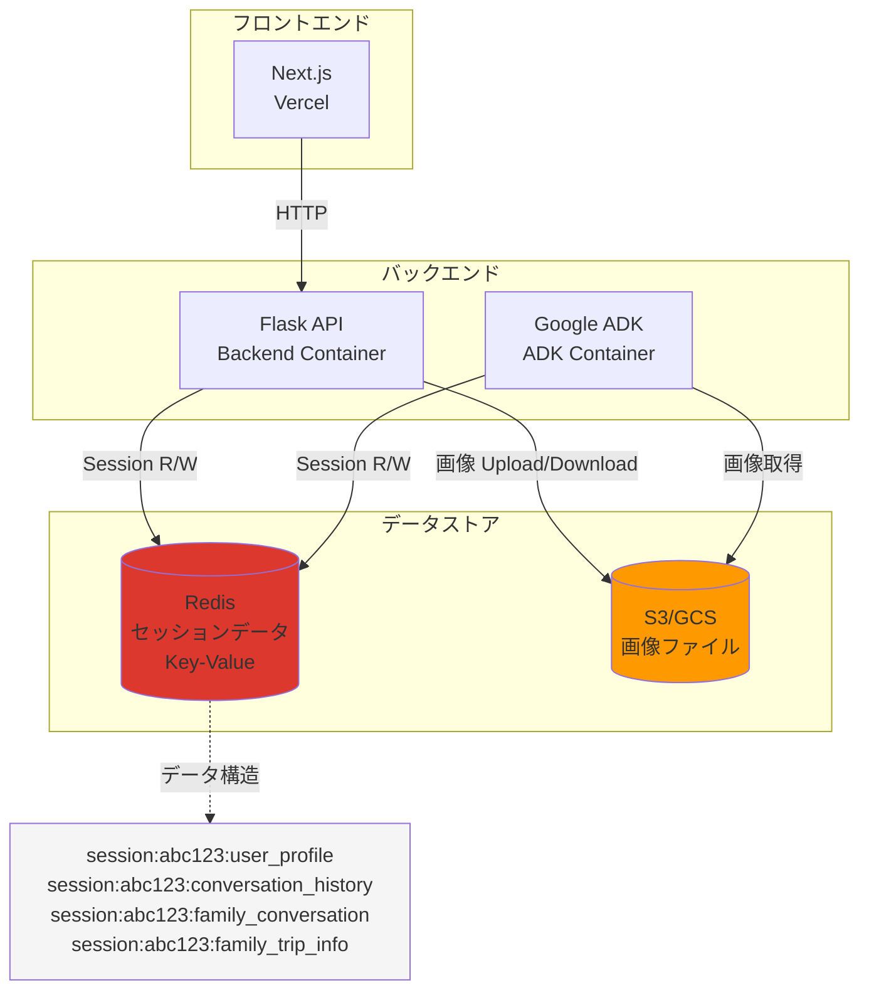
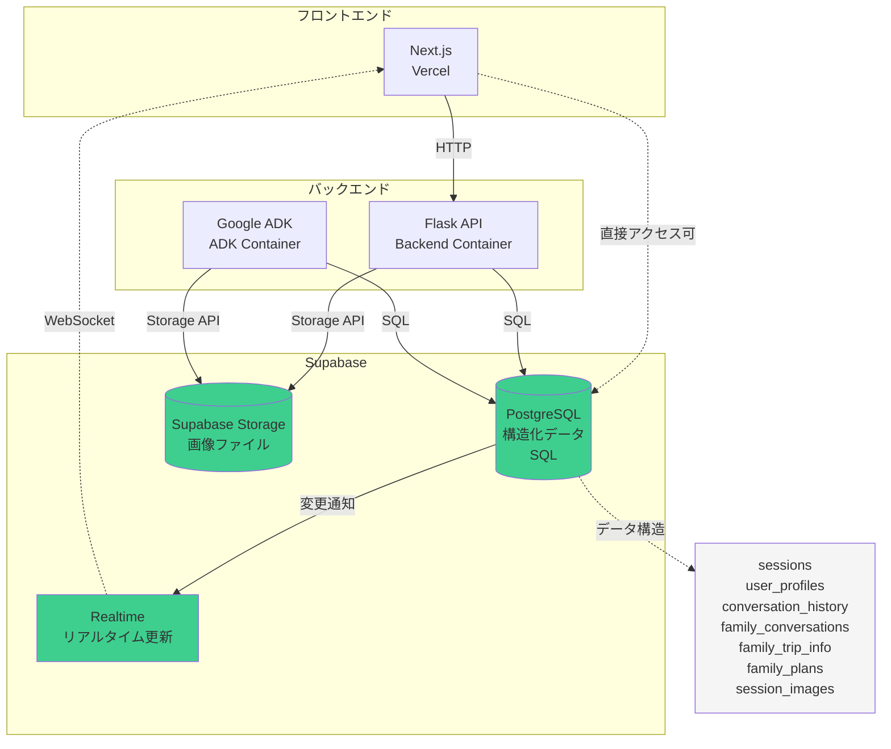
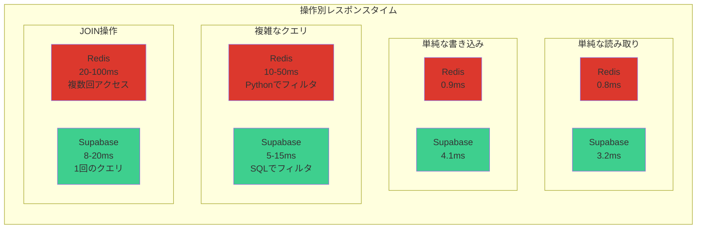
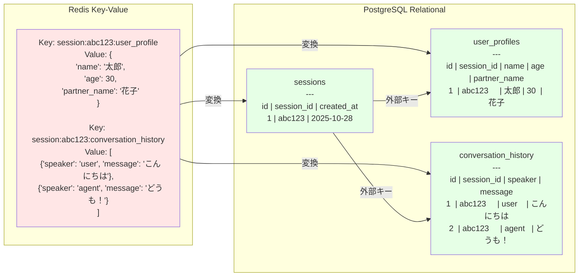
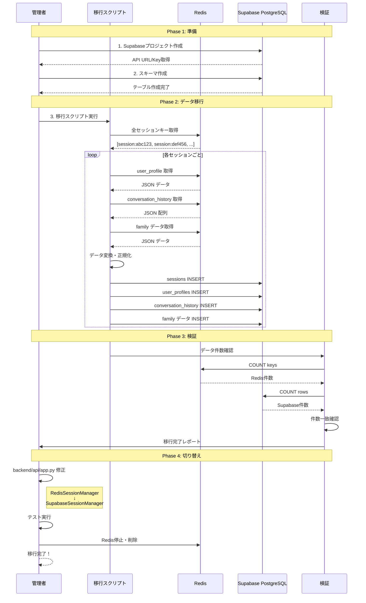
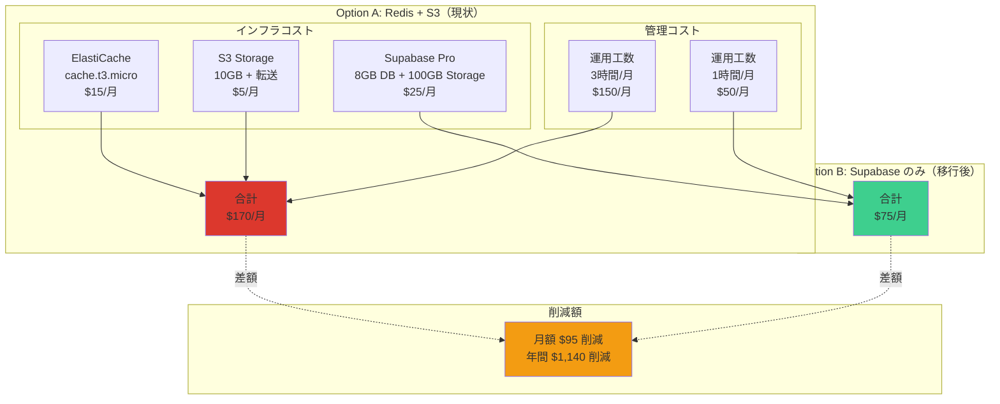
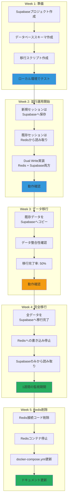
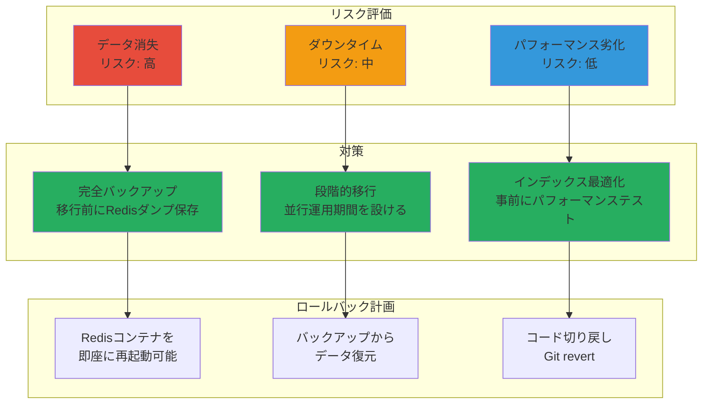
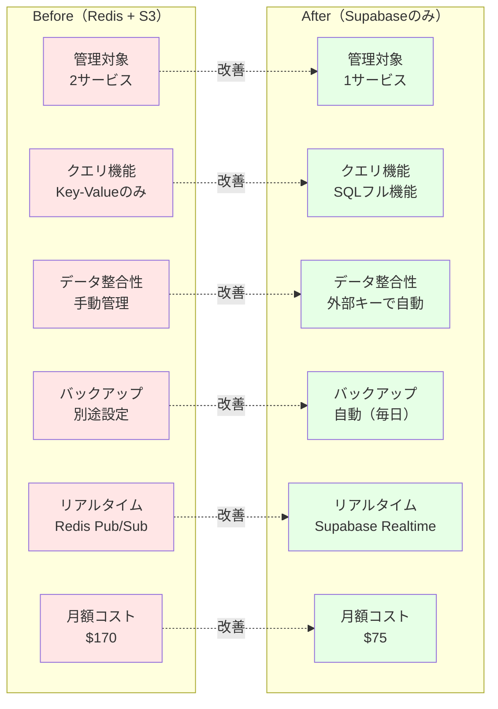
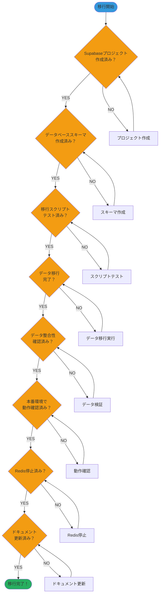

# Redis → Supabase 移行フロー図

**作成日**: 2025-10-28
**目的**: RedisからSupabaseへの移行を視覚化

---

## 📋 目次

1. [現状アーキテクチャ（Redis + S3）](#1-現状アーキテクチャredis--s3)
2. [移行後アーキテクチャ（Supabaseのみ）](#2-移行後アーキテクチャsupabaseのみ)
3. [パフォーマンス比較](#3-パフォーマンス比較)
4. [データ構造の変換](#4-データ構造の変換)
5. [移行プロセス](#5-移行プロセス)
6. [コスト比較](#6-コスト比較)
7. [段階的移行フロー](#7-段階的移行フロー)

---

## 1. 現状アーキテクチャ（Redis + S3）

### 課題

- ⚠️ **2つのサービス管理**: Redis + S3
- ⚠️ **クエリ機能が限定的**: Key-Value構造のみ
- ⚠️ **データ整合性**: 手動管理が必要
- ⚠️ **バックアップ**: 別途設定が必要

---

## 2. 移行後アーキテクチャ（Supabaseのみ）

### メリット

- ✅ **1つのプラットフォーム**: Supabaseで完結
- ✅ **SQLクエリ**: 複雑な検索が可能
- ✅ **データ整合性**: 外部キーで自動管理
- ✅ **自動バックアップ**: 標準装備
- ✅ **リアルタイム機能**: 追加コストなし

---

## 3. パフォーマンス比較

### 結論

- **単純操作**: Redisが約4倍速い（0.8ms vs 3.2ms）
- **複雑操作**: Supabaseが2-5倍速い
- **ユーザー体験**: どちらも100ms以下で体感差なし ✅

---

## 4. データ構造の変換

### 変換の利点

1. **データ正規化**: 重複を排除
2. **整合性保証**: 外部キーで関連性を保持
3. **柔軟なクエリ**: SQLで複雑な検索が可能
4. **型安全**: 各カラムに明確な型定義

---

## 5. 移行プロセス

---

## 6. コスト比較

### 年間コスト比較

| 項目 | Redis + S3 | Supabase | 削減額 |
|------|------------|----------|--------|
| **インフラ費** | $240 | $300 | -$60 |
| **管理工数（時給$50）** | $1,800 | $600 | **+$1,200** |
| **合計** | **$2,040** | **$900** | **$1,140** |

**結論**: Supabaseに移行すると **年間$1,140削減**

---

## 7. 段階的移行フロー

---

## 8. リスク管理

---

## 9. Before/After 比較

---

## 10. 移行完了チェックリスト

---

## まとめ

### ✅ Redisを削除し、Supabaseに統合する理由

1. **管理の簡素化**: 2サービス → 1サービス
2. **機能の向上**: Key-Value → SQLフル機能
3. **コスト削減**: $170/月 → $75/月（$95削減）
4. **運用工数削減**: 3時間/月 → 1時間/月
5. **データ整合性**: 手動 → 自動（外部キー）
6. **パフォーマンス**: 実用上問題なし（3ms）

### 🚀 次のステップ

1. **Week 1**: Supabaseセットアップ
2. **Week 2-3**: 段階的にデータ移行
3. **Week 4**: 動作確認・監視
4. **Week 5**: Redis完全削除

**所要時間**: 5週間（安全な移行）
**投資時間**: 20-25時間
**年間削減額**: $1,140

**Redisは削除し、Supabaseに統合しましょう！**
