# Supabase統合アーキテクチャ図

本ドキュメントでは、Supabase統合後のシステムアーキテクチャを詳細に図示します。

---

## 1. Supabaseシステム全体構成

```mermaid
graph TB
    subgraph "ユーザー環境"
        User[ユーザー<br/>ブラウザ]
    end

    subgraph "Vercel"
        Frontend[Next.js Frontend<br/>:3000]
    end

    subgraph "Cloud Run / Vercel Serverless"
        Backend[Flask Backend<br/>:8080]
    end

    subgraph "Supabase Platform"
        subgraph "Database"
            PostgreSQL[(PostgreSQL<br/>セッション・会話データ)]
            Sessions[sessions]
            UserProfiles[user_profiles]
            Conversations[conversation_history]
            FamilyConv[family_conversations]
            TripInfo[family_trip_info]
            Plans[family_plans]
            Images[session_images]
        end

        subgraph "Storage"
            Storage[(Supabase Storage<br/>画像ファイル)]
            Bucket[session-images bucket]
        end

        subgraph "Features"
            Realtime[Realtime<br/>リアルタイム通知]
            Auth[Auth<br/>認証 - 将来用]
            API[REST API<br/>PostgREST]
        end
    end

    User -->|HTTP| Frontend
    Frontend -->|API Call| Backend
    Frontend -.->|Direct Access| PostgreSQL
    Frontend -.->|Direct Access| Storage
    Backend -->|REST API| PostgreSQL
    Backend -->|Storage API| Storage
    PostgreSQL -->|変更通知| Realtime
    Realtime -.->|WebSocket| Frontend
    PostgreSQL --> Sessions
    PostgreSQL --> UserProfiles
    PostgreSQL --> Conversations
    PostgreSQL --> FamilyConv
    PostgreSQL --> TripInfo
    PostgreSQL --> Plans
    PostgreSQL --> Images
    Storage --> Bucket

    style PostgreSQL fill:#3ecf8e
    style Storage fill:#3ecf8e
    style Realtime fill:#3ecf8e
    style Auth fill:#a8dadc
    style API fill:#3ecf8e
    style Backend fill:#4ecdc4
    style Frontend fill:#95e1d3
```

---

## 2. データベーススキーマ関係図

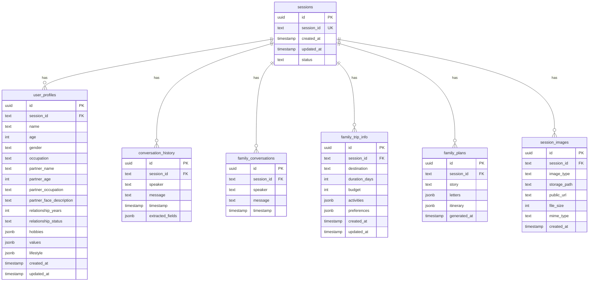

---

## 3. セッション作成フロー（Supabase版）

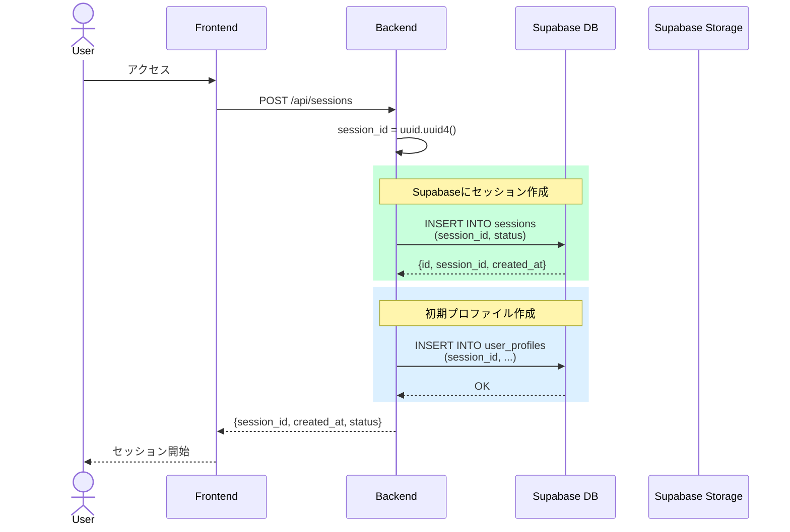

---

## 4. メッセージ送信・保存フロー（Supabase版）

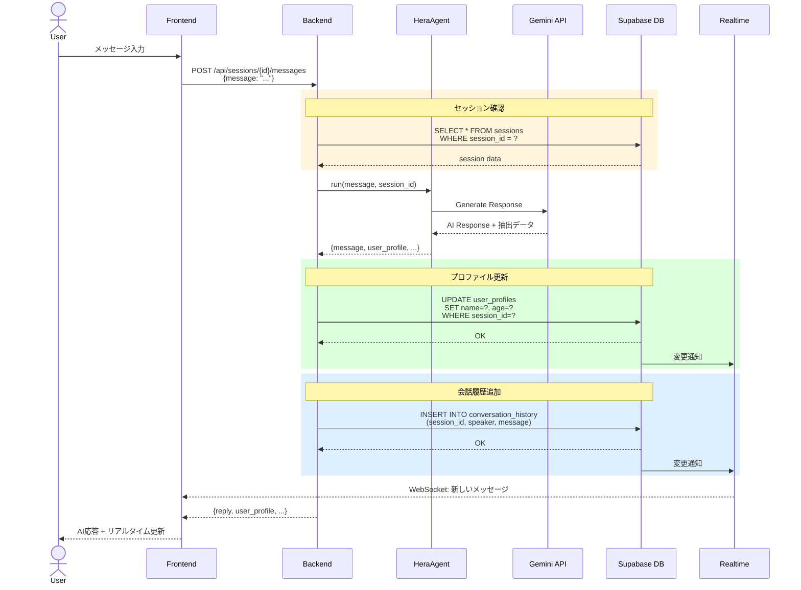

---

## 5. 画像アップロード・保存フロー（Supabase版）

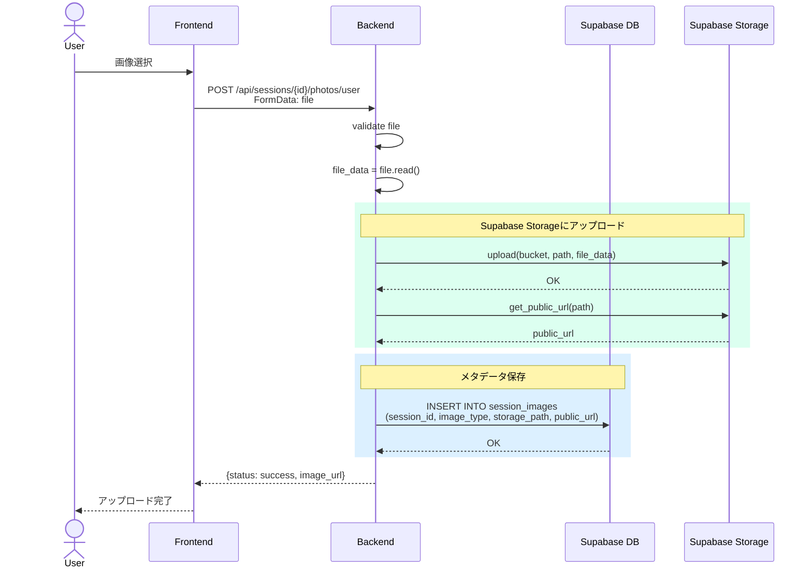

---

## 6. 画像取得フロー（Supabase版）

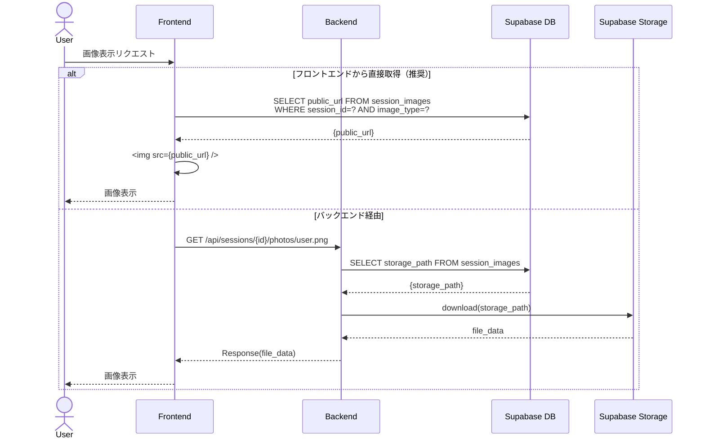

---

## 7. リアルタイム更新フロー

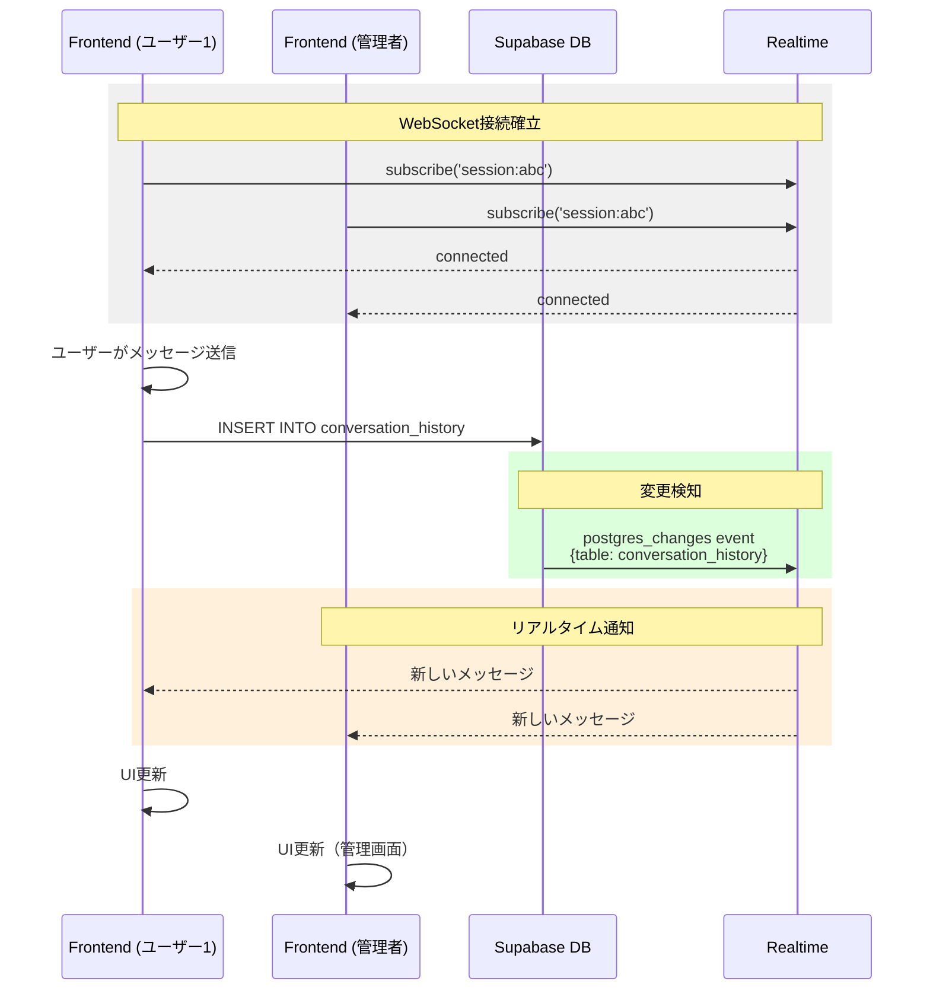

---

## 8. データ移行フロー（Redis → Supabase）

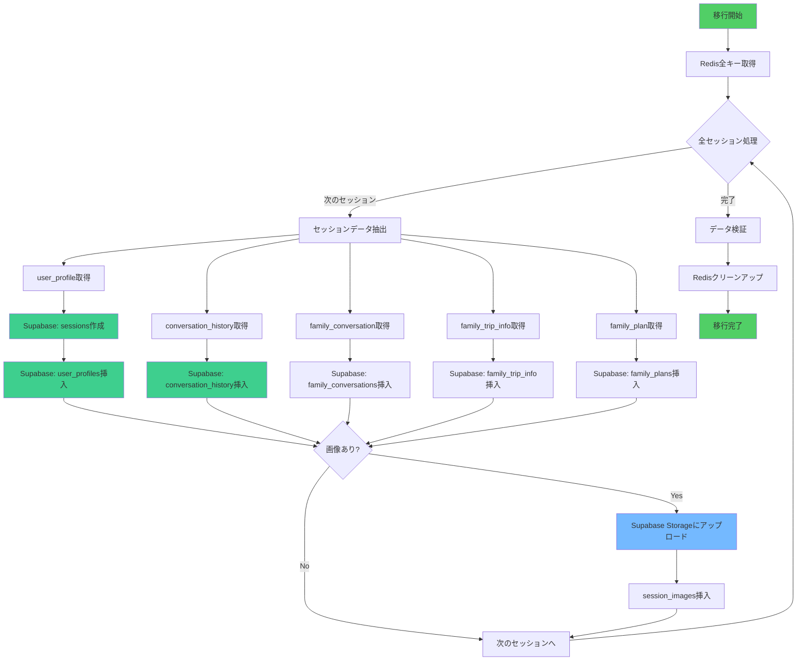

---

## 9. Row Level Security (RLS) ポリシー

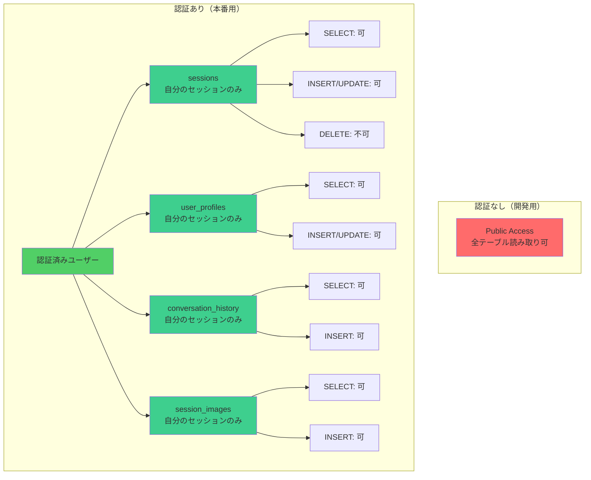

### RLSポリシー設定例

```sql
-- sessions テーブル: 認証済みユーザーは自分のセッションのみアクセス可
CREATE POLICY "Users can view own sessions"
ON sessions FOR SELECT
USING (auth.uid()::text = session_id);

CREATE POLICY "Users can insert own sessions"
ON sessions FOR INSERT
WITH CHECK (auth.uid()::text = session_id);

-- user_profiles テーブル
CREATE POLICY "Users can view own profiles"
ON user_profiles FOR SELECT
USING (session_id IN (
    SELECT session_id FROM sessions
    WHERE auth.uid()::text = session_id
));

-- conversation_history テーブル
CREATE POLICY "Users can view own conversations"
ON conversation_history FOR SELECT
USING (session_id IN (
    SELECT session_id FROM sessions
    WHERE auth.uid()::text = session_id
));

-- 開発用: 全アクセス許可（本番では削除）
CREATE POLICY "Allow all for development"
ON sessions FOR ALL
USING (true);
```

---

## 10. Supabase Storage バケット構造

```mermaid
graph TB
    subgraph "Supabase Storage"
        Bucket[session-images<br/>Public Bucket]

        Bucket --> Session1[{session_id_1}/]
        Bucket --> Session2[{session_id_2}/]
        Bucket --> Session3[...]

        Session1 --> User1[user.png]
        Session1 --> Partner1[partner.png]
        Session1 --> Child1[child_1.png]

        Session2 --> User2[user.png]
        Session2 --> Partner2[partner.png]
    end

    subgraph "アクセス制御"
        PublicRead[Public Read<br/>誰でも画像取得可]
        AuthWrite[Authenticated Write<br/>認証済みのみアップロード可]
    end

    User1 -.-> PublicRead
    Partner1 -.-> PublicRead
    User2 -.-> AuthWrite
    Partner2 -.-> AuthWrite

    style Bucket fill:#3ecf8e
    style PublicRead fill:#74b9ff
    style AuthWrite fill:#ffd43b
```

### Storage ポリシー設定

```sql
-- 誰でも画像取得可能
CREATE POLICY "Public can view images"
ON storage.objects FOR SELECT
USING (bucket_id = 'session-images');

-- 認証済みユーザーのみアップロード可能
CREATE POLICY "Authenticated users can upload"
ON storage.objects FOR INSERT
WITH CHECK (
    bucket_id = 'session-images' AND
    auth.role() = 'authenticated'
);
```

---

## 11. 環境別デプロイ構成

```mermaid
graph TB
    subgraph "ローカル開発"
        LocalFE[Frontend<br/>localhost:3000]
        LocalBE[Backend<br/>localhost:8080]
        LocalSupabase[Supabase CLI<br/>localhost:54321]

        LocalFE --> LocalBE
        LocalBE --> LocalSupabase
        LocalFE -.-> LocalSupabase
    end

    subgraph "ステージング"
        StageFE[Vercel Preview]
        StageBE[Cloud Run Dev]
        StageSupabase[Supabase Project<br/>staging]

        StageFE --> StageBE
        StageBE --> StageSupabase
        StageFE -.-> StageSupabase
    end

    subgraph "本番"
        ProdFE[Vercel Production]
        ProdBE[Cloud Run Production]
        ProdSupabase[Supabase Project<br/>production]

        ProdFE --> ProdBE
        ProdBE --> ProdSupabase
        ProdFE -.-> ProdSupabase
    end

    style LocalSupabase fill:#a8dadc
    style StageSupabase fill:#3ecf8e
    style ProdSupabase fill:#3ecf8e
```

---

## 12. コスト構造比較

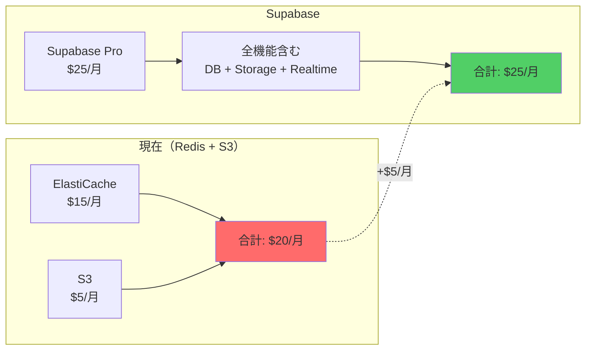

---

## 13. パフォーマンス比較

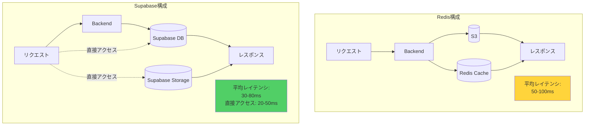

---

## 補足説明

### Supabase接続情報

```bash
# .env
SUPABASE_URL=https://your-project.supabase.co
SUPABASE_KEY=your-anon-key
SUPABASE_SERVICE_KEY=your-service-role-key  # バックエンド用
SUPABASE_BUCKET=session-images

# フロントエンド用
NEXT_PUBLIC_SUPABASE_URL=https://your-project.supabase.co
NEXT_PUBLIC_SUPABASE_ANON_KEY=your-anon-key
```

### API エンドポイント

```
REST API: https://your-project.supabase.co/rest/v1/
Realtime: wss://your-project.supabase.co/realtime/v1/
Storage: https://your-project.supabase.co/storage/v1/
Auth: https://your-project.supabase.co/auth/v1/
```

---

このドキュメントは、Supabase統合後のシステムアーキテクチャを完全に表現しています。
