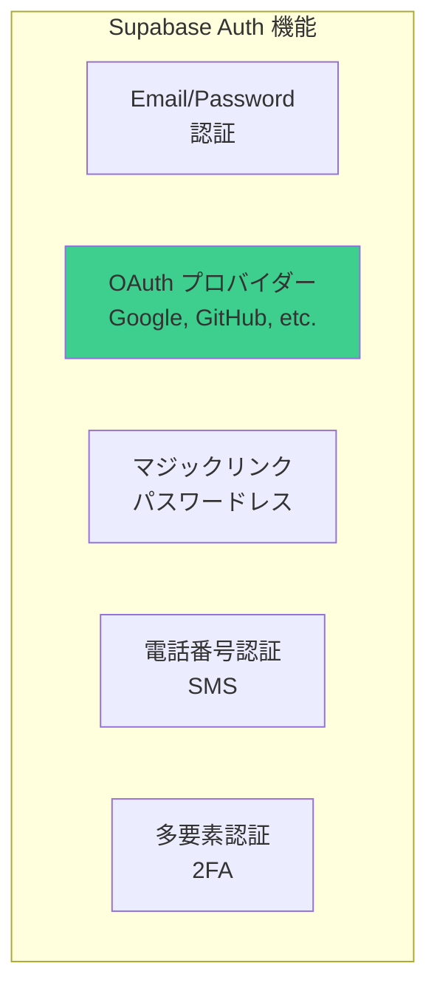
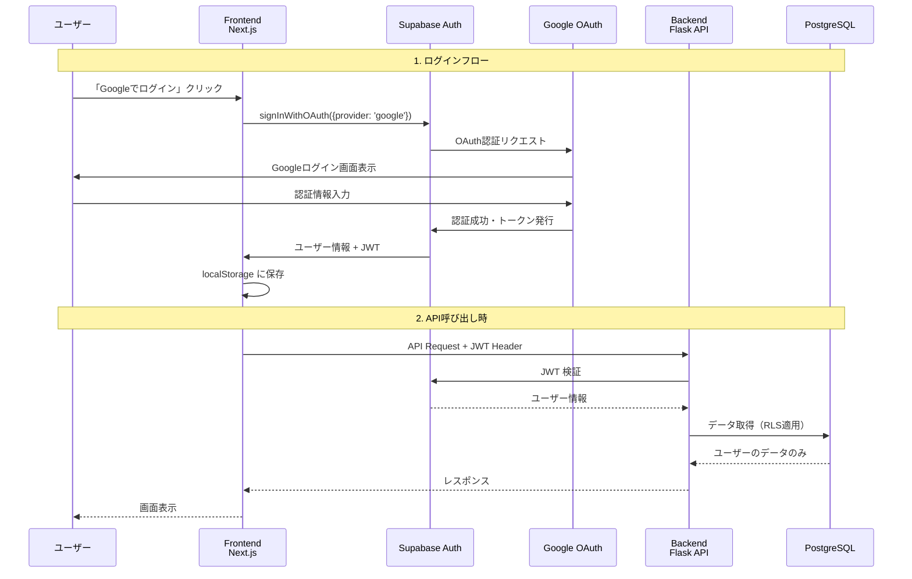
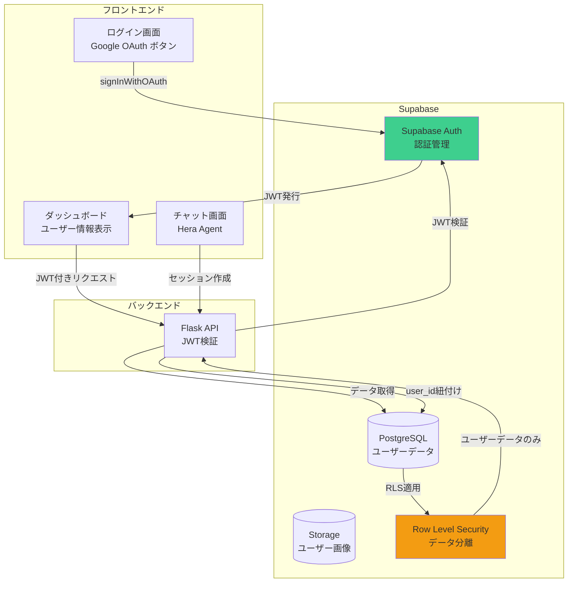

# Supabase Auth + Google OAuth 統合計画

**作成日**: 2025-10-28
**目的**: Supabase Authを使ったGoogleログイン機能の実装

---

## 📋 目次

1. [Supabase Authとは](#1-supabase-authとは)
2. [アーキテクチャ設計](#2-アーキテクチャ設計)
3. [Google OAuth設定](#3-google-oauth設定)
4. [フロントエンド実装](#4-フロントエンド実装)
5. [バックエンド実装](#5-バックエンド実装)
6. [Row Level Security（RLS）](#6-row-level-securityrls)
7. [実装手順](#7-実装手順)
8. [コスト](#8-コスト)

---

## 1. Supabase Authとは

### 概要

Supabase Authは、**認証機能がビルトイン**されたSupabaseの機能です。



### 特徴

✅ **簡単セットアップ**: 数クリックでOAuth設定完了
✅ **セキュア**: JWT（JSON Web Token）ベース
✅ **複数プロバイダー対応**: Google、GitHub、Facebook、Twitter等
✅ **無料**: Freeプランでも無制限ユーザー
✅ **Row Level Security**: ユーザーごとのデータ分離
✅ **セッション管理**: 自動でトークン管理

---

## 2. アーキテクチャ設計

### 認証フロー



---

### システムアーキテクチャ



---

## 3. Google OAuth設定

### 3.1 Google Cloud Console設定

#### Step 1: プロジェクト作成

1. https://console.cloud.google.com/ にアクセス
2. 新しいプロジェクト作成「Hera App」
3. OAuth同意画面を設定

#### Step 2: OAuth 2.0 認証情報作成

```
1. 「APIとサービス」→「認証情報」
2. 「認証情報を作成」→「OAuth 2.0 クライアント ID」
3. アプリケーションの種類: ウェブアプリケーション
4. 承認済みのリダイレクト URI:
   https://<your-project>.supabase.co/auth/v1/callback
5. クライアント ID と クライアントシークレット を取得
```

#### Step 3: Supabase に設定

```
1. Supabase Dashboard → Authentication → Providers
2. Google を有効化
3. Client ID を入力
4. Client Secret を入力
5. 保存
```

### 3.2 環境変数

```bash
# .env.local (フロントエンド)
NEXT_PUBLIC_SUPABASE_URL=https://your-project.supabase.co
NEXT_PUBLIC_SUPABASE_ANON_KEY=your-anon-key

# .env (バックエンド)
SUPABASE_URL=https://your-project.supabase.co
SUPABASE_KEY=your-anon-key
SUPABASE_SERVICE_ROLE_KEY=your-service-role-key  # JWT検証用
```

---

## 4. フロントエンド実装

### 4.1 ディレクトリ構成

```
frontend/
├── app/
│   ├── login/
│   │   └── page.tsx              # ログイン画面
│   ├── dashboard/
│   │   └── page.tsx              # ダッシュボード（要ログイン）
│   └── chat/
│       └── page.tsx              # チャット画面（要ログイン）
├── components/
│   ├── auth/
│   │   ├── LoginButton.tsx       # Googleログインボタン
│   │   ├── LogoutButton.tsx      # ログアウトボタン
│   │   └── AuthProvider.tsx      # 認証プロバイダー
│   └── layout/
│       └── Header.tsx            # ヘッダー（ユーザー情報表示）
├── lib/
│   └── supabase.ts               # Supabase クライアント
└── hooks/
    └── useAuth.ts                # 認証フック
```

---

### 4.2 Supabase クライアント設定

**frontend/lib/supabase.ts**

```typescript
import { createClient } from '@supabase/supabase-js'

const supabaseUrl = process.env.NEXT_PUBLIC_SUPABASE_URL!
const supabaseAnonKey = process.env.NEXT_PUBLIC_SUPABASE_ANON_KEY!

export const supabase = createClient(supabaseUrl, supabaseAnonKey)

// 型定義
export type Profile = {
  id: string
  email: string
  full_name: string
  avatar_url: string
  created_at: string
}
```

---

### 4.3 認証フック

**frontend/hooks/useAuth.ts**

```typescript
'use client'

import { useEffect, useState } from 'react'
import { User } from '@supabase/supabase-js'
import { supabase } from '@/lib/supabase'

export function useAuth() {
  const [user, setUser] = useState<User | null>(null)
  const [loading, setLoading] = useState(true)

  useEffect(() => {
    // 初期ユーザー情報取得
    supabase.auth.getSession().then(({ data: { session } }) => {
      setUser(session?.user ?? null)
      setLoading(false)
    })

    // 認証状態の変更を監視
    const {
      data: { subscription },
    } = supabase.auth.onAuthStateChange((_event, session) => {
      setUser(session?.user ?? null)
    })

    return () => subscription.unsubscribe()
  }, [])

  return { user, loading }
}
```

---

### 4.4 ログイン画面

**frontend/app/login/page.tsx**

```typescript
'use client'

import { useState } from 'react'
import { supabase } from '@/lib/supabase'
import { useRouter } from 'next/navigation'

export default function LoginPage() {
  const [loading, setLoading] = useState(false)
  const router = useRouter()

  const handleGoogleLogin = async () => {
    try {
      setLoading(true)
      const { error } = await supabase.auth.signInWithOAuth({
        provider: 'google',
        options: {
          redirectTo: `${window.location.origin}/dashboard`,
        },
      })

      if (error) throw error
    } catch (error) {
      console.error('Error logging in:', error)
      alert('ログインに失敗しました')
    } finally {
      setLoading(false)
    }
  }

  return (
    <div className="min-h-screen flex items-center justify-center bg-gradient-to-br from-purple-50 to-pink-50">
      <div className="max-w-md w-full space-y-8 p-10 bg-white rounded-xl shadow-lg">
        <div className="text-center">
          <h1 className="text-4xl font-bold text-gray-900 mb-2">Hera</h1>
          <p className="text-gray-600">
            あなただけの AI パートナーエージェント
          </p>
        </div>

        <div className="mt-8">
          <button
            onClick={handleGoogleLogin}
            disabled={loading}
            className="w-full flex items-center justify-center gap-3 px-4 py-3 border border-gray-300 rounded-lg shadow-sm bg-white text-gray-700 hover:bg-gray-50 focus:outline-none focus:ring-2 focus:ring-offset-2 focus:ring-purple-500 disabled:opacity-50 disabled:cursor-not-allowed transition-colors"
          >
            <svg className="w-5 h-5" viewBox="0 0 24 24">
              <path
                fill="currentColor"
                d="M22.56 12.25c0-.78-.07-1.53-.2-2.25H12v4.26h5.92c-.26 1.37-1.04 2.53-2.21 3.31v2.77h3.57c2.08-1.92 3.28-4.74 3.28-8.09z"
              />
              <path
                fill="currentColor"
                d="M12 23c2.97 0 5.46-.98 7.28-2.66l-3.57-2.77c-.98.66-2.23 1.06-3.71 1.06-2.86 0-5.29-1.93-6.16-4.53H2.18v2.84C3.99 20.53 7.7 23 12 23z"
              />
              <path
                fill="currentColor"
                d="M5.84 14.09c-.22-.66-.35-1.36-.35-2.09s.13-1.43.35-2.09V7.07H2.18C1.43 8.55 1 10.22 1 12s.43 3.45 1.18 4.93l2.85-2.22.81-.62z"
              />
              <path
                fill="currentColor"
                d="M12 5.38c1.62 0 3.06.56 4.21 1.64l3.15-3.15C17.45 2.09 14.97 1 12 1 7.7 1 3.99 3.47 2.18 7.07l3.66 2.84c.87-2.6 3.3-4.53 6.16-4.53z"
              />
            </svg>
            {loading ? 'ログイン中...' : 'Google でログイン'}
          </button>
        </div>

        <p className="mt-6 text-center text-sm text-gray-600">
          ログインすることで、
          <a href="/terms" className="text-purple-600 hover:underline">
            利用規約
          </a>
          と
          <a href="/privacy" className="text-purple-600 hover:underline">
            プライバシーポリシー
          </a>
          に同意したものとみなされます。
        </p>
      </div>
    </div>
  )
}
```

---

### 4.5 ダッシュボード（ログイン後画面）

**frontend/app/dashboard/page.tsx**

```typescript
'use client'

import { useEffect } from 'react'
import { useRouter } from 'next/navigation'
import { useAuth } from '@/hooks/useAuth'
import { supabase } from '@/lib/supabase'

export default function DashboardPage() {
  const { user, loading } = useAuth()
  const router = useRouter()

  useEffect(() => {
    if (!loading && !user) {
      router.push('/login')
    }
  }, [user, loading, router])

  const handleLogout = async () => {
    await supabase.auth.signOut()
    router.push('/login')
  }

  if (loading) {
    return (
      <div className="min-h-screen flex items-center justify-center">
        <div className="animate-spin rounded-full h-12 w-12 border-b-2 border-purple-600"></div>
      </div>
    )
  }

  if (!user) {
    return null
  }

  return (
    <div className="min-h-screen bg-gray-50">
      <header className="bg-white shadow">
        <div className="max-w-7xl mx-auto px-4 sm:px-6 lg:px-8 py-4 flex items-center justify-between">
          <h1 className="text-2xl font-bold text-gray-900">Hera Dashboard</h1>
          <div className="flex items-center gap-4">
            
            <div>
              <p className="text-sm font-medium text-gray-900">
                {user.user_metadata.full_name}
              </p>
              <p className="text-xs text-gray-500">{user.email}</p>
            </div>
            <button
              onClick={handleLogout}
              className="ml-4 px-4 py-2 text-sm font-medium text-white bg-purple-600 rounded-lg hover:bg-purple-700"
            >
              ログアウト
            </button>
          </div>
        </div>
      </header>

      <main className="max-w-7xl mx-auto px-4 sm:px-6 lg:px-8 py-8">
        <div className="grid grid-cols-1 gap-6 sm:grid-cols-2 lg:grid-cols-3">
          {/* セッション一覧カード */}
          <div className="bg-white overflow-hidden shadow rounded-lg">
            <div className="p-5">
              <div className="flex items-center">
                <div className="flex-shrink-0">
                  <svg
                    className="h-6 w-6 text-purple-600"
                    fill="none"
                    viewBox="0 0 24 24"
                    stroke="currentColor"
                  >
                    <path
                      strokeLinecap="round"
                      strokeLinejoin="round"
                      strokeWidth={2}
                      d="M8 10h.01M12 10h.01M16 10h.01M9 16H5a2 2 0 01-2-2V6a2 2 0 012-2h14a2 2 0 012 2v8a2 2 0 01-2 2h-5l-5 5v-5z"
                    />
                  </svg>
                </div>
                <div className="ml-5 w-0 flex-1">
                  <dl>
                    <dt className="text-sm font-medium text-gray-500 truncate">
                      セッション数
                    </dt>
                    <dd className="text-lg font-semibold text-gray-900">12</dd>
                  </dl>
                </div>
              </div>
            </div>
            <div className="bg-gray-50 px-5 py-3">
              <a
                href="/chat"
                className="text-sm font-medium text-purple-600 hover:text-purple-500"
              >
                新しいチャットを開始 →
              </a>
            </div>
          </div>

          {/* 他のカード... */}
        </div>
      </main>
    </div>
  )
}
```

---

### 4.6 認証プロバイダー（グローバルラッパー）

**frontend/app/layout.tsx**

```typescript
import './globals.css'
import { Inter } from 'next/font/google'

const inter = Inter({ subsets: ['latin'] })

export const metadata = {
  title: 'Hera - AI Partner Agent',
  description: 'あなただけの AI パートナーエージェント',
}

export default function RootLayout({
  children,
}: {
  children: React.ReactNode
}) {
  return (
    <html lang="ja">
      <body className={inter.className}>{children}</body>
    </html>
  )
}
```

---

## 5. バックエンド実装

### 5.1 JWT検証ミドルウェア

**backend/api/middleware/auth.py**

```python
"""
認証ミドルウェア
Supabase JWTの検証
"""
from functools import wraps
from flask import request, jsonify
import os
import jwt
from jwt import PyJWKClient

SUPABASE_URL = os.getenv('SUPABASE_URL')
SUPABASE_JWT_SECRET = os.getenv('SUPABASE_JWT_SECRET')  # SupabaseダッシュボードのProject Settings > API


def require_auth(f):
    """
    認証が必要なエンドポイントにデコレートする
    """
    @wraps(f)
    def decorated_function(*args, **kwargs):
        # Authorization ヘッダーからトークン取得
        auth_header = request.headers.get('Authorization')
        if not auth_header:
            return jsonify({'error': 'Authorization header is missing'}), 401

        try:
            # "Bearer <token>" 形式から<token>部分を抽出
            token = auth_header.split(' ')[1]

            # JWT検証
            payload = jwt.decode(
                token,
                SUPABASE_JWT_SECRET,
                algorithms=['HS256'],
                audience='authenticated'
            )

            # ユーザー情報をリクエストに追加
            request.user_id = payload['sub']
            request.user_email = payload.get('email')
            request.user_metadata = payload.get('user_metadata', {})

            return f(*args, **kwargs)

        except jwt.ExpiredSignatureError:
            return jsonify({'error': 'Token has expired'}), 401
        except jwt.InvalidTokenError:
            return jsonify({'error': 'Invalid token'}), 401
        except Exception as e:
            return jsonify({'error': str(e)}), 401

    return decorated_function
```

---

### 5.2 セッション作成API（認証付き）

**backend/api/app.py**

```python
from flask import Flask, request, jsonify
from middleware.auth import require_auth
from utils.supabase_manager import SupabaseSessionManager
import uuid
from datetime import datetime

app = Flask(__name__)

# Supabaseマネージャー初期化
session_mgr = SupabaseSessionManager(
    supabase_url=os.getenv('SUPABASE_URL'),
    supabase_key=os.getenv('SUPABASE_SERVICE_ROLE_KEY')  # Service Roleキー
)


@app.route('/api/sessions', methods=['POST'])
@require_auth  # 認証必須
def create_session():
    """
    セッション作成（ユーザーIDと紐付け）
    """
    try:
        session_id = str(uuid.uuid4())
        user_id = request.user_id  # ミドルウェアで設定されたuser_id

        # Supabaseにセッション作成（user_idと紐付け）
        session_mgr.create_session(session_id, user_id)

        return jsonify({
            'session_id': session_id,
            'user_id': user_id,
            'created_at': datetime.now().isoformat(),
            'status': 'created'
        })

    except Exception as e:
        return jsonify({'error': str(e)}), 500


@app.route('/api/sessions/<session_id>/messages', methods=['POST'])
@require_auth
def send_message(session_id):
    """
    メッセージ送信（ユーザーのセッションかチェック）
    """
    try:
        user_id = request.user_id

        # セッションがユーザーのものか確認
        if not session_mgr.is_user_session(session_id, user_id):
            return jsonify({'error': 'Unauthorized'}), 403

        # ... (メッセージ処理)

        return jsonify({
            'message': 'Message sent successfully'
        })

    except Exception as e:
        return jsonify({'error': str(e)}), 500


@app.route('/api/sessions', methods=['GET'])
@require_auth
def get_user_sessions():
    """
    ユーザーのセッション一覧取得
    """
    try:
        user_id = request.user_id

        sessions = session_mgr.get_user_sessions(user_id)

        return jsonify({
            'sessions': sessions
        })

    except Exception as e:
        return jsonify({'error': str(e)}), 500
```

---

## 6. Row Level Security（RLS）

### 6.1 RLSポリシー設定

**データベース側でユーザーごとのデータ分離**

```sql
-- sessions テーブルのRLS
ALTER TABLE sessions ENABLE ROW LEVEL SECURITY;

-- ユーザーは自分のセッションのみ閲覧可能
CREATE POLICY "Users can view own sessions"
ON sessions FOR SELECT
USING (auth.uid() = user_id);

-- ユーザーは自分のセッションのみ作成可能
CREATE POLICY "Users can insert own sessions"
ON sessions FOR INSERT
WITH CHECK (auth.uid() = user_id);

-- user_profiles テーブルのRLS
ALTER TABLE user_profiles ENABLE ROW LEVEL SECURITY;

CREATE POLICY "Users can view own profiles"
ON user_profiles FOR SELECT
USING (
  auth.uid() = (
    SELECT user_id FROM sessions WHERE session_id = user_profiles.session_id
  )
);

CREATE POLICY "Users can update own profiles"
ON user_profiles FOR UPDATE
USING (
  auth.uid() = (
    SELECT user_id FROM sessions WHERE session_id = user_profiles.session_id
  )
);

-- conversation_history テーブルのRLS
ALTER TABLE conversation_history ENABLE ROW LEVEL SECURITY;

CREATE POLICY "Users can view own conversations"
ON conversation_history FOR SELECT
USING (
  auth.uid() = (
    SELECT user_id FROM sessions WHERE session_id = conversation_history.session_id
  )
);

CREATE POLICY "Users can insert own conversations"
ON conversation_history FOR INSERT
WITH CHECK (
  auth.uid() = (
    SELECT user_id FROM sessions WHERE session_id = conversation_history.session_id
  )
);
```

---

### 6.2 データベーススキーマ更新

```sql
-- sessions テーブルに user_id カラム追加
ALTER TABLE sessions
ADD COLUMN user_id UUID REFERENCES auth.users(id) ON DELETE CASCADE;

-- インデックス追加
CREATE INDEX idx_sessions_user_id ON sessions(user_id);
```

---

## 7. 実装手順

### Phase 1: Supabase Auth設定（1-2時間）

```
✅ タスク:
1. Google Cloud Console でOAuth設定
2. Supabase Dashboard でGoogle Provider有効化
3. 環境変数設定
4. テスト用Googleアカウントでログインテスト
```

### Phase 2: フロントエンド実装（4-6時間）

```
✅ タスク:
1. Supabaseクライアント設定
2. useAuth フック作成
3. ログイン画面作成
4. ダッシュボード作成
5. ヘッダーコンポーネント（ユーザー情報表示）
6. ログアウト機能
```

### Phase 3: バックエンド実装（3-4時間）

```
✅ タスク:
1. JWT検証ミドルウェア作成
2. 既存APIに @require_auth デコレータ追加
3. セッションにuser_id紐付け
4. ユーザーセッション一覧API作成
5. 権限チェック実装
```

### Phase 4: RLS設定（2-3時間）

```
✅ タスク:
1. データベーススキーマ更新（user_id追加）
2. RLSポリシー作成
3. 既存データに user_id 追加（データ移行）
4. 動作確認
```

### Phase 5: テスト（2-3時間）

```
✅ タスク:
1. ログイン・ログアウトテスト
2. セッション作成テスト
3. RLS動作確認（他ユーザーのデータが見えないか）
4. JWT期限切れテスト
5. 統合テスト
```

**総所要時間**: 12-18時間

---

## 8. コスト

### Supabase Auth の料金

| プラン | 月間アクティブユーザー | 月額 |
|--------|----------------------|------|
| **Free** | 50,000 MAU | **$0** |
| **Pro** | 100,000 MAU | $25 |
| **Team** | 無制限 | $599 |

**Heraプロジェクト**: Freeプランで十分（50,000ユーザーまで無料）✅

---

## 9. セキュリティ考慮事項

### 9.1 JWT管理

```typescript
// JWT を localStorage に保存（Supabase SDKが自動実行）
// - XSS攻撃対策: Content Security Policy (CSP) を設定
// - HTTPS必須
```

### 9.2 RLS（Row Level Security）

```sql
-- データベースレベルでアクセス制御
-- バックエンドのバグがあっても、他ユーザーのデータは見えない
```

### 9.3 CORS設定

```python
# backend/api/app.py
from flask_cors import CORS

CORS(app, origins=[
    'http://localhost:3000',  # 開発環境
    'https://hera-app.vercel.app',  # 本番環境
], supports_credentials=True)
```

---

## 10. まとめ

### ✅ Supabase Auth のメリット

1. **簡単セットアップ**: 数時間で完成
2. **セキュア**: JWT + RLS でデータ保護
3. **無料**: 50,000 MAU まで無料
4. **スケーラブル**: 自動スケーリング
5. **統合管理**: DB + Auth + Storage が1箇所

### 📊 Before/After

| 項目 | Before（認証なし） | After（Supabase Auth） |
|------|-------------------|----------------------|
| **ユーザー管理** | なし | あり |
| **データ分離** | なし | RLSで自動 |
| **セキュリティ** | 低い | 高い（JWT + RLS） |
| **ログイン方法** | なし | Google OAuth |
| **追加コスト** | $0 | $0（Freeプラン） |

### 🚀 次のステップ

1. Google OAuth 設定（30分）
2. フロントエンド実装（4-6時間）
3. バックエンド実装（3-4時間）
4. RLS設定（2-3時間）
5. テスト（2-3時間）

**合計**: 12-18時間で完成！

**ログイン機能を追加して、セキュアな Hera を構築しましょう！**
