# システム構成図と処理フロー

本ドキュメントでは、Redis統合後のシステム構成と処理フローを詳細に説明します。

---

## 1. システム全体構成図

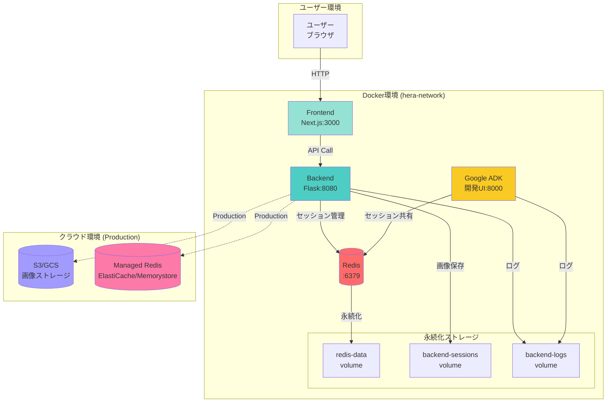

---

## 2. データフロー概要

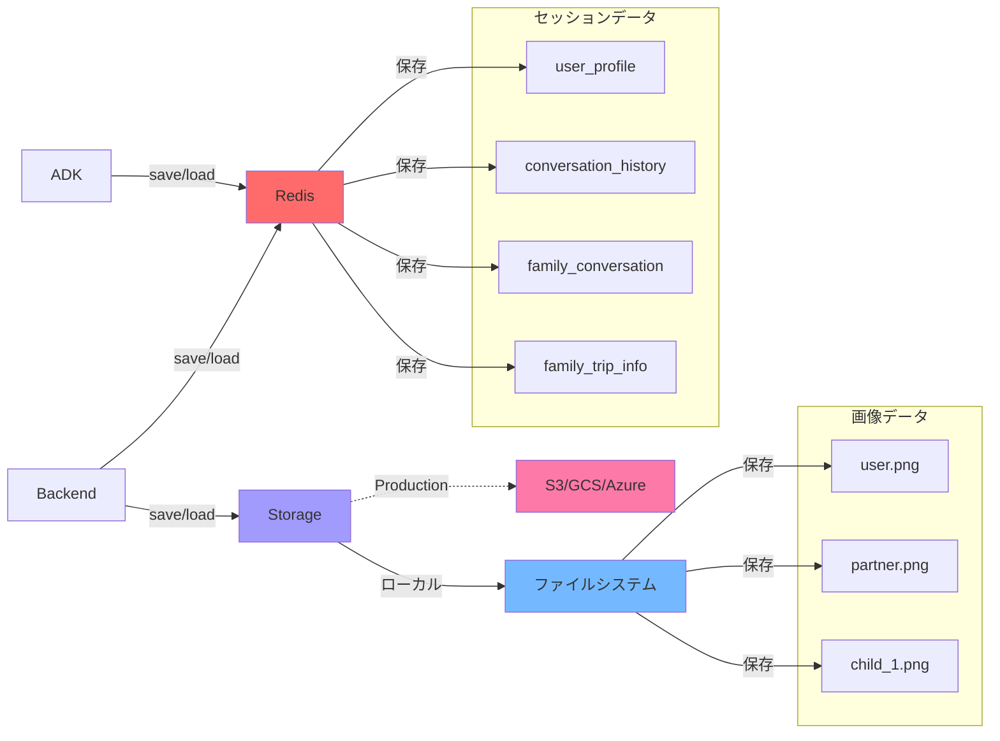

---

## 3. セッション作成フロー

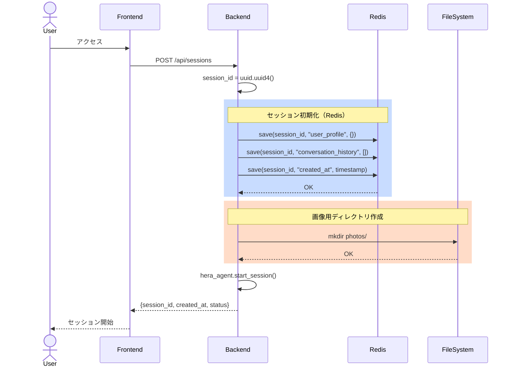

---

## 4. メッセージ送信・AI応答フロー

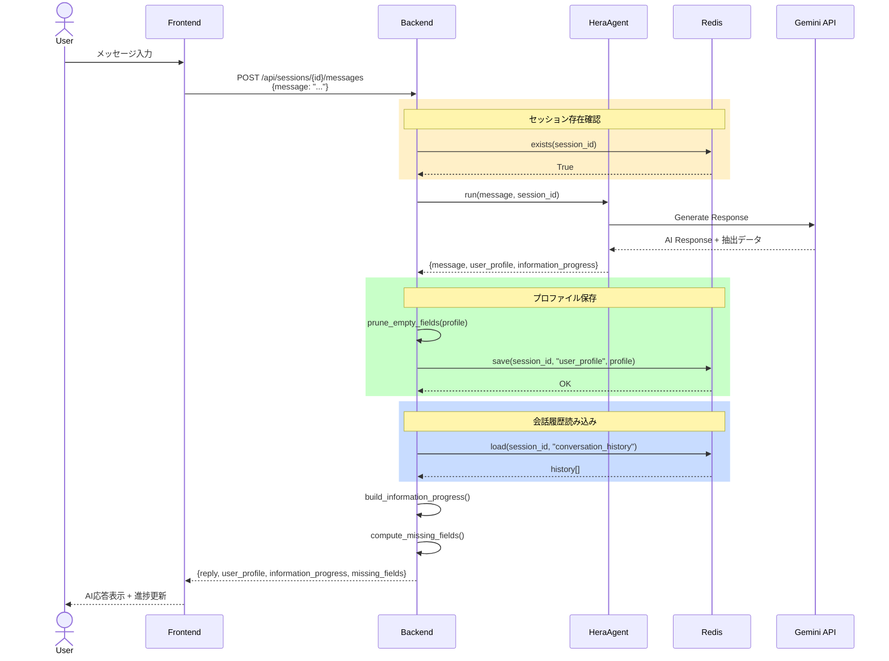

---

## 5. 画像アップロードフロー

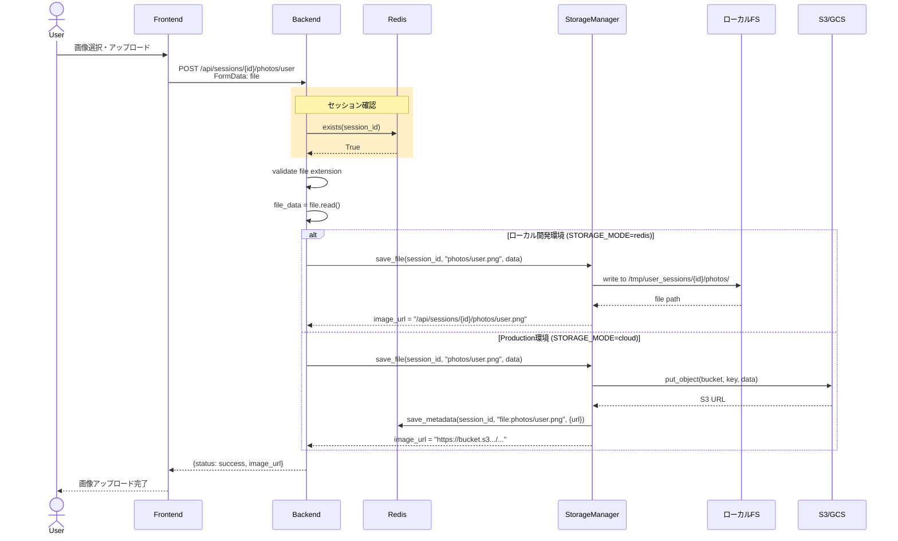

---

## 6. 画像取得フロー

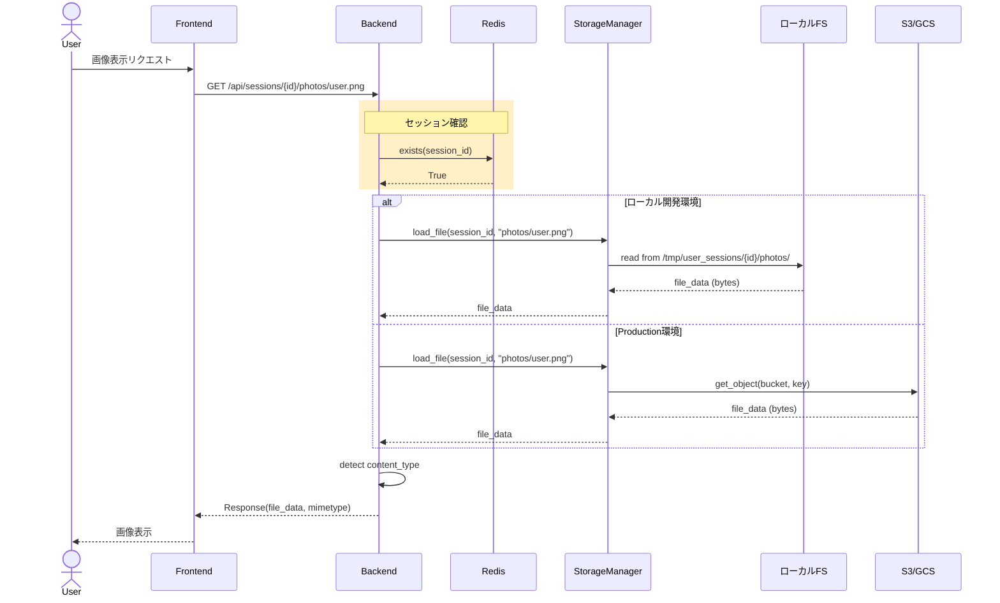

---

## 7. 家族エージェント連携フロー

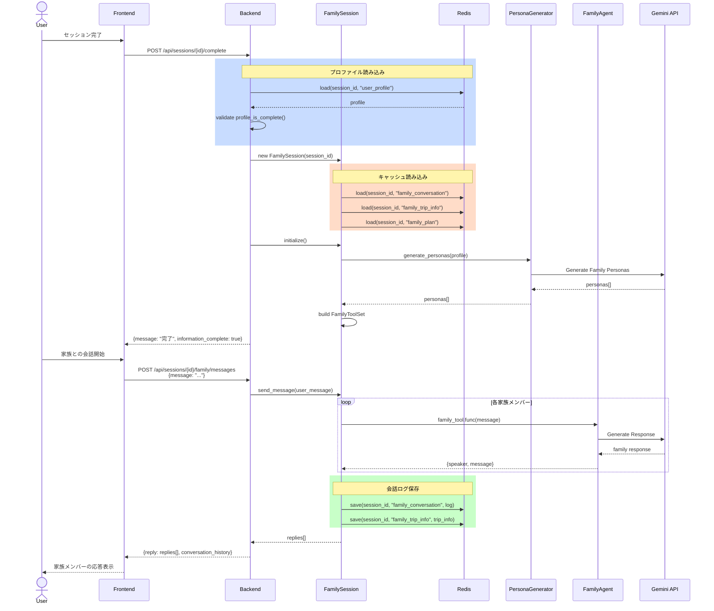

---

## 8. Backend/ADK セッション共有フロー

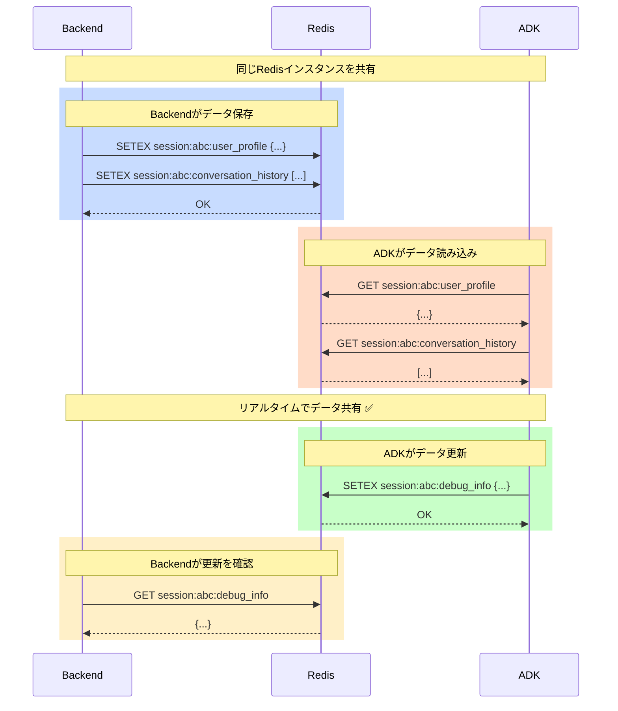

---

## 9. データストレージ階層構造

```mermaid
graph TB
    subgraph "セッションデータ (Redis)"
        R1[session:abc:user_profile]
        R2[session:abc:conversation_history]
        R3[session:abc:family_conversation]
        R4[session:abc:family_trip_info]
        R5[session:abc:family_plan]
        R6[session:abc:_meta]
    end

    subgraph "画像データ (ローカル/クラウド)"
        F1[photos/user.png]
        F2[photos/partner.png]
        F3[photos/child_1.png]
    end

    subgraph "メタデータ (Redis - Production)"
        M1[session:abc:meta:file:photos/user.png<br/>{url: s3://...}]
        M2[session:abc:meta:file:photos/partner.png<br/>{url: s3://...}]
    end

    Backend -->|save/load| R1
    Backend -->|save/load| R2
    Backend -->|save/load| R3
    Backend -->|save/load| R4
    Backend -->|save/load| R5

    Backend -->|save/load| F1
    Backend -->|save/load| F2
    Backend -->|save/load| F3

    Backend -.->|Production| M1
    Backend -.->|Production| M2

    style R1 fill:#ff6b6b
    style R2 fill:#ff6b6b
    style R3 fill:#ff6b6b
    style R4 fill:#ff6b6b
    style R5 fill:#ff6b6b
    style R6 fill:#ff6b6b
    style F1 fill:#74b9ff
    style F2 fill:#74b9ff
    style F3 fill:#74b9ff
    style M1 fill:#a29bfe
    style M2 fill:#a29bfe
```

---

## 10. 環境別構成の違い

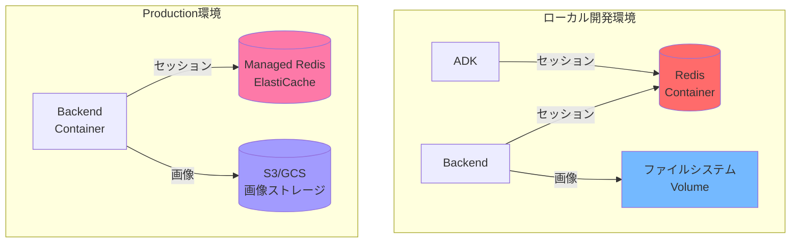

---

## 11. エラーハンドリングフロー

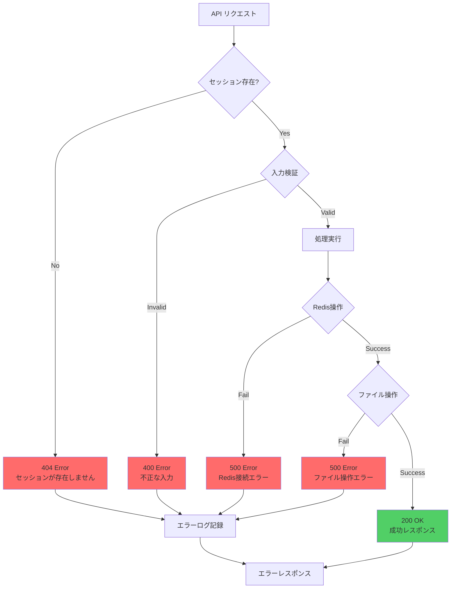

---

## 12. デプロイフロー

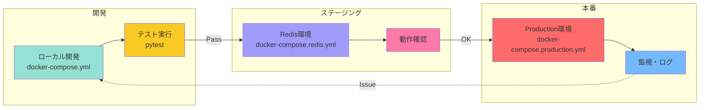

---

## 補足説明

### Redis キー構造
```
session:{session_id}:user_profile
session:{session_id}:conversation_history
session:{session_id}:family_conversation
session:{session_id}:family_trip_info
session:{session_id}:family_plan
session:{session_id}:_meta
session:{session_id}:meta:file:photos/{filename}  (Production)
```

### ファイルシステム構造
```
/app/tmp/user_sessions/
  ├── {session_id}/
  │   └── photos/
  │       ├── user.png
  │       ├── partner.png
  │       └── child_1.png
  └── ...
```

### 環境変数による動作切り替え
- `STORAGE_MODE=redis` → セッションはRedis、画像はローカル
- `STORAGE_MODE=cloud` → セッションはRedis、画像はS3/GCS
- `SESSION_TYPE=redis` → Redis使用
- `SESSION_TYPE=file` → ファイルベース（後方互換性）

---

このドキュメントは、実装されたシステムの動作を完全に表現しています。
