# Terraform アーキテクチャ図

**作成日**: 2025-10-28
**対象**: HeraプロジェクトのTerraform構成を視覚化

---

## 📋 目次

1. [Terraform全体構成](#1-terraform全体構成)
2. [モジュール構造](#2-モジュール構造)
3. [環境別デプロイフロー](#3-環境別デプロイフロー)
4. [AWSインフラ構成](#4-awsインフラ構成)
5. [Supabase管理フロー](#5-supabase管理フロー)
6. [CI/CDパイプライン](#6-cicdパイプライン)
7. [状態管理](#7-状態管理)
8. [開発フロー](#8-開発フロー)
9. [環境間の差異](#9-環境間の差異)
10. [コスト最適化フロー](#10-コスト最適化フロー)

---

## 1. Terraform全体構成

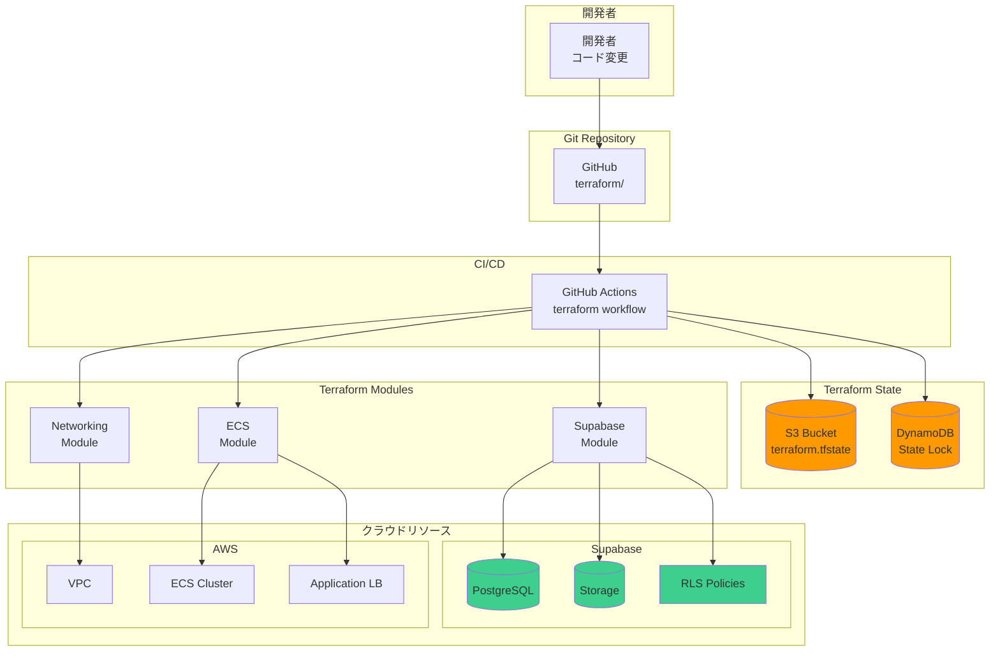

---

## 2. モジュール構造

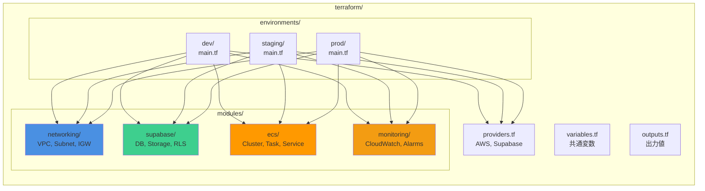

---

## 3. 環境別デプロイフロー

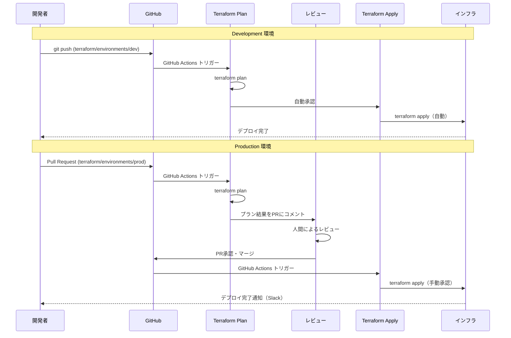

---

## 4. AWSインフラ構成

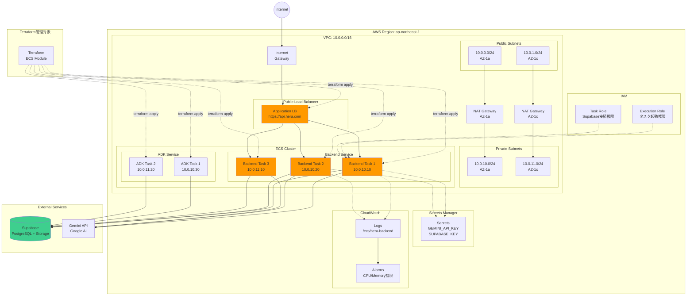

---

## 5. Supabase管理フロー

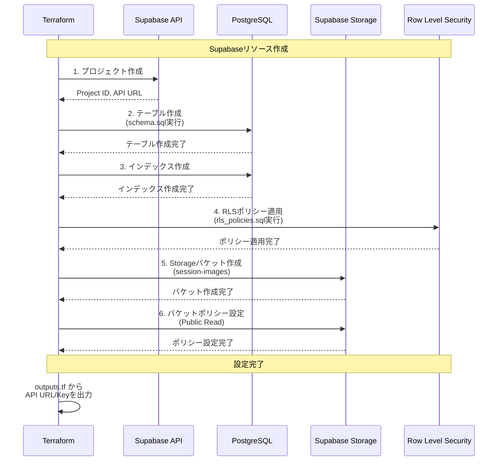

---

## 6. CI/CDパイプライン

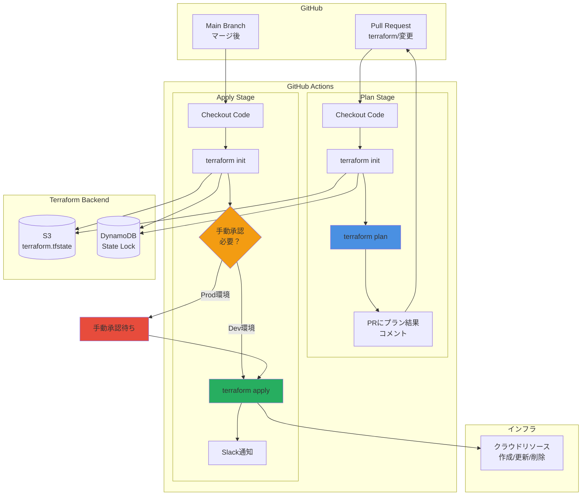

---

## 7. 状態管理

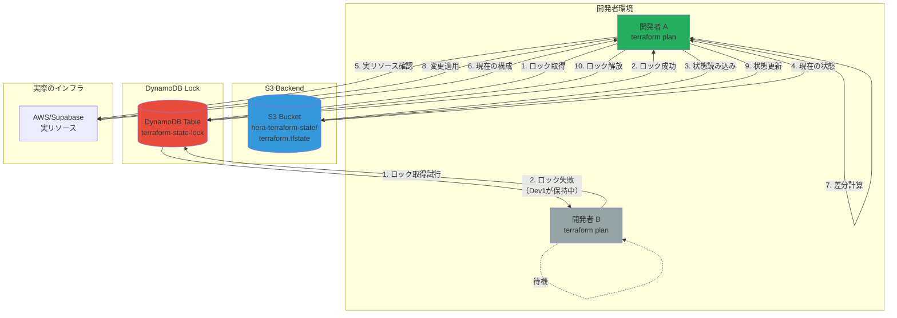

---

## 8. 開発フロー

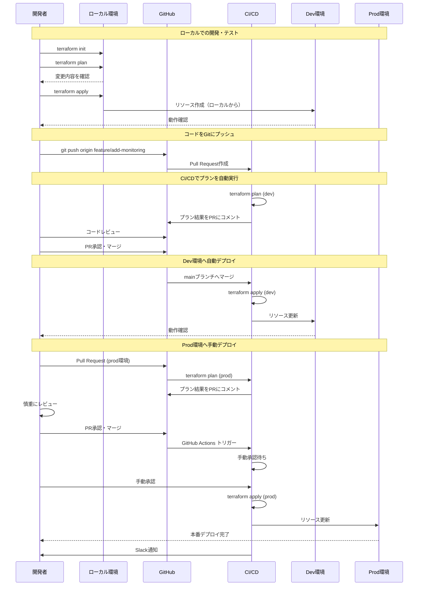

---

## 9. 環境間の差異

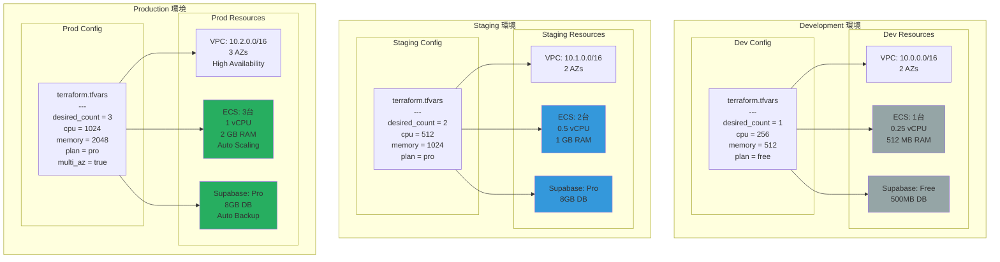

---

## 10. コスト最適化フロー

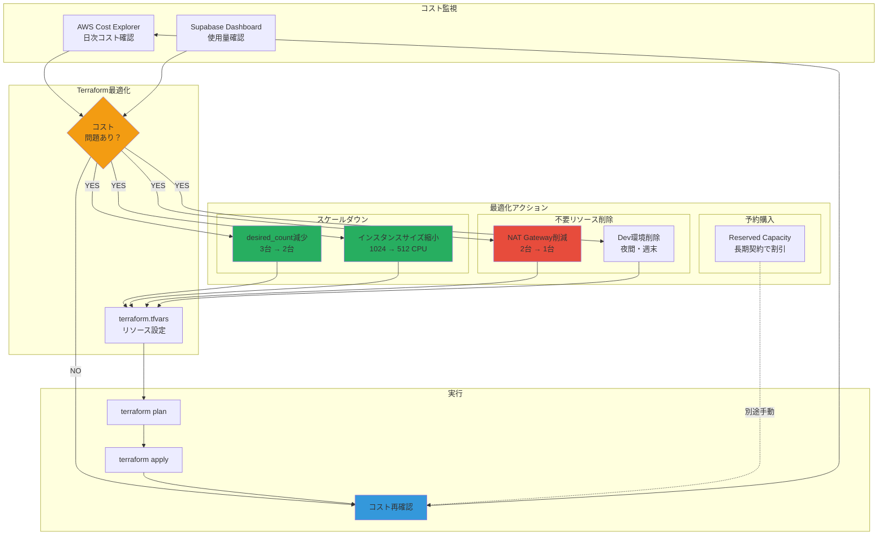

---

## 11. Terraformのメリット可視化

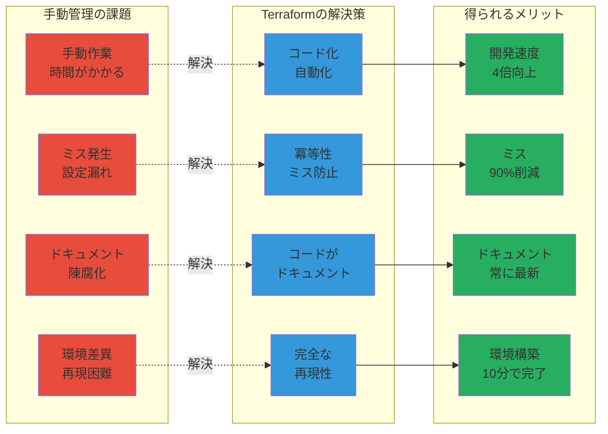

---

## 12. リソース依存関係グラフ

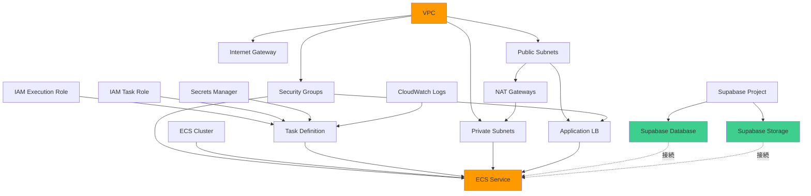

**Terraformが自動的に依存関係を解決し、正しい順序でリソースを作成します！**

---

## まとめ

### Terraformのメリット

1. **インフラのコード化**: 全ての設定がコードで管理される
2. **バージョン管理**: Gitで変更履歴を追跡
3. **環境の再現性**: 同じコードから同じ環境を再現
4. **変更の可視化**: `terraform plan` で事前確認
5. **チーム協業**: 状態管理とロック機構で安全に協業
6. **マルチクラウド**: AWS + Supabase を統一的に管理

### 推奨される使用ケース

- ✅ 複数環境の管理（dev/staging/prod）
- ✅ チーム開発
- ✅ 長期運用プロジェクト
- ✅ インフラの頻繁な変更
- ✅ コンプライアンス要件（監査証跡）

### 初期投資

- **セットアップ時間**: 18-26時間
- **学習コスト**: HCLの基本（2-3日）
- **運用コスト**: Terraform Cloud $20/月（オプション）

### 長期的なROI

- **開発速度**: 4倍向上
- **ミス削減**: 90%削減
- **運用工数**: 月10時間 → 月2時間

**Terraformは初期投資が必要ですが、長期的には大幅なコスト削減と品質向上を実現します。**
