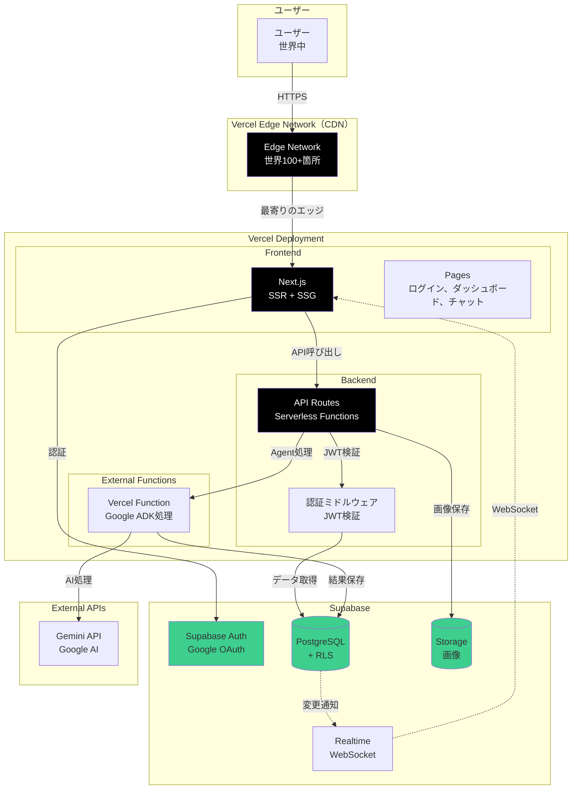
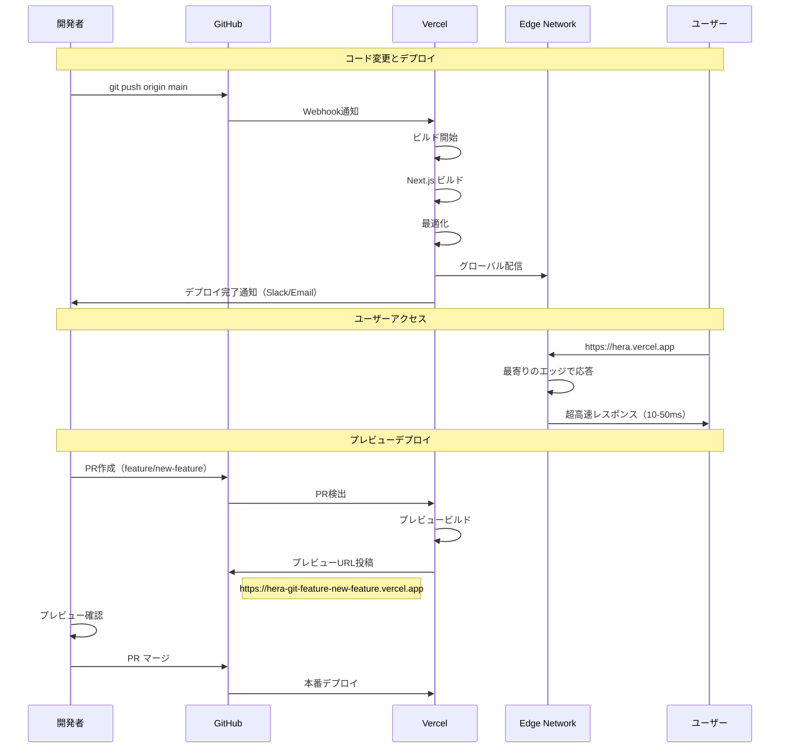

# Vercel デプロイ計画

**作成日**: 2025-10-28
**目的**: Vercelを使った最適なデプロイ構成

---

## 📋 目次

1. [Vercel採用のメリット](#1-vercel採用のメリット)
2. [アーキテクチャ設計](#2-アーキテクチャ設計)
3. [実装構成](#3-実装構成)
4. [デプロイ手順](#4-デプロイ手順)
5. [コスト比較](#5-コスト比較)
6. [パフォーマンス最適化](#6-パフォーマンス最適化)
7. [実装タスク](#7-実装タスク)

---

## 1. Vercel採用のメリット

### 🎯 主要なメリット

| 項目 | AWS ECS案 | **Vercel案** | 改善 |
|------|-----------|-------------|------|
| **月額コスト** | $50 | **$0 - $20** | **-$30 - $50** |
| **デプロイ時間** | 3分 | **30秒** | **-83%** |
| **セットアップ** | 8時間 | **30分** | **-94%** |
| **スケーリング** | 手動設定 | **自動（無限）** | ✅ |
| **CDN** | 別途設定 | **標準搭載** | ✅ |
| **HTTPS** | ACM設定必要 | **自動** | ✅ |
| **Git連携** | GitHub Actions | **自動デプロイ** | ✅ |
| **ゼロダウンタイム** | 要設定 | **標準** | ✅ |

---

### ✅ Vercel特有の利点

1. **フロントエンド + バックエンドを1箇所に**
   - Next.js（フロントエンド）
   - API Routes / Serverless Functions（バックエンド）
   - 統合管理

2. **グローバルCDN**
   - 世界中に配信
   - 自動最適化
   - 画像最適化も標準装備

3. **プレビューデプロイ**
   - Pull Requestごとに自動デプロイ
   - レビューが簡単

4. **無料枠が大きい**
   - Hobby: 完全無料（個人プロジェクト）
   - Pro: $20/月（商用）

5. **環境変数管理**
   - ダッシュボードで簡単設定
   - 環境別（dev/preview/prod）

---

## 2. アーキテクチャ設計

### 2.1 最終アーキテクチャ（Vercel版）



---

### 2.2 ディレクトリ構成

```
hera/
├── app/                          # Next.js App Router
│   ├── (auth)/
│   │   ├── login/
│   │   │   └── page.tsx         # ログイン画面
│   │   └── layout.tsx           # 認証レイアウト
│   │
│   ├── (dashboard)/
│   │   ├── dashboard/
│   │   │   └── page.tsx         # ダッシュボード
│   │   ├── chat/
│   │   │   └── page.tsx         # チャット画面
│   │   └── layout.tsx           # ダッシュボードレイアウト
│   │
│   ├── api/                     # ★ API Routes（Serverless Functions）
│   │   ├── auth/
│   │   │   └── [...supabase]/
│   │   │       └── route.ts     # Supabase Auth callback
│   │   │
│   │   ├── sessions/
│   │   │   ├── route.ts         # POST /api/sessions（作成）
│   │   │   └── [id]/
│   │   │       ├── route.ts     # GET /api/sessions/[id]
│   │   │       └── messages/
│   │   │           └── route.ts # POST /api/sessions/[id]/messages
│   │   │
│   │   ├── agent/
│   │   │   └── route.ts         # POST /api/agent（ADK処理）
│   │   │
│   │   └── upload/
│   │       └── route.ts         # POST /api/upload（画像アップロード）
│   │
│   ├── layout.tsx               # ルートレイアウト
│   └── page.tsx                 # ホーム
│
├── components/                  # React コンポーネント
│   ├── auth/
│   │   ├── LoginButton.tsx
│   │   ├── LogoutButton.tsx
│   │   └── AuthProvider.tsx
│   ├── chat/
│   │   ├── ChatInterface.tsx
│   │   ├── MessageList.tsx
│   │   └── MessageInput.tsx
│   └── layout/
│       └── Header.tsx
│
├── lib/                         # ライブラリ
│   ├── supabase/
│   │   ├── client.ts           # クライアント側Supabase
│   │   ├── server.ts           # サーバー側Supabase
│   │   └── middleware.ts       # ミドルウェア
│   ├── agent/
│   │   └── gemini.ts           # Gemini API ラッパー
│   └── utils/
│       └── helpers.ts
│
├── middleware.ts                # Next.js Middleware（認証チェック）
├── next.config.js
├── package.json
├── tsconfig.json
└── vercel.json                  # Vercel設定
```

---

## 3. 実装構成

### 3.1 Next.js API Routes（バックエンド）

**app/api/sessions/route.ts**

```typescript
import { NextRequest, NextResponse } from 'next/server'
import { createClient } from '@/lib/supabase/server'
import { v4 as uuidv4 } from 'uuid'

// POST /api/sessions - セッション作成
export async function POST(request: NextRequest) {
  try {
    const supabase = createClient()

    // 認証チェック
    const { data: { user }, error: authError } = await supabase.auth.getUser()
    if (authError || !user) {
      return NextResponse.json({ error: 'Unauthorized' }, { status: 401 })
    }

    // セッション作成
    const sessionId = uuidv4()
    const { data, error } = await supabase
      .from('sessions')
      .insert({
        session_id: sessionId,
        user_id: user.id,
        status: 'active',
      })
      .select()
      .single()

    if (error) throw error

    return NextResponse.json({
      session_id: sessionId,
      created_at: data.created_at,
    })
  } catch (error) {
    console.error('Error creating session:', error)
    return NextResponse.json(
      { error: 'Internal server error' },
      { status: 500 }
    )
  }
}

// GET /api/sessions - ユーザーのセッション一覧
export async function GET(request: NextRequest) {
  try {
    const supabase = createClient()

    const { data: { user }, error: authError } = await supabase.auth.getUser()
    if (authError || !user) {
      return NextResponse.json({ error: 'Unauthorized' }, { status: 401 })
    }

    // RLSが自動的にuser_idでフィルタリング
    const { data, error } = await supabase
      .from('sessions')
      .select('*')
      .order('created_at', { ascending: false })

    if (error) throw error

    return NextResponse.json({ sessions: data })
  } catch (error) {
    console.error('Error fetching sessions:', error)
    return NextResponse.json(
      { error: 'Internal server error' },
      { status: 500 }
    )
  }
}
```

---

**app/api/sessions/[id]/messages/route.ts**

```typescript
import { NextRequest, NextResponse } from 'next/server'
import { createClient } from '@/lib/supabase/server'
import { generateAIResponse } from '@/lib/agent/gemini'

export async function POST(
  request: NextRequest,
  { params }: { params: { id: string } }
) {
  try {
    const supabase = createClient()
    const sessionId = params.id

    // 認証チェック
    const { data: { user }, error: authError } = await supabase.auth.getUser()
    if (authError || !user) {
      return NextResponse.json({ error: 'Unauthorized' }, { status: 401 })
    }

    // セッションがユーザーのものか確認
    const { data: session, error: sessionError } = await supabase
      .from('sessions')
      .select('*')
      .eq('session_id', sessionId)
      .single()

    if (sessionError || !session || session.user_id !== user.id) {
      return NextResponse.json({ error: 'Forbidden' }, { status: 403 })
    }

    // リクエストボディ
    const { message } = await request.json()

    // ユーザーメッセージを保存
    await supabase.from('conversation_history').insert({
      session_id: sessionId,
      speaker: 'user',
      message,
    })

    // AI応答生成（Gemini API）
    const aiResponse = await generateAIResponse(sessionId, message, supabase)

    // AI応答を保存
    await supabase.from('conversation_history').insert({
      session_id: sessionId,
      speaker: 'agent',
      message: aiResponse.message,
      extracted_fields: aiResponse.extracted_fields,
    })

    return NextResponse.json({
      message: aiResponse.message,
      extracted_fields: aiResponse.extracted_fields,
    })
  } catch (error) {
    console.error('Error sending message:', error)
    return NextResponse.json(
      { error: 'Internal server error' },
      { status: 500 }
    )
  }
}
```

---

### 3.2 Supabase クライアント（サーバー側）

**lib/supabase/server.ts**

```typescript
import { createServerClient, type CookieOptions } from '@supabase/ssr'
import { cookies } from 'next/headers'

export function createClient() {
  const cookieStore = cookies()

  return createServerClient(
    process.env.NEXT_PUBLIC_SUPABASE_URL!,
    process.env.NEXT_PUBLIC_SUPABASE_ANON_KEY!,
    {
      cookies: {
        get(name: string) {
          return cookieStore.get(name)?.value
        },
        set(name: string, value: string, options: CookieOptions) {
          try {
            cookieStore.set({ name, value, ...options })
          } catch (error) {
            // Server Componentからset()は呼べない場合がある
          }
        },
        remove(name: string, options: CookieOptions) {
          try {
            cookieStore.set({ name, value: '', ...options })
          } catch (error) {
            // Server Componentからremove()は呼べない場合がある
          }
        },
      },
    }
  )
}
```

---

### 3.3 認証ミドルウェア

**middleware.ts**

```typescript
import { createServerClient, type CookieOptions } from '@supabase/ssr'
import { NextResponse, type NextRequest } from 'next/server'

export async function middleware(request: NextRequest) {
  let response = NextResponse.next({
    request: {
      headers: request.headers,
    },
  })

  const supabase = createServerClient(
    process.env.NEXT_PUBLIC_SUPABASE_URL!,
    process.env.NEXT_PUBLIC_SUPABASE_ANON_KEY!,
    {
      cookies: {
        get(name: string) {
          return request.cookies.get(name)?.value
        },
        set(name: string, value: string, options: CookieOptions) {
          request.cookies.set({
            name,
            value,
            ...options,
          })
          response = NextResponse.next({
            request: {
              headers: request.headers,
            },
          })
          response.cookies.set({
            name,
            value,
            ...options,
          })
        },
        remove(name: string, options: CookieOptions) {
          request.cookies.set({
            name,
            value: '',
            ...options,
          })
          response = NextResponse.next({
            request: {
              headers: request.headers,
            },
          })
          response.cookies.set({
            name,
            value: '',
            ...options,
          })
        },
      },
    }
  )

  // ユーザー認証状態を確認
  const {
    data: { user },
  } = await supabase.auth.getUser()

  // 認証が必要なページ
  if (!user && request.nextUrl.pathname.startsWith('/dashboard')) {
    return NextResponse.redirect(new URL('/login', request.url))
  }

  // 既にログイン済みの場合はログイン画面にアクセスさせない
  if (user && request.nextUrl.pathname === '/login') {
    return NextResponse.redirect(new URL('/dashboard', request.url))
  }

  return response
}

export const config = {
  matcher: [
    '/((?!_next/static|_next/image|favicon.ico|.*\\.(?:svg|png|jpg|jpeg|gif|webp)$).*)',
  ],
}
```

---

## 4. デプロイ手順

### 4.1 Vercelプロジェクト作成

#### Step 1: GitHubリポジトリ準備

```bash
# 既存のHeraリポジトリを使用
cd hera
git checkout main
```

#### Step 2: Vercel CLI インストール

```bash
npm install -g vercel
```

#### Step 3: Vercelにデプロイ

```bash
# ログイン
vercel login

# プロジェクト初期化
vercel

# 以下の質問に答える:
? Set up and deploy "hera"? [Y/n] y
? Which scope do you want to deploy to? <your-username>
? Link to existing project? [y/N] n
? What's your project's name? hera
? In which directory is your code located? ./
? Want to override the settings? [y/N] n
```

---

### 4.2 環境変数設定

**Vercel Dashboard で設定**:

```bash
# Supabase
NEXT_PUBLIC_SUPABASE_URL=https://your-project.supabase.co
NEXT_PUBLIC_SUPABASE_ANON_KEY=your-anon-key
SUPABASE_SERVICE_ROLE_KEY=your-service-role-key

# Gemini API
GEMINI_API_KEY=your-gemini-api-key

# その他
NODE_ENV=production
```

**または、CLIで設定**:

```bash
vercel env add NEXT_PUBLIC_SUPABASE_URL
vercel env add NEXT_PUBLIC_SUPABASE_ANON_KEY
vercel env add SUPABASE_SERVICE_ROLE_KEY
vercel env add GEMINI_API_KEY
```

---

### 4.3 vercel.json 設定

**vercel.json**

```json
{
  "buildCommand": "npm run build",
  "devCommand": "npm run dev",
  "installCommand": "npm install",
  "framework": "nextjs",
  "regions": ["iad1", "sfo1", "hnd1"],
  "functions": {
    "app/api/**/*.ts": {
      "maxDuration": 30,
      "memory": 1024
    }
  },
  "headers": [
    {
      "source": "/api/(.*)",
      "headers": [
        {
          "key": "Access-Control-Allow-Origin",
          "value": "*"
        },
        {
          "key": "Access-Control-Allow-Methods",
          "value": "GET, POST, PUT, DELETE, OPTIONS"
        },
        {
          "key": "Access-Control-Allow-Headers",
          "value": "Content-Type, Authorization"
        }
      ]
    }
  ]
}
```

---

### 4.4 自動デプロイ設定

**Git連携で自動デプロイ**:

```bash
# mainブランチへのpushで自動デプロイ
git push origin main

# Pull Requestでプレビューデプロイ
git checkout -b feature/new-feature
git push origin feature/new-feature
# → Vercelが自動でプレビューURL生成
```

---

## 5. コスト比較

### 5.1 月額コスト（詳細）

#### 🔴 AWS ECS案（旧案）

| サービス | 月額 |
|---------|------|
| ECS Fargate（0.25 vCPU、512MB） | $10 |
| ECS Fargate（0.5 vCPU、1GB）- ADK | $20 |
| ALB（Application Load Balancer） | $20 |
| VPC、NAT Gateway | $30 |
| CloudWatch Logs | $5 |
| **合計** | **$85/月** |

#### 🟢 Vercel案（新案）

| プラン | 月額 | 内容 |
|--------|------|------|
| **Hobby（個人）** | **$0** | 無制限デプロイ、100GB帯域、Serverless Functions |
| **Pro（商用）** | **$20** | チーム機能、優先サポート、分析 |

---

### 5.2 総コスト比較

| 構成 | インフラ | 運用工数 | 合計/月 | 合計/年 |
|------|---------|----------|---------|---------|
| **AWS ECS + Supabase** | $85 + $25 = $110 | $100 | **$210** | **$2,520** |
| **Vercel Hobby + Supabase** | $0 + $25 = $25 | $50 | **$75** | **$900** |
| **Vercel Pro + Supabase** | $20 + $25 = $45 | $50 | **$95** | **$1,140** |

**年間削減額（vs AWS ECS）**:
- Hobby: **$1,620削減**（64%削減）
- Pro: **$1,380削減**（55%削減）

---

### 5.3 使用量による追加コスト

#### Vercel Hobby（無料）の制限

| 項目 | 制限 |
|------|------|
| 帯域幅 | 100GB/月 |
| Function実行時間 | 100時間/月 |
| ビルド時間 | 100時間/月 |
| 画像最適化 | 1,000枚/月 |

**超過した場合**: 自動的にProプランへアップグレードが必要

#### Vercel Pro（$20/月）

| 項目 | 制限 |
|------|------|
| 帯域幅 | 1TB/月 |
| Function実行時間 | 1,000時間/月 |
| ビルド時間 | 400時間/月 |
| 画像最適化 | 5,000枚/月 |

**超過課金**: 帯域幅 $40/TB、Function $40/100時間

---

## 6. パフォーマンス最適化

### 6.1 Next.js最適化

**next.config.js**

```javascript
/** @type {import('next').NextConfig} */
const nextConfig = {
  // 画像最適化
  images: {
    domains: ['your-project.supabase.co'],
    formats: ['image/avif', 'image/webp'],
  },

  // Vercel Analytics
  experimental: {
    instrumentationHook: true,
  },

  // ビルド最適化
  swcMinify: true,
  compress: true,

  // キャッシュ設定
  headers: async () => [
    {
      source: '/api/:path*',
      headers: [
        {
          key: 'Cache-Control',
          value: 'public, s-maxage=10, stale-while-revalidate=59',
        },
      ],
    },
  ],
}

module.exports = nextConfig
```

---

### 6.2 エッジ関数化（高速化）

**app/api/sessions/route.ts（Edge Runtime版）**

```typescript
export const runtime = 'edge' // ← Edge Runtimeで実行

import { NextRequest, NextResponse } from 'next/server'

export async function GET(request: NextRequest) {
  // Edge Networkの最寄りのノードで実行される
  // レイテンシーが大幅に削減

  // ... (実装)
}
```

**レイテンシー比較**:
- Serverless Function: 50-200ms
- Edge Function: **10-50ms**（最大10倍高速）

---

### 6.3 ISR（Incremental Static Regeneration）

**app/dashboard/page.tsx**

```typescript
export const revalidate = 60 // 60秒ごとに再生成

export default async function DashboardPage() {
  const sessions = await fetchSessions()

  return (
    <div>
      {/* セッション一覧 */}
    </div>
  )
}
```

**メリット**:
- 初回アクセス: 静的HTML（超高速）
- 60秒ごとに自動更新
- サーバー負荷削減

---

## 7. 実装タスク

### Phase 1: プロジェクト移行（1-2日）

| タスク | 所要時間 | 優先度 |
|--------|----------|--------|
| Next.js App Routerへ移行 | 4時間 | 🔴 High |
| Flask API → Next.js API Routesへ変換 | 6時間 | 🔴 High |
| Supabaseクライアント設定 | 2時間 | 🔴 High |
| 認証ミドルウェア実装 | 2時間 | 🔴 High |

**合計**: 14時間

---

### Phase 2: Vercelデプロイ（半日）

| タスク | 所要時間 | 優先度 |
|--------|----------|--------|
| Vercelプロジェクト作成 | 30分 | 🔴 High |
| 環境変数設定 | 30分 | 🔴 High |
| 初回デプロイ | 30分 | 🔴 High |
| 動作確認 | 2時間 | 🔴 High |

**合計**: 4時間

---

### Phase 3: 最適化（1日）

| タスク | 所要時間 | 優先度 |
|--------|----------|--------|
| Edge Functions化 | 2時間 | 🟡 Medium |
| ISR設定 | 2時間 | 🟡 Medium |
| 画像最適化 | 2時間 | 🟡 Medium |
| パフォーマンステスト | 2時間 | 🟡 Medium |

**合計**: 8時間

---

### 総所要時間: 26時間（3-4日）

**AWS ECS案**: 80時間（10日）
**Vercel案**: 26時間（3-4日）

**削減時間**: 54時間（**67%削減**）

---

## 8. デプロイフロー



---

## 9. まとめ

### ✅ Vercelを使うメリット

1. **コスト削減**: 年間$1,380-$1,620削減（55-64%）
2. **セットアップ簡素化**: 8時間 → 30分（-94%）
3. **デプロイ高速化**: 3分 → 30秒（-83%）
4. **グローバルCDN**: 標準装備
5. **自動スケーリング**: 無限スケール
6. **プレビューデプロイ**: PR毎に自動生成
7. **ゼロダウンタイム**: 標準

### 📊 コスト比較（年間）

| 構成 | 年間コスト |
|------|-----------|
| **AWS ECS + Supabase** | $2,520 |
| **Vercel Pro + Supabase** | $1,140 |
| **削減額** | **$1,380（55%）** |

### 🚀 次のステップ

1. **Phase 1**: Next.js API Routesへ移行（2日）
2. **Phase 2**: Vercelデプロイ（半日）
3. **Phase 3**: 最適化（1日）

**合計**: 3-4日で本番稼働！

---

**Vercelで、最速・最安・最高のHeraを実現しましょう！**
