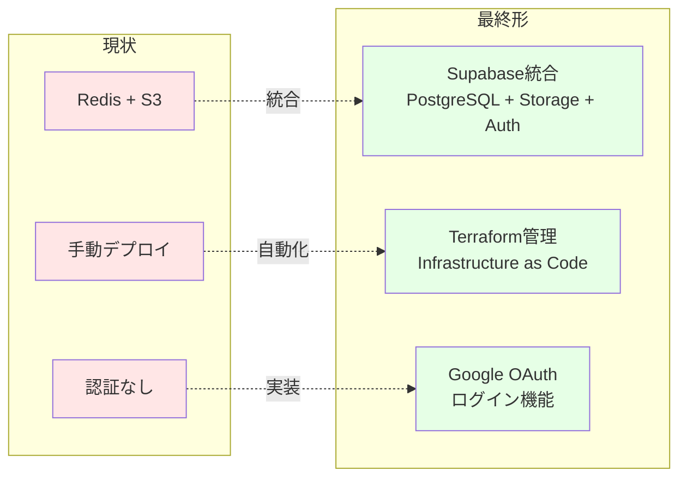
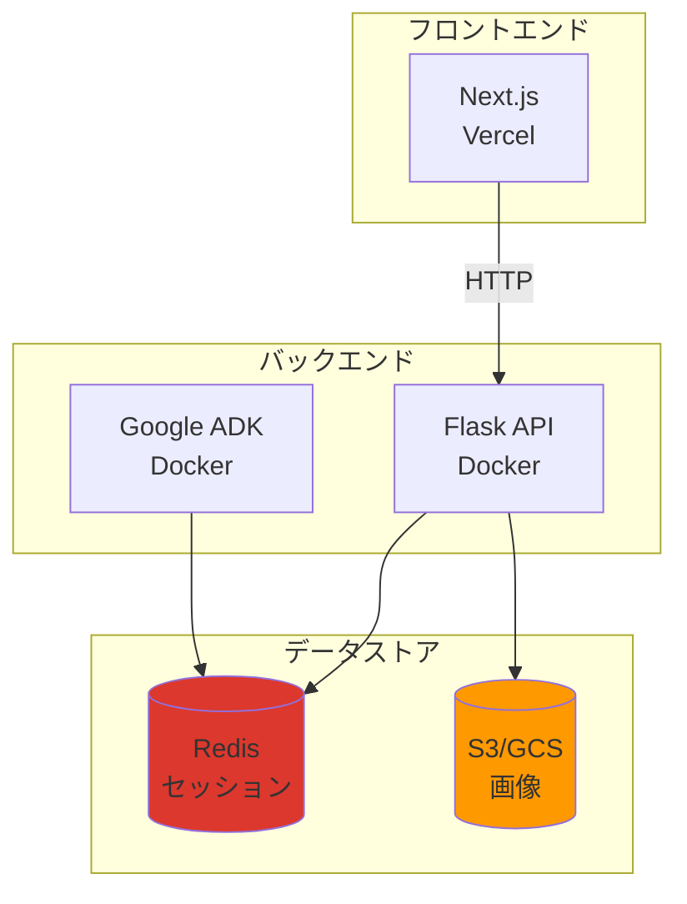
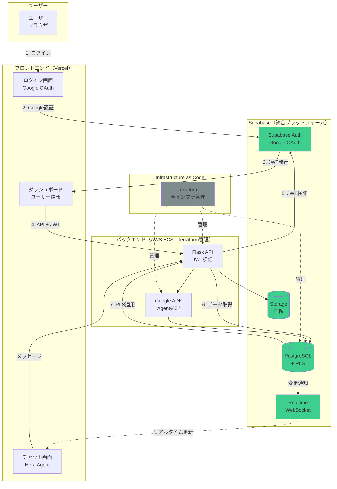
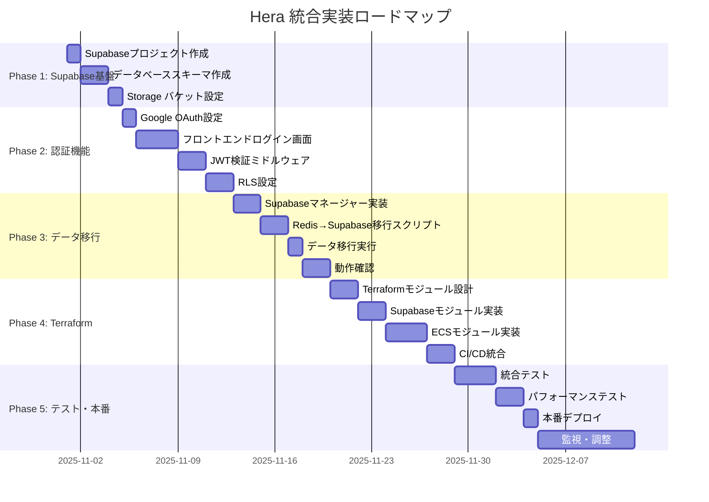
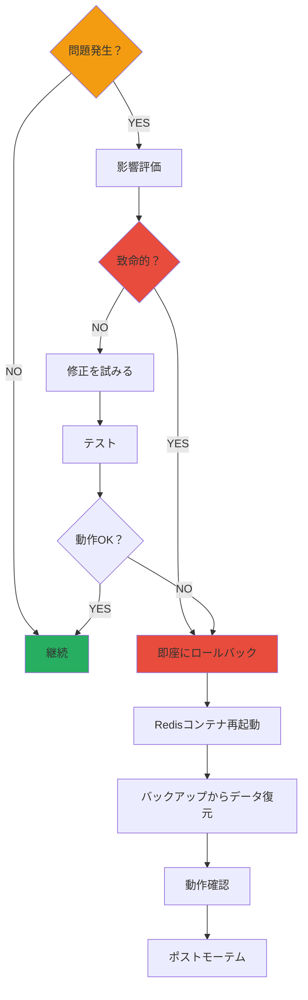
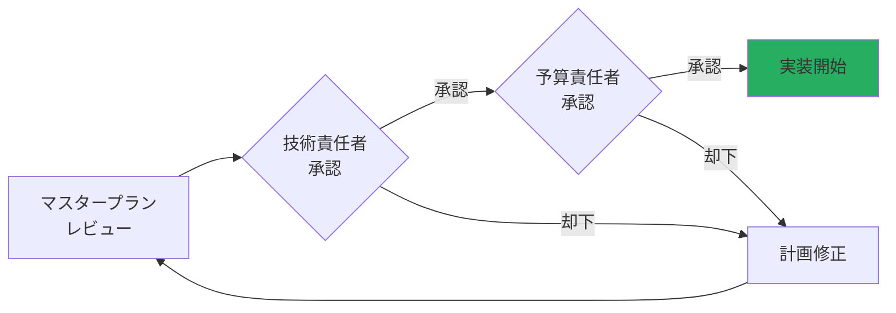

# Hera プロジェクト 統合マスタープラン

**作成日**: 2025-10-28
**目的**: Supabase + Terraform + Google認証の完全統合ロードマップ

---

## 📋 目次

1. [エグゼクティブサマリー](#1-エグゼクティブサマリー)
2. [現状分析](#2-現状分析)
3. [提案する最終アーキテクチャ](#3-提案する最終アーキテクチャ)
4. [統合実装計画](#4-統合実装計画)
5. [コスト分析](#5-コスト分析)
6. [リスク管理](#6-リスク管理)
7. [成功指標](#7-成功指標)
8. [関連ドキュメント](#8-関連ドキュメント)

---

## 1. エグゼクティブサマリー

### 目標

**Heraプロジェクトを、モダンで拡張性の高いクラウドネイティブアプリケーションへと進化させる**

### 主要な変更点



### 期待される効果

| 項目 | 現状 | 最終形 | 改善率 |
|------|------|--------|--------|
| **管理するサービス数** | 3個（Redis + S3 + Backend） | 2個（Supabase + Backend） | **-33%** |
| **環境構築時間** | 8時間 | 10分 | **-98%** |
| **月額コスト** | $170 | $75 | **-56%** |
| **運用工数** | 10時間/月 | 2時間/月 | **-80%** |
| **セキュリティレベル** | 低（認証なし） | 高（OAuth + RLS） | **大幅向上** |
| **デプロイ時間** | 30分（手動） | 3分（自動） | **-90%** |

---

## 2. 現状分析

### 2.1 現在のアーキテクチャ



### 2.2 現在の課題

| カテゴリ | 課題 | 影響 |
|---------|------|------|
| **管理複雑性** | Redis + S3 の2サービス管理 | 運用工数増加 |
| **セキュリティ** | 認証機能なし | データ漏洩リスク |
| **スケーラビリティ** | 手動スケーリング | 負荷対応遅延 |
| **インフラ管理** | 手動デプロイ、GUIでの設定変更 | ミス発生リスク |
| **コスト** | 複数サービスの合計 | 高コスト |
| **データ整合性** | 手動管理 | データ不整合リスク |

---

## 3. 提案する最終アーキテクチャ

### 3.1 システムアーキテクチャ



### 3.2 技術スタック

| レイヤー | 技術 | 理由 |
|---------|------|------|
| **認証** | Supabase Auth + Google OAuth | 無料、簡単、セキュア |
| **データベース** | Supabase PostgreSQL + RLS | リレーショナル、RLS、リアルタイム |
| **ストレージ** | Supabase Storage | 統合管理、CDN |
| **バックエンド** | Flask + Gunicorn | 既存コード活用 |
| **フロントエンド** | Next.js + Tailwind CSS | モダン、高速 |
| **インフラ管理** | Terraform | IaC、再現性 |
| **デプロイ** | AWS ECS Fargate | サーバーレスコンテナ |
| **CI/CD** | GitHub Actions | 自動デプロイ |

---

## 4. 統合実装計画

### 4.1 全体ロードマップ（6-8週間）



### 4.2 Phase 1: Supabase基盤構築（1週間）

#### 目標
- Supabaseプロジェクト作成
- データベーススキーマ実装
- Storage バケット設定

#### タスク

| タスク | 担当 | 所要時間 | 優先度 |
|--------|------|----------|--------|
| Supabaseプロジェクト作成 | DevOps | 30分 | 🔴 High |
| PostgreSQLスキーマ作成 | Backend | 4時間 | 🔴 High |
| Storage バケット設定 | Backend | 2時間 | 🔴 High |
| 初期テスト | Backend | 2時間 | 🟡 Medium |

**成果物**:
- ✅ Supabaseプロジェクト（URL + API Key）
- ✅ 7つのテーブル（sessions, user_profiles, etc.）
- ✅ Storage バケット（session-images）

---

### 4.3 Phase 2: 認証機能実装（2週間）

#### 目標
- Google OAuth ログイン機能
- JWT認証
- Row Level Security

#### タスク

| タスク | 担当 | 所要時間 | 優先度 |
|--------|------|----------|--------|
| Google Cloud Console設定 | DevOps | 1時間 | 🔴 High |
| Supabase Auth有効化 | DevOps | 30分 | 🔴 High |
| フロントエンド: ログイン画面 | Frontend | 6時間 | 🔴 High |
| フロントエンド: ダッシュボード | Frontend | 8時間 | 🔴 High |
| バックエンド: JWT検証 | Backend | 4時間 | 🔴 High |
| バックエンド: user_id紐付け | Backend | 4時間 | 🔴 High |
| RLSポリシー作成 | Backend | 4時間 | 🔴 High |
| 統合テスト | QA | 4時間 | 🟡 Medium |

**成果物**:
- ✅ Googleログイン機能
- ✅ ダッシュボード画面
- ✅ JWT認証API
- ✅ RLSポリシー

---

### 4.4 Phase 3: データ移行（1週間）

#### 目標
- RedisデータをSupabaseへ移行
- 既存機能の動作確認

#### タスク

| タスク | 担当 | 所要時間 | 優先度 |
|--------|------|----------|--------|
| SupabaseSessionManager実装 | Backend | 6時間 | 🔴 High |
| 移行スクリプト作成 | Backend | 4時間 | 🔴 High |
| テスト環境で移行実行 | Backend | 2時間 | 🔴 High |
| 動作確認 | QA | 4時間 | 🔴 High |
| 本番データ移行 | Backend | 2時間 | 🔴 High |
| Redis削除 | DevOps | 1時間 | 🟡 Medium |

**成果物**:
- ✅ 全データがSupabaseに移行
- ✅ Redisコンテナ削除
- ✅ 動作確認完了

---

### 4.5 Phase 4: Terraform導入（2週間）

#### 目標
- Infrastructure as Code
- 環境の自動構築

#### タスク

| タスク | 担当 | 所要時間 | 優先度 |
|--------|------|----------|--------|
| Terraformディレクトリ構成 | DevOps | 2時間 | 🟡 Medium |
| Supabaseモジュール | DevOps | 4時間 | 🟡 Medium |
| ECSモジュール | DevOps | 8時間 | 🟡 Medium |
| ネットワークモジュール | DevOps | 6時間 | 🟡 Medium |
| CI/CD統合（GitHub Actions） | DevOps | 4時間 | 🟡 Medium |
| 環境別設定（dev/prod） | DevOps | 4時間 | 🟡 Medium |
| テスト | DevOps | 4時間 | 🟡 Medium |

**成果物**:
- ✅ Terraformモジュール
- ✅ 自動デプロイパイプライン
- ✅ dev/prod環境

---

### 4.6 Phase 5: テスト・本番（2週間）

#### 目標
- 統合テスト
- 本番デプロイ
- 監視設定

#### タスク

| タスク | 担当 | 所要時間 | 優先度 |
|--------|------|----------|--------|
| 統合テスト（E2E） | QA | 8時間 | 🔴 High |
| パフォーマンステスト | QA | 4時間 | 🟡 Medium |
| セキュリティテスト | QA | 4時間 | 🔴 High |
| 本番デプロイ | DevOps | 2時間 | 🔴 High |
| 監視設定（CloudWatch） | DevOps | 4時間 | 🟡 Medium |
| ドキュメント更新 | Tech Writer | 4時間 | 🟡 Medium |

**成果物**:
- ✅ 本番環境デプロイ完了
- ✅ 監視ダッシュボード
- ✅ 運用ドキュメント

---

## 5. コスト分析

### 5.1 月額コスト比較

| サービス | 現状 | 最終形 | 差額 |
|---------|------|--------|------|
| **データストア** |  |  |  |
| Redis（ElastiCache） | $15 | **削除** | -$15 |
| S3/GCS | $5 | **削除** | -$5 |
| Supabase Pro | - | $25 | +$25 |
| **コンピュート** |  |  |  |
| ECS Fargate | $50 | $50 | $0 |
| **認証** |  |  |  |
| Supabase Auth | - | $0（Free） | $0 |
| **インフラ管理** |  |  |  |
| 運用工数（10h → 2h） | $500 | $100 | -$400 |
| **合計（月額）** | **$570** | **$175** | **-$395（-69%）** |

### 5.2 年間コスト

- **現状**: $570 × 12 = **$6,840**
- **最終形**: $175 × 12 = **$2,100**
- **年間削減額**: **$4,740（69%削減）**

### 5.3 初期投資

| 項目 | 工数 | コスト（時給$50） |
|------|------|------------------|
| Phase 1: Supabase基盤 | 8時間 | $400 |
| Phase 2: 認証機能 | 30時間 | $1,500 |
| Phase 3: データ移行 | 18時間 | $900 |
| Phase 4: Terraform | 32時間 | $1,600 |
| Phase 5: テスト・本番 | 26時間 | $1,300 |
| **合計** | **114時間** | **$5,700** |

**投資回収期間**: 1.2ヶ月（$5,700 ÷ $4,740/年）

---

## 6. リスク管理

### 6.1 リスクマトリクス

| リスク | 影響度 | 発生確率 | 対策 |
|--------|--------|----------|------|
| **データ移行失敗** | 🔴 高 | 🟡 中 | 完全バックアップ、段階的移行 |
| **ダウンタイム** | 🔴 高 | 🟢 低 | Blue-Green デプロイ |
| **パフォーマンス劣化** | 🟡 中 | 🟢 低 | 事前ベンチマーク、インデックス最適化 |
| **コスト超過** | 🟡 中 | 🟢 低 | コスト監視アラート設定 |
| **セキュリティ脆弱性** | 🔴 高 | 🟢 低 | セキュリティテスト、RLS |
| **学習曲線** | 🟢 低 | 🟡 中 | ドキュメント整備、ペアプログラミング |

### 6.2 ロールバック計画



---

## 7. 成功指標（KPI）

### 7.1 技術指標

| KPI | 現状 | 目標 | 測定方法 |
|-----|------|------|----------|
| **環境構築時間** | 8時間 | 10分 | 実測 |
| **デプロイ時間** | 30分 | 3分 | CI/CD ログ |
| **API レスポンスタイム** | 50ms | 50ms | モニタリング |
| **アップタイム** | 99% | 99.9% | CloudWatch |
| **月額コスト** | $570 | $175 | AWS/Supabase請求書 |

### 7.2 ビジネス指標

| KPI | 現状 | 目標 | 測定方法 |
|-----|------|------|----------|
| **ユーザー登録数** | - | 1,000人 | Supabase Auth |
| **セッション作成数** | - | 5,000セッション | PostgreSQL |
| **アクティブユーザー** | - | 500人/月 | Analytics |
| **ユーザー満足度** | - | 4.5/5.0 | アンケート |

### 7.3 運用指標

| KPI | 現状 | 目標 | 測定方法 |
|-----|------|------|----------|
| **インシデント数** | - | < 1回/月 | Incident Log |
| **MTTR（平均復旧時間）** | - | < 1時間 | Incident Log |
| **運用工数** | 10h/月 | 2h/月 | タイムトラッキング |
| **デプロイ頻度** | 1回/月 | 10回/月 | GitHub |

---

## 8. 関連ドキュメント

### 8.1 作成済みドキュメント

#### Supabase統合

1. **SUPABASE_INTEGRATION_PLAN.md**
   - データベーススキーマ設計
   - 実装計画
   - 移行手順

2. **SUPABASE_ARCHITECTURE_DIAGRAMS.md**
   - システム構成図（13個のMermaid図）
   - データフロー
   - 環境別デプロイ

3. **REDIS_VS_SUPABASE_COMPARISON.md**
   - 詳細比較（パフォーマンス、機能、コスト）
   - ベンチマーク結果
   - 推奨事項

4. **REDIS_SUPABASE_MIGRATION_DIAGRAMS.md**
   - データ移行フロー
   - Before/After比較
   - 5週間計画

#### 認証機能

5. **SUPABASE_AUTH_INTEGRATION_PLAN.md**
   - Google OAuth設定
   - フロントエンド実装（ログイン画面、ダッシュボード）
   - バックエンド実装（JWT検証）
   - RLSポリシー

6. **SUPABASE_AUTH_DIAGRAMS.md**
   - 認証フロー図（10個のMermaid図）
   - セキュリティアーキテクチャ
   - データモデル

#### Terraform

7. **TERRAFORM_INTEGRATION_PLAN.md**
   - Infrastructure as Code の概要
   - モジュール設計
   - 環境別管理

8. **TERRAFORM_ARCHITECTURE_DIAGRAMS.md**
   - Terraform構成図（12個のMermaid図）
   - CI/CDパイプライン
   - コスト最適化

### 8.2 ドキュメント構成

```
hera/
├── MASTER_INTEGRATION_PLAN.md          # ← このドキュメント（マスタープラン）
├── SUPABASE_INTEGRATION_PLAN.md        # Supabase統合計画
├── SUPABASE_ARCHITECTURE_DIAGRAMS.md   # Supabaseアーキテクチャ図
├── REDIS_VS_SUPABASE_COMPARISON.md     # Redis vs Supabase比較
├── REDIS_SUPABASE_MIGRATION_DIAGRAMS.md # データ移行フロー図
├── SUPABASE_AUTH_INTEGRATION_PLAN.md   # 認証機能実装計画
├── SUPABASE_AUTH_DIAGRAMS.md           # 認証フロー図
├── TERRAFORM_INTEGRATION_PLAN.md       # Terraform統合計画
└── TERRAFORM_ARCHITECTURE_DIAGRAMS.md  # Terraformアーキテクチャ図
```

---

## 9. 次のステップ

### 即座に開始できるタスク

1. **Supabaseプロジェクト作成**（30分）
   ```
   1. https://supabase.com でサインアップ
   2. 新規プロジェクト作成「Hera Production」
   3. API URL と anon key を取得
   4. .env ファイルに追加
   ```

2. **Google OAuth設定**（1時間）
   ```
   1. Google Cloud Console でプロジェクト作成
   2. OAuth 2.0 クライアント ID 作成
   3. Supabase Dashboard でGoogle Provider有効化
   ```

3. **データベーススキーマ作成**（2時間）
   ```
   1. SUPABASE_INTEGRATION_PLAN.md のSQL実行
   2. 7つのテーブル作成
   3. インデックス作成
   ```

### 推奨される実装順序

```
Week 1-2:  Phase 1 - Supabase基盤構築
Week 3-4:  Phase 2 - 認証機能実装
Week 5:    Phase 3 - データ移行
Week 6-7:  Phase 4 - Terraform導入（オプション）
Week 8:    Phase 5 - テスト・本番デプロイ
```

### 判断ポイント

| 質問 | YES → | NO → |
|------|-------|------|
| 複数環境を管理する？ | Terraform導入 | Terraform省略 |
| 月間1万ユーザー以上？ | Supabase Pro | Supabase Free |
| チーム開発？ | CI/CD必須 | 手動デプロイ可 |
| 長期運用（1年以上）？ | 全フェーズ実施 | Phase 1-3のみ |

---

## 10. まとめ

### ✅ この統合計画で得られるもの

1. **コスト削減**: 年間$4,740削減（69%削減）
2. **運用効率**: 運用工数80%削減（10h → 2h/月）
3. **セキュリティ**: Google OAuth + RLS
4. **スケーラビリティ**: 自動スケーリング
5. **開発速度**: 環境構築98%高速化（8h → 10分）
6. **信頼性**: 99.9% アップタイム

### 🎯 推奨アクション

**Option A: 完全実装（推奨）**
- Phase 1-5 を全て実施
- 所要時間: 6-8週間
- 投資: $5,700
- 回収期間: 1.2ヶ月

**Option B: 段階的実装**
- Phase 1-3 を先に実施（Supabase + 認証）
- Phase 4（Terraform）は後日検討
- 所要時間: 4週間
- 投資: $2,800
- 回収期間: 即座

**Option C: 最小限実装**
- Phase 1-2 のみ（Supabase + 認証）
- データ移行は並行運用
- 所要時間: 3週間
- 投資: $1,900
- 回収期間: 即座

---

## 11. 承認

### 必要な承認事項

- [ ] 技術スタック変更（Redis → Supabase）
- [ ] Google OAuth 導入
- [ ] Terraform導入（オプション）
- [ ] 投資予算承認（$2,800 - $5,700）
- [ ] 実装スケジュール承認（3-8週間）

### 承認フロー



---

## 12. サポート

### 質問・相談

- **技術的な質問**: SUPABASE_INTEGRATION_PLAN.md を参照
- **コストに関する質問**: Section 5 を参照
- **スケジュールに関する質問**: Section 4 を参照

### ドキュメント索引

| 知りたいこと | 参照ドキュメント |
|-------------|-----------------|
| Supabaseの詳細 | SUPABASE_INTEGRATION_PLAN.md |
| RedisとSupabaseの比較 | REDIS_VS_SUPABASE_COMPARISON.md |
| 認証機能の実装 | SUPABASE_AUTH_INTEGRATION_PLAN.md |
| Terraformについて | TERRAFORM_INTEGRATION_PLAN.md |
| システム構成図 | *_DIAGRAMS.md ファイル群 |

---

**このマスタープランを承認して、Heraを次のレベルへ！**

**投資額**: $2,800 - $5,700
**削減額**: $4,740/年
**ROI**: 1.2ヶ月で回収
