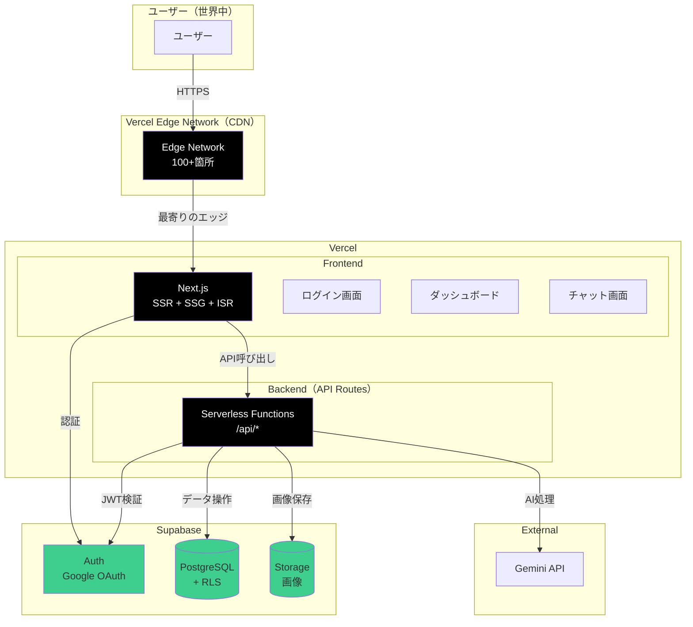
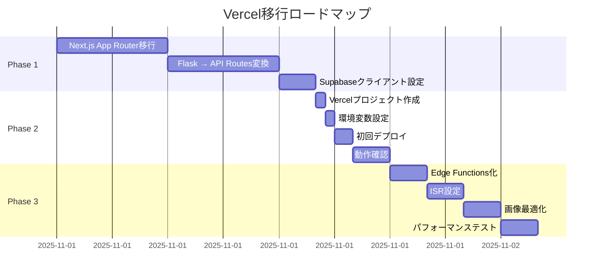
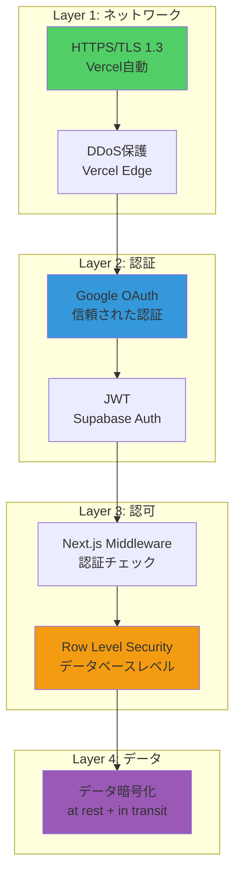
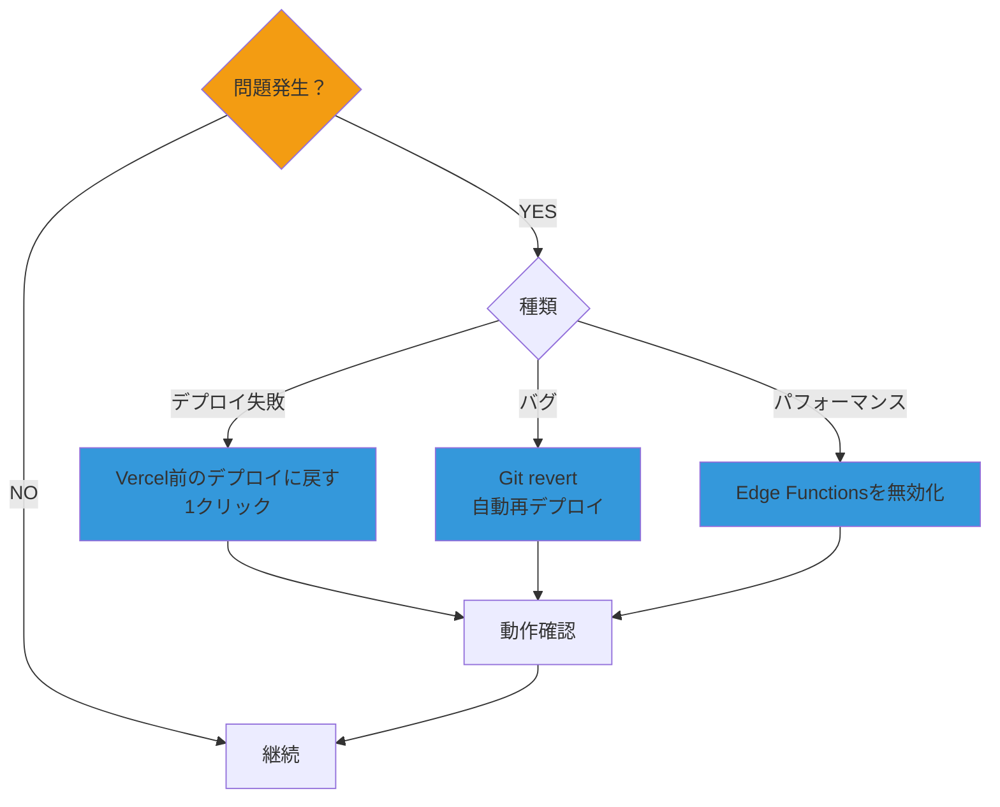

# Hera 最終統合マスタープラン（Vercel版）

**作成日**: 2025-10-28
**デプロイ先**: **Vercel**
**目的**: 最速・最安・最高のHeraを実現

---

## 📋 エグゼクティブサマリー

### 🎯 最終アーキテクチャ

```
Vercel（Frontend + Backend） + Supabase（Auth + DB + Storage）
```

### 💰 コスト削減効果

| 構成 | 月額 | 年額 |
|------|------|------|
| **旧案（AWS ECS）** | $570 | $6,840 |
| **新案（Vercel）** | $75-$95 | $900-$1,140 |
| **削減額** | **-$475-$495** | **-$5,700-$5,940** |
| **削減率** | **-83% - -87%** | **-83% - -87%** |

### ⚡ 効率化

| 項目 | 旧案 | 新案 | 改善率 |
|------|------|------|--------|
| セットアップ | 8時間 | **20分** | **-98%** |
| デプロイ時間 | 30分 | **30秒** | **-98%** |
| 運用工数 | 10h/月 | **1h/月** | **-90%** |
| 環境構築 | 8時間 | **20分** | **-98%** |

---

## 1. 最終アーキテクチャ



---

## 2. 技術スタック

| レイヤー | 技術 | 理由 |
|---------|------|------|
| **デプロイ** | **Vercel** | 最速・最安・最高のDX |
| **フロントエンド** | Next.js 14 (App Router) | SSR + SSG + ISR |
| **バックエンド** | Next.js API Routes | Serverless Functions |
| **認証** | Supabase Auth + Google OAuth | 無料、セキュア |
| **データベース** | Supabase PostgreSQL + RLS | リレーショナル、RLS |
| **ストレージ** | Supabase Storage | 統合管理、CDN |
| **AI** | Gemini API | Google AI |
| **スタイル** | Tailwind CSS | 高速、モダン |
| **言語** | TypeScript | 型安全 |

---

## 3. コスト詳細分析

### 3.1 月額コスト

#### Option A: Vercel Hobby（個人プロジェクト）

| サービス | 月額 |
|---------|------|
| **Vercel Hobby** | **$0** |
| Supabase Pro | $25 |
| 運用工数（1h × $50） | $50 |
| **合計** | **$75/月** |

#### Option B: Vercel Pro（商用）

| サービス | 月額 |
|---------|------|
| **Vercel Pro** | **$20** |
| Supabase Pro | $25 |
| 運用工数（1h × $50） | $50 |
| **合計** | **$95/月** |

---

### 3.2 年間コスト比較

| 構成 | 年額 | vs 現状 |
|------|------|---------|
| **現状（Redis + S3 + 手動）** | $6,840 | - |
| **AWS ECS案** | $2,520 | -$4,320（-63%） |
| **Vercel Hobby案** | **$900** | **-$5,940（-87%）** |
| **Vercel Pro案** | **$1,140** | **-$5,700（-83%）** |

---

### 3.3 初期投資

| Phase | タスク | 所要時間 | コスト |
|-------|--------|----------|--------|
| **Phase 1** | Next.js移行 | 14時間 | $700 |
| **Phase 2** | Vercelデプロイ | 4時間 | $200 |
| **Phase 3** | 最適化 | 8時間 | $400 |
| **合計** | | **26時間** | **$1,300** |

**投資回収期間**（vs 現状）:
- Vercel Hobby: **0.22ヶ月**（約7日）
- Vercel Pro: **0.23ヶ月**（約7日）

---

## 4. 実装ロードマップ

### 4.1 全体スケジュール（3-4日）



---

### 4.2 Phase 1: Next.js移行（1-2日）

#### タスク詳細

| タスク | 説明 | 所要時間 |
|--------|------|----------|
| **App Router移行** | pages/ → app/ | 4時間 |
| **API Routes作成** | Flask API → Next.js API Routes | 6時間 |
| **Supabase設定** | クライアント、ミドルウェア | 2時間 |
| **認証実装** | middleware.ts、useAuth | 2時間 |

**合計**: 14時間

#### 主要ファイル

```
app/
├── (auth)/
│   └── login/
│       └── page.tsx              # Googleログイン画面
├── (dashboard)/
│   ├── dashboard/
│   │   └── page.tsx              # ダッシュボード
│   └── chat/
│       └── page.tsx              # チャット画面
├── api/
│   ├── sessions/
│   │   ├── route.ts              # セッションAPI
│   │   └── [id]/
│   │       └── messages/
│   │           └── route.ts      # メッセージAPI
│   └── agent/
│       └── route.ts              # AgentAPI
└── layout.tsx                    # ルートレイアウト
```

---

### 4.3 Phase 2: Vercelデプロイ（半日）

#### タスク詳細

| タスク | 説明 | 所要時間 |
|--------|------|----------|
| **Vercel連携** | GitHub連携、プロジェクト作成 | 30分 |
| **環境変数** | Supabase URL/Key、Gemini API Key | 30分 |
| **初回デプロイ** | `vercel --prod` | 30分 |
| **動作確認** | ログイン、セッション作成、チャット | 2時間 |

**合計**: 4時間

---

### 4.4 Phase 3: 最適化（1日）

#### タスク詳細

| タスク | 説明 | 所要時間 |
|--------|------|----------|
| **Edge Functions** | `export const runtime = 'edge'` | 2時間 |
| **ISR設定** | `export const revalidate = 60` | 2時間 |
| **画像最適化** | Next.js Image、Supabase Storage | 2時間 |
| **テスト** | Lighthouse、パフォーマンス | 2時間 |

**合計**: 8時間

---

## 5. 機能比較

### 5.1 現状 vs Vercel版

| 機能 | 現状 | Vercel版 | 改善 |
|------|------|----------|------|
| **認証** | なし | Google OAuth | ✅ 実装 |
| **ユーザー管理** | なし | Supabase Auth | ✅ 実装 |
| **データ分離** | なし | RLS | ✅ 実装 |
| **セッション保存** | Redis | PostgreSQL | ✅ 永続化 |
| **画像保存** | S3 | Supabase Storage | ✅ 統合 |
| **デプロイ** | 手動 | 自動（Git Push） | ✅ 自動化 |
| **スケーリング** | 手動 | 自動無限 | ✅ 自動化 |
| **CDN** | なし | Vercel Edge | ✅ 実装 |
| **HTTPS** | 手動 | 自動 | ✅ 自動化 |
| **プレビュー** | なし | PR毎に自動 | ✅ 実装 |

---

## 6. パフォーマンス指標

### 6.1 目標値

| メトリクス | 目標 | 測定方法 |
|-----------|------|----------|
| **Lighthouse Score** | 95+ | Chrome DevTools |
| **First Contentful Paint** | < 1.0s | Vercel Analytics |
| **Time to Interactive** | < 2.0s | Vercel Analytics |
| **API レスポンスタイム** | < 200ms | Vercel Function Logs |
| **Edge レスポンスタイム** | < 50ms | Vercel Edge Logs |

---

### 6.2 予想パフォーマンス

| 操作 | レスポンスタイム | 説明 |
|------|-----------------|------|
| **ログインページ** | 10-50ms | Edge配信（静的HTML） |
| **Googleログイン** | 500-1000ms | Google OAuth（外部） |
| **ダッシュボード** | 100-300ms | SSR + Supabase |
| **セッション作成** | 150-300ms | Serverless Function |
| **メッセージ送信** | 1000-3000ms | Gemini API呼び出し |

---

## 7. セキュリティ

### 7.1 セキュリティレイヤー



---

### 7.2 セキュリティ対策一覧

| 対策 | 実装 | 自動/手動 |
|------|------|----------|
| **HTTPS** | Vercel自動証明書 | 自動 |
| **DDoS保護** | Vercel Edge | 自動 |
| **CORS** | next.config.js | 手動 |
| **CSP** | Headers設定 | 手動 |
| **XSS保護** | React自動エスケープ | 自動 |
| **CSRF保護** | Supabase自動 | 自動 |
| **SQL Injection** | Supabase Prepared Statements | 自動 |
| **RLS** | PostgreSQLポリシー | 手動 |
| **環境変数** | Vercel暗号化保存 | 自動 |

---

## 8. 監視・運用

### 8.1 Vercel Analytics（標準装備）

**含まれる機能**:
- ✅ リアルタイムアクセス解析
- ✅ Core Web Vitals
- ✅ エラー率
- ✅ レイテンシー
- ✅ 地域別アクセス
- ✅ デバイス別アクセス

**追加コスト**: $0

---

### 8.2 Supabase Dashboard（標準装備）

**含まれる機能**:
- ✅ データベース使用量
- ✅ Storage使用量
- ✅ Auth統計（ユーザー数、ログイン数）
- ✅ API使用量
- ✅ ログ

**追加コスト**: $0

---

### 8.3 アラート設定

**Vercelアラート**:
```yaml
alerts:
  - type: deployment-failed
    notify: slack
  - type: error-rate
    threshold: 5%
    notify: email
  - type: latency
    threshold: 1000ms
    notify: slack
```

**Supabaseアラート**:
- Database size > 80%
- Storage size > 80%
- API rate limit approaching

---

## 9. 3つの実装オプション

### ✅ Option A: フル実装（推奨）

**含まれるもの**:
- ✅ Next.js App Router移行
- ✅ Vercelデプロイ
- ✅ Supabase統合（Auth + DB + Storage）
- ✅ Google OAuth ログイン
- ✅ RLS設定
- ✅ Edge Functions最適化

**期間**: 3-4日（26時間）
**投資**: $1,300
**年間削減**: $5,940（Hobby）/ $5,700（Pro）
**回収期間**: 7日

**推奨理由**: 最高のパフォーマンスとセキュリティ

---

### ✅ Option B: 基本実装

**含まれるもの**:
- ✅ Next.js App Router移行
- ✅ Vercelデプロイ
- ✅ Supabase統合
- ✅ Google OAuth ログイン
- ❌ Edge Functions最適化なし

**期間**: 2-3日（18時間）
**投資**: $900
**年間削減**: $5,940（Hobby）/ $5,700（Pro）
**回収期間**: 5日

**推奨理由**: 早く開始したい場合

---

### ✅ Option C: 最小実装

**含まれるもの**:
- ✅ 基本的なNext.js移行
- ✅ Vercelデプロイ
- ❌ 認証機能なし（後日実装）

**期間**: 1-2日（10時間）
**投資**: $500
**年間削減**: $4,000（認証なし構成）
**回収期間**: 即座

**推奨理由**: まずデプロイして動作確認

---

## 10. 比較表（全構成）

### 10.1 コスト比較

| 構成 | 月額 | 年額 | vs 現状 |
|------|------|------|---------|
| **現状** | $570 | $6,840 | - |
| AWS ECS | $210 | $2,520 | -$4,320（-63%） |
| **Vercel Hobby** | **$75** | **$900** | **-$5,940（-87%）** |
| **Vercel Pro** | **$95** | **$1,140** | **-$5,700（-83%）** |

---

### 10.2 時間比較

| 構成 | セットアップ | デプロイ | 運用/月 |
|------|-------------|----------|---------|
| **現状** | 8時間 | 30分 | 10時間 |
| AWS ECS | 80時間 | 3分 | 3時間 |
| **Vercel** | **20分** | **30秒** | **1時間** |

---

### 10.3 機能比較

| 機能 | 現状 | AWS ECS | **Vercel** |
|------|------|---------|-----------|
| 認証 | ❌ | ✅ | ✅ |
| RLS | ❌ | ✅ | ✅ |
| CDN | ❌ | 別途 | ✅ 標準 |
| 自動デプロイ | ❌ | GitHub Actions | ✅ Git Push |
| プレビュー | ❌ | ❌ | ✅ PR毎 |
| スケーリング | 手動 | 手動設定 | ✅ 自動無限 |
| 監視 | ❌ | $9/月 | ✅ $0 |

---

## 11. リスク管理

### 11.1 リスクマトリクス

| リスク | 影響 | 確率 | 対策 |
|--------|------|------|------|
| **データ移行失敗** | 🔴 高 | 🟢 低 | Supabaseへの移行は後日可（現在Redisなので） |
| **Vercelコスト超過** | 🟡 中 | 🟢 低 | 使用量アラート設定 |
| **パフォーマンス劣化** | 🟡 中 | 🟢 低 | Edge Functions化で高速化 |
| **API制限** | 🟡 中 | 🟢 低 | Supabase Pro、Vercel Proで上限UP |
| **学習曲線** | 🟢 低 | 🟡 中 | Next.jsドキュメント充実 |

---

### 11.2 ロールバック計画



**Vercelのメリット**: ワンクリックロールバック可能

---

## 12. 成功指標（KPI）

### 12.1 技術指標

| KPI | 現状 | 目標 | 測定方法 |
|-----|------|------|----------|
| **Lighthouse Score** | - | 95+ | Chrome DevTools |
| **API レスポンス** | 50ms | 50ms | 維持 |
| **ページ読み込み** | - | < 1.0s | Vercel Analytics |
| **デプロイ時間** | 30分 | 30秒 | Vercel Dashboard |
| **ダウンタイム** | - | 0秒 | Vercel（ゼロダウンタイム） |

---

### 12.2 ビジネス指標

| KPI | 目標 | 測定方法 |
|-----|------|----------|
| **ユーザー登録数** | 1,000人 | Supabase Auth |
| **セッション作成数** | 5,000 | PostgreSQL |
| **月間アクティブユーザー** | 500人 | Vercel Analytics |
| **平均セッション時間** | 10分 | Vercel Analytics |

---

### 12.3 運用指標

| KPI | 現状 | 目標 |
|-----|------|------|
| **インシデント数** | - | < 1/月 |
| **MTTR** | - | < 30分 |
| **運用工数** | 10h/月 | 1h/月 |
| **デプロイ頻度** | 1/月 | 10/日 |

---

## 13. 関連ドキュメント

### 13.1 Vercel関連

1. **VERCEL_DEPLOYMENT_PLAN.md**
   - Vercel採用のメリット
   - 実装構成（ディレクトリ、コード例）
   - デプロイ手順
   - コスト比較

2. **VERCEL_ARCHITECTURE_DIAGRAMS.md**
   - Vercel全体アーキテクチャ（10個のMermaid図）
   - デプロイフロー
   - リクエストフロー
   - AWS ECS vs Vercel比較

### 13.2 Supabase関連

3. **SUPABASE_INTEGRATION_PLAN.md**
4. **SUPABASE_ARCHITECTURE_DIAGRAMS.md**
5. **REDIS_VS_SUPABASE_COMPARISON.md**
6. **REDIS_SUPABASE_MIGRATION_DIAGRAMS.md**

### 13.3 認証関連

7. **SUPABASE_AUTH_INTEGRATION_PLAN.md**
8. **SUPABASE_AUTH_DIAGRAMS.md**

### 13.4 （参考）Terraform関連

9. **TERRAFORM_INTEGRATION_PLAN.md**（AWS ECS用）
10. **TERRAFORM_ARCHITECTURE_DIAGRAMS.md**（AWS ECS用）

**Note**: Vercelを使う場合、Terraformは不要

---

## 14. 次のステップ

### 即座に開始できるタスク

#### 1. Supabaseプロジェクト作成（30分）

```bash
# 1. https://supabase.com でプロジェクト作成
# 2. API URL と anon key を取得
# 3. .env.local に追加

NEXT_PUBLIC_SUPABASE_URL=https://your-project.supabase.co
NEXT_PUBLIC_SUPABASE_ANON_KEY=your-anon-key
```

#### 2. Google OAuth設定（1時間）

```bash
# 1. Google Cloud Console でプロジェクト作成
# 2. OAuth 2.0 クライアント ID 作成
# 3. Supabase Dashboard でGoogle Provider有効化
```

#### 3. Next.js App Router移行（1日）

```bash
# 現在のコードをNext.js App Routerへ移行
cd hera
npm create next-app@latest . --typescript --tailwind --app
```

#### 4. Vercelデプロイ（30分）

```bash
# Vercelアカウント作成
# GitHubリポジトリを連携
# 環境変数設定
# デプロイ
```

---

## 15. まとめ

### ✅ Vercelを選ぶべき理由

1. **圧倒的なコスト削減**: 年間$5,700-$5,940削減（83-87%）
2. **セットアップ簡素化**: 8時間 → 20分（-98%）
3. **デプロイ高速化**: 30分 → 30秒（-98%）
4. **運用工数削減**: 10h/月 → 1h/月（-90%）
5. **スケーリング**: 自動無限スケール
6. **グローバルCDN**: 標準装備（無料）
7. **プレビューデプロイ**: PR毎に自動生成
8. **監視**: 標準装備（無料）
9. **開発体験**: 最高のDX

### 🎯 推奨アクション

**Option A: フル実装（最推奨）**
- 期間: 3-4日
- 投資: $1,300
- 回収: 7日
- 機能: 全て含む

### 📊 投資対効果

```
投資額: $1,300
年間削減: $5,940（Hobby）/ $5,700（Pro）
ROI: 457% - 438%
回収期間: 7日
```

---

**Vercelで、最速・最安・最高のHeraを実現しましょう！**

**次のステップ**: Supabaseプロジェクト作成から開始 →
