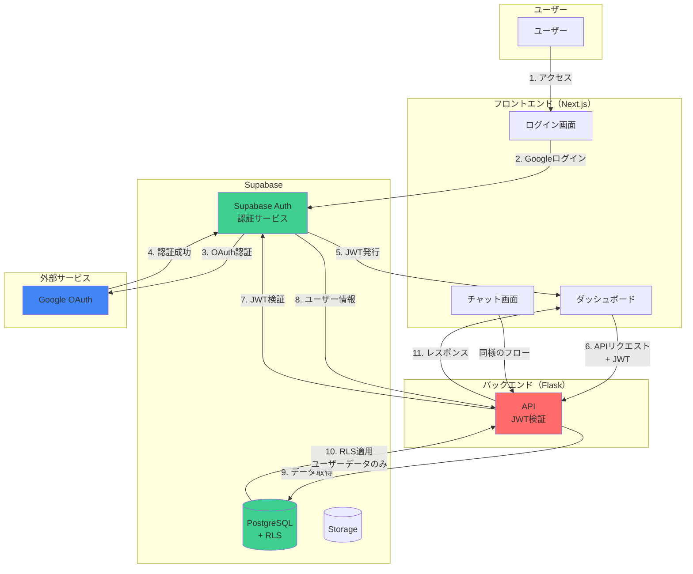
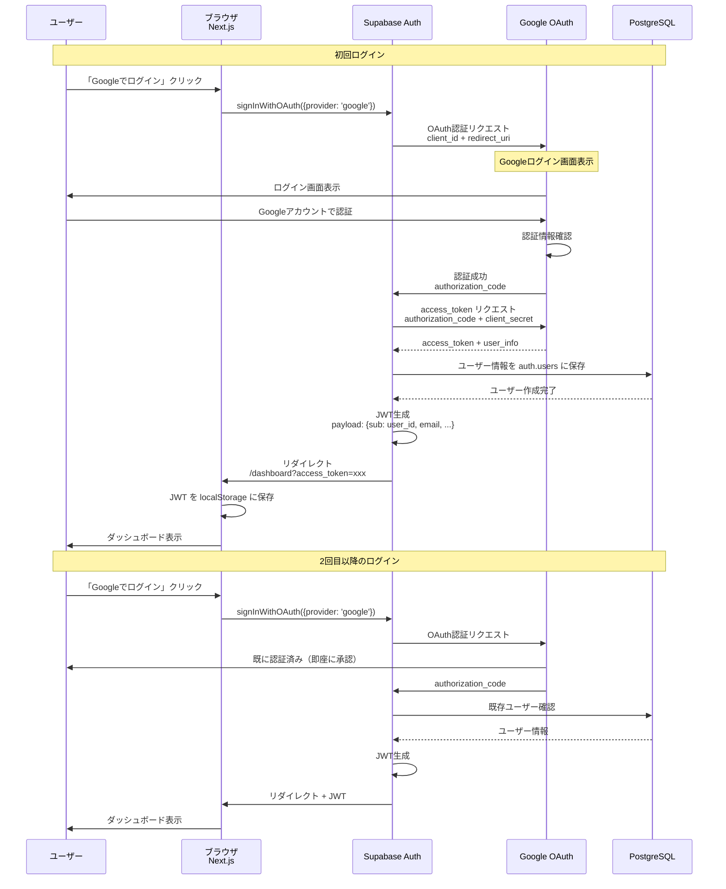
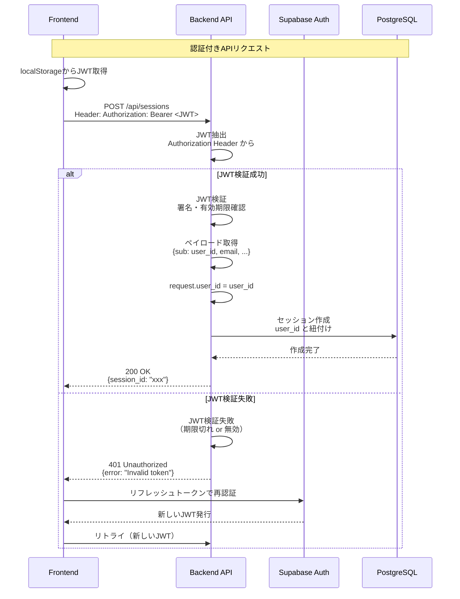
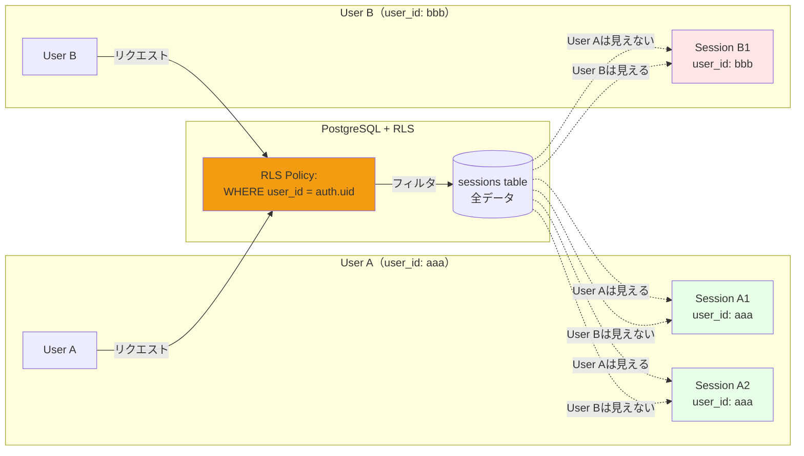
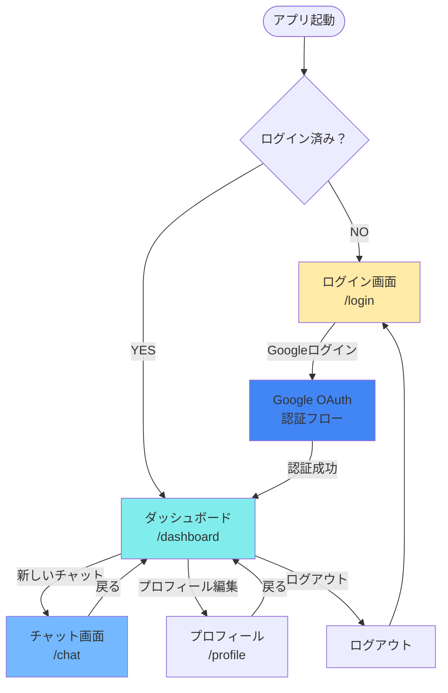
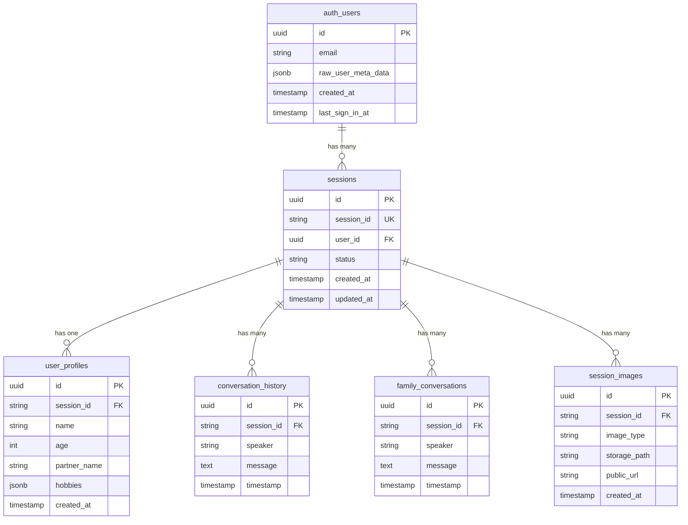
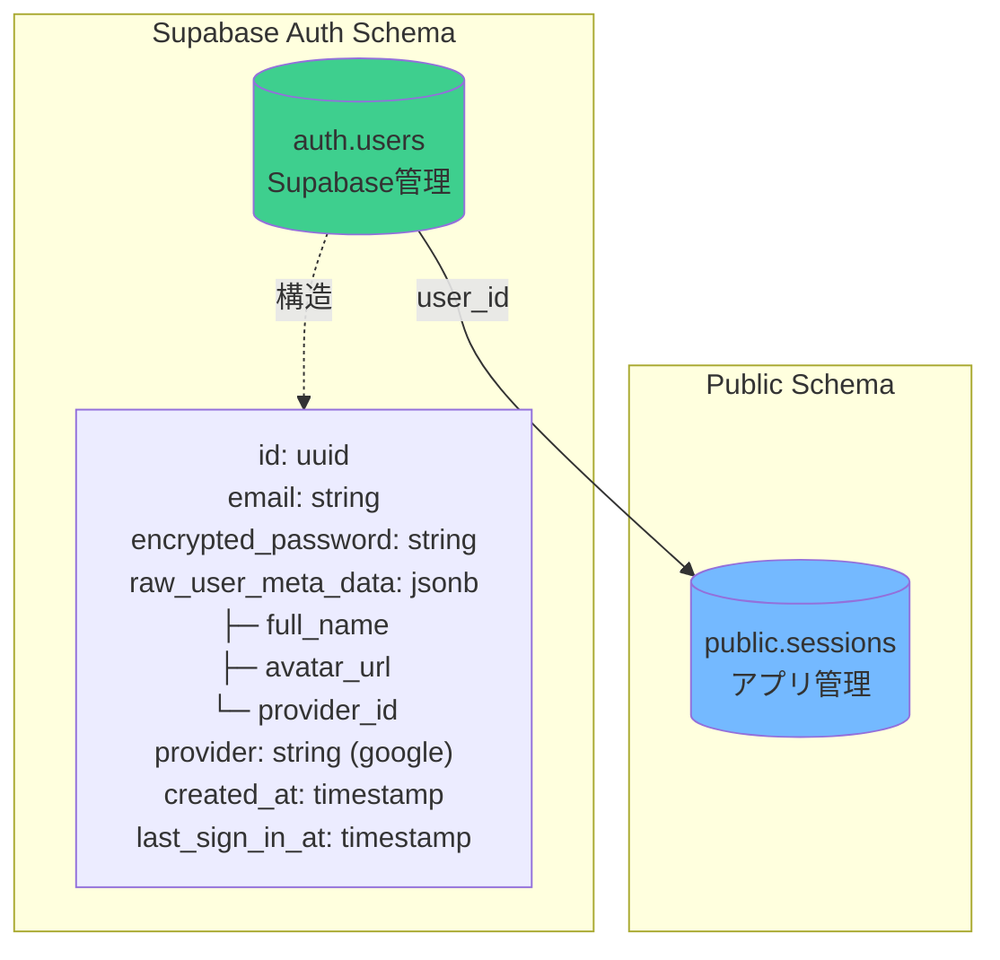
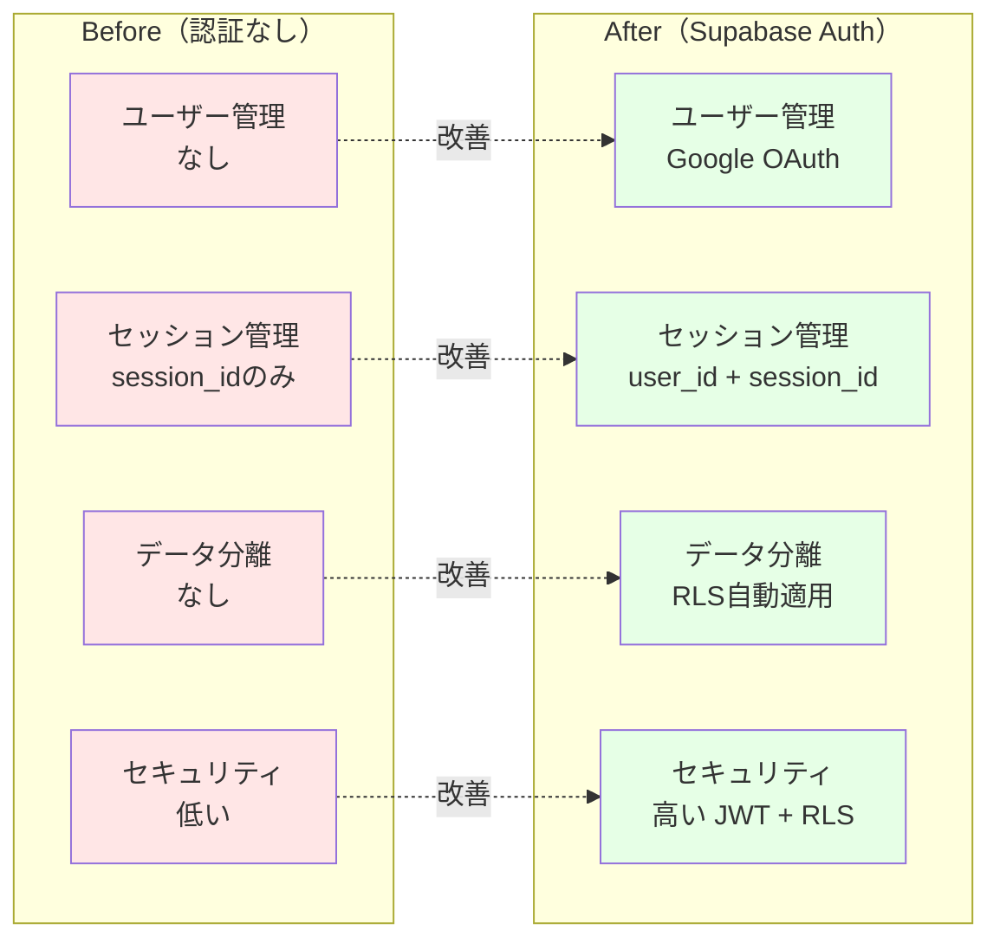
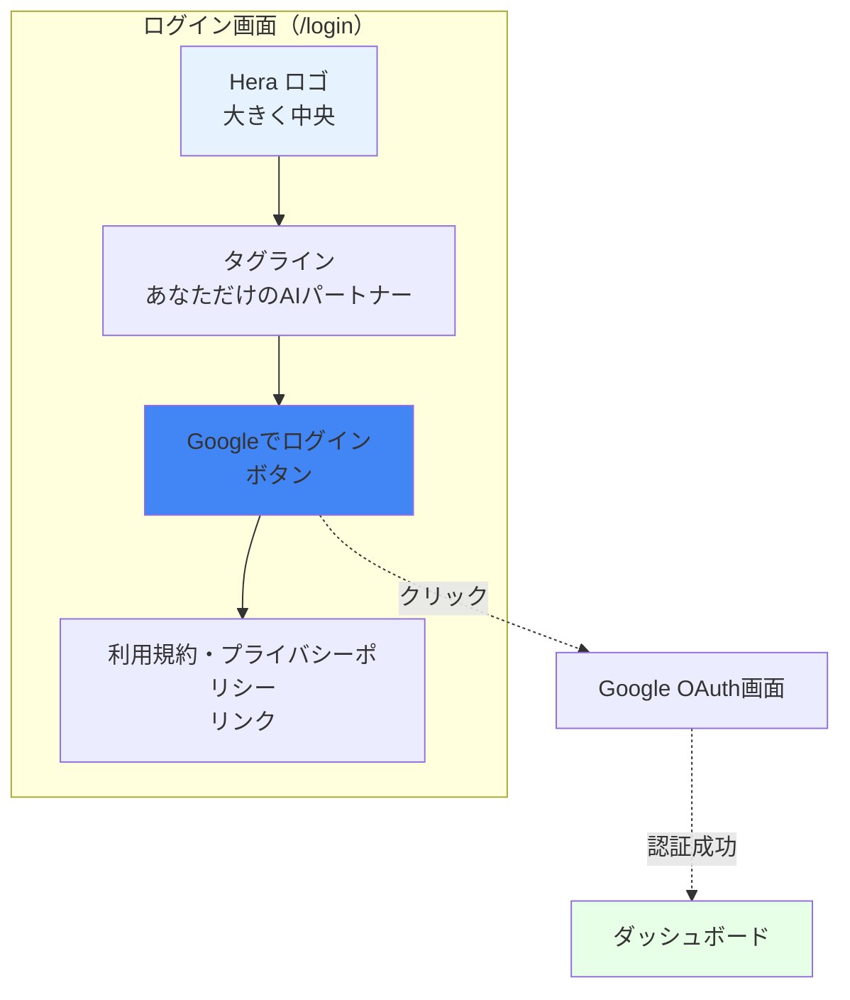

# Supabase Auth + Google OAuth アーキテクチャ図

**作成日**: 2025-10-28
**目的**: 認証機能の詳細フローを視覚化

---

## 📋 目次

1. [認証フロー全体像](#1-認証フロー全体像)
2. [Googleログインシーケンス](#2-googleログインシーケンス)
3. [JWT検証フロー](#3-jwt検証フロー)
4. [Row Level Security（RLS）](#4-row-level-securityrls)
5. [フロントエンド画面遷移](#5-フロントエンド画面遷移)
6. [データモデル](#6-データモデル)
7. [セキュリティアーキテクチャ](#7-セキュリティアーキテクチャ)

---

## 1. 認証フロー全体像



---

## 2. Googleログインシーケンス



---

## 3. JWT検証フロー



---

## 4. Row Level Security（RLS）

### 4.1 RLS適用の仕組み

```mermaid
graph TB
    subgraph "バックエンド"
        API[Flask API]
    end

    subgraph "PostgreSQL + RLS"
        Query[SQL Query<br/>SELECT * FROM sessions]
        RLSCheck{RLSポリシー<br/>チェック}
        FilteredData[フィルタされたデータ<br/>user_id = auth.uid()]
    end

    subgraph "Supabase Auth"
        AuthContext[認証コンテキスト<br/>auth.uid() = user_123]
    end

    API -->|1. JWTと共にクエリ| Query
    Query -->|2. RLS適用| RLSCheck
    RLSCheck -->|3. auth.uid()取得| AuthContext
    AuthContext -->|4. user_id = user_123| RLSCheck
    RLSCheck -->|5. WHERE user_id = 'user_123'<br/>自動追加| FilteredData
    FilteredData -->|6. ユーザーのデータのみ| API

    style RLSCheck fill:#f39c12
    style AuthContext fill:#3ecf8e
```

### 4.2 RLSポリシー例



---

## 5. フロントエンド画面遷移



---

## 6. データモデル

### 6.1 認証関連テーブル



### 6.2 auth.users テーブル（Supabase管理）



---

## 7. セキュリティアーキテクチャ

```mermaid
graph TB
    subgraph "セキュリティ層"
        subgraph "Layer 1: ネットワーク"
            HTTPS[HTTPS<br/>TLS 1.3]
            CORS[CORS<br/>Origin制限]
        end

        subgraph "Layer 2: 認証"
            OAuth[Google OAuth<br/>信頼された認証]
            JWT[JWT<br/>署名付きトークン]
        end

        subgraph "Layer 3: 認可"
            RLS[Row Level Security<br/>データベースレベル]
            APIAuth[API認証<br/>@require_auth]
        end

        subgraph "Layer 4: データ"
            Encryption[データ暗号化<br/>at rest + in transit]
            Backup[自動バックアップ<br/>Point-in-Time Recovery]
        end
    end

    User[ユーザー] --> HTTPS
    HTTPS --> CORS
    CORS --> OAuth
    OAuth --> JWT
    JWT --> RLS
    RLS --> APIAuth
    APIAuth --> Encryption
    Encryption --> Backup

    style HTTPS fill:#27ae60
    style OAuth fill:#3498db
    style RLS fill:#f39c12
    style Encryption fill:#9b59b6
```

---

## 8. 実装の全体像

```mermaid
graph TB
    subgraph "Phase 1: 設定（1-2時間）"
        P1_1[Google OAuth設定]
        P1_2[Supabase Auth有効化]
        P1_3[環境変数設定]

        P1_1 --> P1_2
        P1_2 --> P1_3
    end

    subgraph "Phase 2: フロントエンド（4-6時間）"
        P2_1[Supabaseクライアント]
        P2_2[useAuth フック]
        P2_3[ログイン画面]
        P2_4[ダッシュボード]
        P2_5[ヘッダー]

        P2_1 --> P2_2
        P2_2 --> P2_3
        P2_3 --> P2_4
        P2_4 --> P2_5
    end

    subgraph "Phase 3: バックエンド（3-4時間）"
        P3_1[JWT検証ミドルウェア]
        P3_2[@require_auth追加]
        P3_3[user_id紐付け]
        P3_4[権限チェック]

        P3_1 --> P3_2
        P3_2 --> P3_3
        P3_3 --> P3_4
    end

    subgraph "Phase 4: RLS設定（2-3時間）"
        P4_1[スキーマ更新]
        P4_2[RLSポリシー作成]
        P4_3[データ移行]

        P4_1 --> P4_2
        P4_2 --> P4_3
    end

    subgraph "Phase 5: テスト（2-3時間）"
        P5_1[ログインテスト]
        P5_2[RLS動作確認]
        P5_3[統合テスト]

        P5_1 --> P5_2
        P5_2 --> P5_3
    end

    P1_3 --> P2_1
    P2_5 --> P3_1
    P3_4 --> P4_1
    P4_3 --> P5_1

    style P1_3 fill:#3498db
    style P2_5 fill:#3498db
    style P3_4 fill:#3498db
    style P4_3 fill:#f39c12
    style P5_3 fill:#27ae60
```

---

## 9. Before/After 比較



---

## 10. ログイン画面デザイン



---

## まとめ

### ✅ 実装するもの

1. **Google OAuth設定**: Google Cloud Console + Supabase
2. **フロントエンド**: ログイン画面、ダッシュボード、認証フック
3. **バックエンド**: JWT検証ミドルウェア、user_id紐付け
4. **データベース**: RLSポリシー、user_idカラム追加
5. **テスト**: ログイン、RLS、統合テスト

### 📊 セキュリティ対策

1. **HTTPS**: 通信暗号化
2. **Google OAuth**: 信頼された認証
3. **JWT**: 署名付きトークン
4. **RLS**: データベースレベルのアクセス制御
5. **CORS**: Origin制限

### 🚀 所要時間

- **Phase 1（設定）**: 1-2時間
- **Phase 2（フロントエンド）**: 4-6時間
- **Phase 3（バックエンド）**: 3-4時間
- **Phase 4（RLS）**: 2-3時間
- **Phase 5（テスト）**: 2-3時間

**合計**: 12-18時間

### 💰 コスト

- **Supabase Auth**: $0（Freeプランで50,000 MAUまで無料）
- **Google OAuth**: $0（無料）

**追加コストなしで、強固な認証システムが構築できます！**
