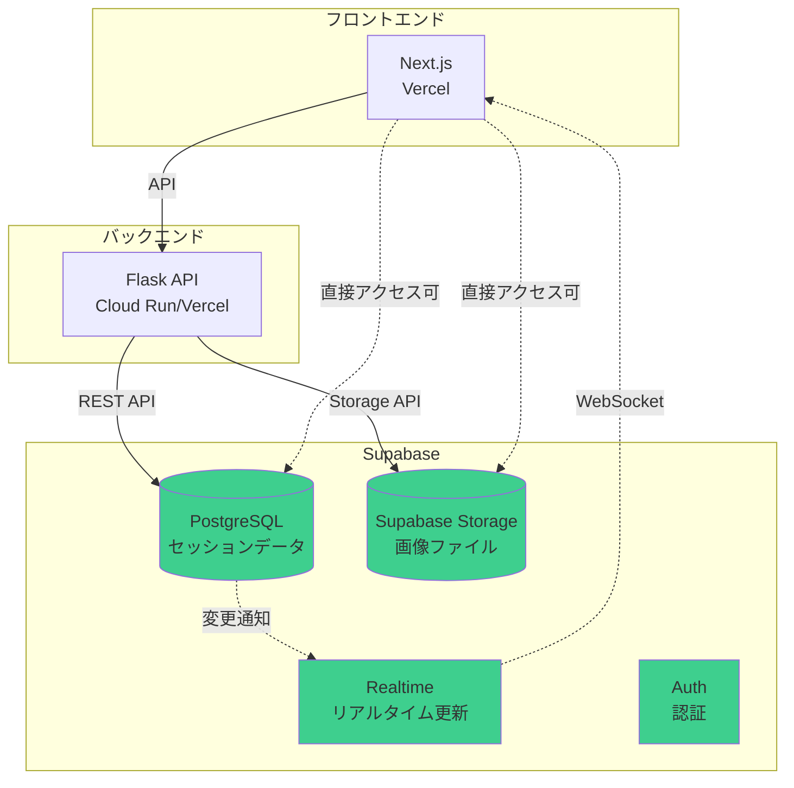

# Supabase統合計画

**作成日**: 2025-10-28
**対象**: Redis + S3/GCS → Supabase PostgreSQL + Supabase Storage への移行

---

## 📋 目次

1. [現状分析](#現状分析)
2. [Supabaseアーキテクチャ設計](#supabaseアーキテクチャ設計)
3. [データベーススキーマ設計](#データベーススキーマ設計)
4. [実装計画](#実装計画)
5. [移行手順](#移行手順)
6. [コスト比較](#コスト比較)
7. [デプロイ構成](#デプロイ構成)

---

## 1. 現状分析

### 現在のアーキテクチャ（Redis + S3/GCS）

```
Frontend (Vercel)
    ↓
Backend (Cloud Run / ECS)
    ↓
Redis (ElastiCache / Memorystore) ← セッションデータ
    ↓
S3/GCS ← 画像ファイル
```

### 使用しているデータ構造

#### Redis キー構造
```
session:{session_id}:user_profile
session:{session_id}:conversation_history
session:{session_id}:family_conversation
session:{session_id}:family_trip_info
session:{session_id}:family_plan
session:{session_id}:_meta
```

#### データ型
- **user_profile**: JSON (ユーザー情報)
- **conversation_history**: JSON配列 (会話履歴)
- **family_conversation**: JSON配列 (家族との会話)
- **family_trip_info**: JSON (旅行情報)
- **family_plan**: JSON (旅行プラン)

#### 画像ファイル
- `photos/user.png`
- `photos/partner.png`
- `photos/child_1.png`

---

## 2. Supabaseアーキテクチャ設計

### 提案するアーキテクチャ



### Supabaseの利点

✅ **統合されたプラットフォーム**
- データベース + ストレージ + 認証が1箇所
- 管理が簡単

✅ **コスト効率**
- 無料枠: 500MB DB, 1GB Storage
- Proプラン: $25/月で十分

✅ **リアルタイム機能**
- PostgreSQLの変更をリアルタイムで監視
- フロントエンドへのプッシュ通知

✅ **Row Level Security (RLS)**
- データベースレベルのセキュリティ
- ユーザーごとのアクセス制御

✅ **直接アクセス可能**
- フロントエンドから直接Supabaseへアクセス可能
- バックエンドの負荷軽減

---

## 3. データベーススキーマ設計

### 3.1 sessions テーブル

```sql
CREATE TABLE sessions (
    id UUID PRIMARY KEY DEFAULT uuid_generate_v4(),
    session_id TEXT UNIQUE NOT NULL,
    created_at TIMESTAMP WITH TIME ZONE DEFAULT NOW(),
    updated_at TIMESTAMP WITH TIME ZONE DEFAULT NOW(),
    status TEXT DEFAULT 'active',

    -- インデックス
    INDEX idx_session_id (session_id),
    INDEX idx_created_at (created_at)
);

-- 自動更新トリガー
CREATE TRIGGER update_sessions_updated_at
    BEFORE UPDATE ON sessions
    FOR EACH ROW
    EXECUTE FUNCTION update_updated_at_column();
```

### 3.2 user_profiles テーブル

```sql
CREATE TABLE user_profiles (
    id UUID PRIMARY KEY DEFAULT uuid_generate_v4(),
    session_id TEXT NOT NULL REFERENCES sessions(session_id) ON DELETE CASCADE,

    -- 基本情報
    name TEXT,
    age INTEGER,
    gender TEXT,
    occupation TEXT,

    -- パートナー情報
    partner_name TEXT,
    partner_age INTEGER,
    partner_occupation TEXT,
    partner_face_description TEXT,

    -- 関係情報
    relationship_years INTEGER,
    relationship_status TEXT,

    -- 趣味・価値観
    hobbies JSONB DEFAULT '[]',
    values JSONB DEFAULT '[]',
    lifestyle JSONB DEFAULT '{}',

    -- タイムスタンプ
    created_at TIMESTAMP WITH TIME ZONE DEFAULT NOW(),
    updated_at TIMESTAMP WITH TIME ZONE DEFAULT NOW(),

    -- インデックス
    UNIQUE(session_id),
    INDEX idx_session_id (session_id)
);
```

### 3.3 conversation_history テーブル

```sql
CREATE TABLE conversation_history (
    id UUID PRIMARY KEY DEFAULT uuid_generate_v4(),
    session_id TEXT NOT NULL REFERENCES sessions(session_id) ON DELETE CASCADE,

    speaker TEXT NOT NULL,  -- 'user' or 'agent'
    message TEXT NOT NULL,
    timestamp TIMESTAMP WITH TIME ZONE DEFAULT NOW(),

    -- メタデータ
    extracted_fields JSONB DEFAULT '{}',

    -- インデックス
    INDEX idx_session_id (session_id),
    INDEX idx_timestamp (timestamp)
);
```

### 3.4 family_conversations テーブル

```sql
CREATE TABLE family_conversations (
    id UUID PRIMARY KEY DEFAULT uuid_generate_v4(),
    session_id TEXT NOT NULL REFERENCES sessions(session_id) ON DELETE CASCADE,

    speaker TEXT NOT NULL,  -- 'user' or 家族メンバー名
    message TEXT NOT NULL,
    timestamp TIMESTAMP WITH TIME ZONE DEFAULT NOW(),

    -- インデックス
    INDEX idx_session_id (session_id),
    INDEX idx_timestamp (timestamp)
);
```

### 3.5 family_trip_info テーブル

```sql
CREATE TABLE family_trip_info (
    id UUID PRIMARY KEY DEFAULT uuid_generate_v4(),
    session_id TEXT NOT NULL REFERENCES sessions(session_id) ON DELETE CASCADE,

    destination TEXT,
    duration_days INTEGER,
    budget INTEGER,
    activities JSONB DEFAULT '[]',
    preferences JSONB DEFAULT '{}',

    created_at TIMESTAMP WITH TIME ZONE DEFAULT NOW(),
    updated_at TIMESTAMP WITH TIME ZONE DEFAULT NOW(),

    -- インデックス
    UNIQUE(session_id)
);
```

### 3.6 family_plans テーブル

```sql
CREATE TABLE family_plans (
    id UUID PRIMARY KEY DEFAULT uuid_generate_v4(),
    session_id TEXT NOT NULL REFERENCES sessions(session_id) ON DELETE CASCADE,

    story TEXT,
    letters JSONB DEFAULT '{}',
    itinerary JSONB DEFAULT '[]',

    generated_at TIMESTAMP WITH TIME ZONE DEFAULT NOW(),

    -- インデックス
    UNIQUE(session_id)
);
```

### 3.7 session_images テーブル

```sql
CREATE TABLE session_images (
    id UUID PRIMARY KEY DEFAULT uuid_generate_v4(),
    session_id TEXT NOT NULL REFERENCES sessions(session_id) ON DELETE CASCADE,

    image_type TEXT NOT NULL,  -- 'user', 'partner', 'child_1', etc.
    storage_path TEXT NOT NULL,  -- Supabase Storage path
    public_url TEXT,

    file_size INTEGER,
    mime_type TEXT,

    created_at TIMESTAMP WITH TIME ZONE DEFAULT NOW(),

    -- インデックス
    INDEX idx_session_id (session_id),
    UNIQUE(session_id, image_type)
);
```

### 3.8 Supabase Storage バケット構成

```
Bucket: session-images
├── {session_id}/
│   ├── user.png
│   ├── partner.png
│   └── child_1.png
└── ...

ポリシー:
- Public Read: 認証不要で画像取得可能
- Authenticated Write: 認証済みユーザーのみアップロード可能
```

---

## 4. 実装計画

### Phase 1: Supabase接続層の実装

#### 4.1 新しいマネージャークラス作成

**backend/utils/supabase_manager.py**

```python
"""
Supabase統合マネージャー
PostgreSQL + Supabase Storage
"""
from typing import Any, Dict, Optional, List
from datetime import datetime
import os


class SupabaseSessionManager:
    """Supabaseベースのセッション管理"""

    def __init__(self, supabase_url: str, supabase_key: str):
        from supabase import create_client
        self.client = create_client(supabase_url, supabase_key)

    def create_session(self, session_id: str) -> Dict[str, Any]:
        """新しいセッションを作成"""
        result = self.client.table('sessions').insert({
            'session_id': session_id,
            'status': 'active'
        }).execute()
        return result.data[0]

    def save_user_profile(self, session_id: str, profile: Dict[str, Any]) -> None:
        """ユーザープロファイルを保存"""
        self.client.table('user_profiles').upsert({
            'session_id': session_id,
            **profile
        }).execute()

    def load_user_profile(self, session_id: str) -> Optional[Dict[str, Any]]:
        """ユーザープロファイルを読み込み"""
        result = self.client.table('user_profiles')\
            .select('*')\
            .eq('session_id', session_id)\
            .execute()

        return result.data[0] if result.data else None

    def add_conversation(self, session_id: str, speaker: str,
                        message: str, extracted_fields: Dict = None) -> None:
        """会話履歴を追加"""
        self.client.table('conversation_history').insert({
            'session_id': session_id,
            'speaker': speaker,
            'message': message,
            'extracted_fields': extracted_fields or {}
        }).execute()

    def get_conversation_history(self, session_id: str) -> List[Dict[str, Any]]:
        """会話履歴を取得"""
        result = self.client.table('conversation_history')\
            .select('*')\
            .eq('session_id', session_id)\
            .order('timestamp', desc=False)\
            .execute()

        return result.data

    def session_exists(self, session_id: str) -> bool:
        """セッションが存在するか確認"""
        result = self.client.table('sessions')\
            .select('session_id')\
            .eq('session_id', session_id)\
            .execute()

        return len(result.data) > 0


class SupabaseStorageManager:
    """Supabase Storageベースの画像管理"""

    def __init__(self, supabase_url: str, supabase_key: str, bucket_name: str = 'session-images'):
        from supabase import create_client
        self.client = create_client(supabase_url, supabase_key)
        self.bucket_name = bucket_name

    def upload_image(self, session_id: str, image_type: str,
                    file_data: bytes, mime_type: str = 'image/png') -> str:
        """画像をアップロード"""
        # Supabase Storageにアップロード
        file_path = f"{session_id}/{image_type}.png"

        self.client.storage.from_(self.bucket_name)\
            .upload(file_path, file_data, {'content-type': mime_type})

        # 公開URLを取得
        public_url = self.client.storage.from_(self.bucket_name)\
            .get_public_url(file_path)

        # メタデータをデータベースに保存
        self.client.table('session_images').upsert({
            'session_id': session_id,
            'image_type': image_type,
            'storage_path': file_path,
            'public_url': public_url,
            'file_size': len(file_data),
            'mime_type': mime_type
        }).execute()

        return public_url

    def get_image_url(self, session_id: str, image_type: str) -> Optional[str]:
        """画像URLを取得"""
        result = self.client.table('session_images')\
            .select('public_url')\
            .eq('session_id', session_id)\
            .eq('image_type', image_type)\
            .execute()

        return result.data[0]['public_url'] if result.data else None

    def download_image(self, session_id: str, image_type: str) -> Optional[bytes]:
        """画像をダウンロード"""
        file_path = f"{session_id}/{image_type}.png"

        try:
            result = self.client.storage.from_(self.bucket_name)\
                .download(file_path)
            return result
        except Exception:
            return None
```

#### 4.2 環境変数設定

```bash
# .env
SUPABASE_URL=https://your-project.supabase.co
SUPABASE_KEY=your-anon-key
SUPABASE_BUCKET=session-images
```

#### 4.3 requirements.txt 追加

```txt
supabase==2.3.0  # Supabase Python SDK
```

### Phase 2: 既存コードの移行

#### 2.1 app.py の修正

```python
# backend/api/app.py

from utils.supabase_manager import SupabaseSessionManager, SupabaseStorageManager

# 初期化
supabase_session_mgr = SupabaseSessionManager(
    supabase_url=os.getenv('SUPABASE_URL'),
    supabase_key=os.getenv('SUPABASE_KEY')
)

supabase_storage_mgr = SupabaseStorageManager(
    supabase_url=os.getenv('SUPABASE_URL'),
    supabase_key=os.getenv('SUPABASE_KEY'),
    bucket_name=os.getenv('SUPABASE_BUCKET', 'session-images')
)

# セッション作成
@app.route('/api/sessions', methods=['POST'])
def create_session():
    session_id = str(uuid.uuid4())

    # Supabaseに保存
    supabase_session_mgr.create_session(session_id)

    return jsonify({
        'session_id': session_id,
        'created_at': datetime.now().isoformat(),
        'status': 'created'
    })

# メッセージ送信
@app.route('/api/sessions/<session_id>/messages', methods=['POST'])
def send_message(session_id):
    # ... (AI処理)

    # プロファイル保存
    supabase_session_mgr.save_user_profile(session_id, profile)

    # 会話履歴追加
    supabase_session_mgr.add_conversation(
        session_id, 'user', user_message
    )
    supabase_session_mgr.add_conversation(
        session_id, 'agent', agent_response['message'],
        extracted_fields=agent_response.get('last_extracted_fields', {})
    )

    return jsonify(...)

# 画像アップロード
@app.route('/api/sessions/<session_id>/photos/user', methods=['POST'])
def upload_user_photo(session_id):
    file = request.files['file']
    file_data = file.read()

    # Supabase Storageにアップロード
    public_url = supabase_storage_mgr.upload_image(
        session_id, 'user', file_data
    )

    return jsonify({
        'status': 'success',
        'image_url': public_url
    })
```

### Phase 3: フロントエンドの直接アクセス（オプション）

#### 3.1 Next.js から直接Supabaseアクセス

```typescript
// frontend/lib/supabase.ts
import { createClient } from '@supabase/supabase-js'

const supabaseUrl = process.env.NEXT_PUBLIC_SUPABASE_URL!
const supabaseAnonKey = process.env.NEXT_PUBLIC_SUPABASE_ANON_KEY!

export const supabase = createClient(supabaseUrl, supabaseAnonKey)

// リアルタイム更新の購読
export function subscribeToSession(sessionId: string, callback: (data: any) => void) {
  return supabase
    .channel(`session:${sessionId}`)
    .on('postgres_changes', {
      event: '*',
      schema: 'public',
      table: 'conversation_history',
      filter: `session_id=eq.${sessionId}`
    }, callback)
    .subscribe()
}
```

#### 3.2 リアルタイム会話表示

```typescript
// frontend/components/ChatView.tsx
import { useEffect, useState } from 'react'
import { supabase, subscribeToSession } from '@/lib/supabase'

export function ChatView({ sessionId }: { sessionId: string }) {
  const [messages, setMessages] = useState([])

  useEffect(() => {
    // 初期データ取得
    const fetchMessages = async () => {
      const { data } = await supabase
        .from('conversation_history')
        .select('*')
        .eq('session_id', sessionId)
        .order('timestamp', { ascending: true })

      setMessages(data || [])
    }

    fetchMessages()

    // リアルタイム更新を購読
    const subscription = subscribeToSession(sessionId, (payload) => {
      if (payload.eventType === 'INSERT') {
        setMessages((prev) => [...prev, payload.new])
      }
    })

    return () => {
      subscription.unsubscribe()
    }
  }, [sessionId])

  return (
    <div>
      {messages.map((msg) => (
        <div key={msg.id}>
          <strong>{msg.speaker}:</strong> {msg.message}
        </div>
      ))}
    </div>
  )
}
```

---

## 5. 移行手順

### ステップ1: Supabaseプロジェクト作成

1. https://supabase.com でプロジェクト作成
2. API URLとanon keyを取得
3. データベーススキーマを実行
4. Storage バケット作成

### ステップ2: ローカル開発環境構築

```bash
# Supabase CLI インストール
npm install -g supabase

# ローカルSupabase起動
supabase start

# マイグレーション適用
supabase db push
```

### ステップ3: バックエンド実装

1. `backend/utils/supabase_manager.py` 作成
2. `backend/api/app.py` 修正
3. テスト実行

### ステップ4: データ移行（既存データがある場合）

```python
# migration_redis_to_supabase.py
import redis
from utils.supabase_manager import SupabaseSessionManager

redis_client = redis.from_url('redis://localhost:6379/0')
supabase_mgr = SupabaseSessionManager(...)

# 全セッションを取得
sessions = redis_client.keys('session:*:_meta')

for session_key in sessions:
    session_id = session_key.split(':')[1]

    # Redisからデータ読み込み
    profile = redis_client.get(f'session:{session_id}:user_profile')
    history = redis_client.get(f'session:{session_id}:conversation_history')

    # Supabaseに保存
    supabase_mgr.create_session(session_id)
    supabase_mgr.save_user_profile(session_id, json.loads(profile))
    # ...
```

### ステップ5: デプロイ

```bash
# 環境変数設定
SUPABASE_URL=https://xxx.supabase.co
SUPABASE_KEY=your-key

# デプロイ
docker-compose -f docker-compose.supabase.yml up -d
```

---

## 6. コスト比較

### 現在のアーキテクチャ（AWS）

| サービス | 月額コスト |
|---------|-----------|
| ElastiCache (cache.t3.micro) | $15 |
| S3 (10GB + 転送) | $5 |
| **合計** | **$20** |

### Supabaseアーキテクチャ

| プラン | 月額コスト | 内容 |
|--------|-----------|------|
| Free | $0 | 500MB DB, 1GB Storage |
| Pro | $25 | 8GB DB, 100GB Storage, サポート |
| Team | $599 | 無制限 |

**推奨**: Proプラン（$25/月）

**コスト差**: +$5/月 → **統合管理のメリット > コスト増**

---

## 7. デプロイ構成

### docker-compose.supabase.yml

```yaml
version: '3.8'

services:
  backend:
    build:
      context: ./backend
      dockerfile: Dockerfile
    environment:
      - GEMINI_API_KEY=${GEMINI_API_KEY}
      - SUPABASE_URL=${SUPABASE_URL}
      - SUPABASE_KEY=${SUPABASE_KEY}
      - SUPABASE_BUCKET=session-images
      - STORAGE_MODE=supabase
    ports:
      - "8080:8080"
    networks:
      - hera-network

  frontend:
    build:
      context: ./frontend
      dockerfile: Dockerfile
      args:
        NEXT_PUBLIC_API_URL=${NEXT_PUBLIC_API_URL}
        NEXT_PUBLIC_SUPABASE_URL=${SUPABASE_URL}
        NEXT_PUBLIC_SUPABASE_ANON_KEY=${SUPABASE_ANON_KEY}
    ports:
      - "3000:3000"
    networks:
      - hera-network
    depends_on:
      - backend

networks:
  hera-network:
    driver: bridge
```

---

## 8. 実装タスクリスト

### Phase 1: 基盤構築（2-3時間）
- [ ] Supabaseプロジェクト作成
- [ ] データベーススキーマ実装
- [ ] Storage バケット設定
- [ ] `supabase_manager.py` 実装
- [ ] 環境変数設定

### Phase 2: バックエンド統合（3-4時間）
- [ ] セッション管理エンドポイント移行
- [ ] メッセージエンドポイント移行
- [ ] 画像アップロードエンドポイント移行
- [ ] 家族エージェントエンドポイント移行
- [ ] エラーハンドリング追加

### Phase 3: テスト（1-2時間）
- [ ] 統合テスト作成
- [ ] ローカル環境でテスト実行
- [ ] データ移行スクリプト作成

### Phase 4: ドキュメント（1時間）
- [ ] Supabaseデプロイガイド作成
- [ ] システム構成図更新
- [ ] README更新

**推定合計時間**: 7-10時間

---

## 9. メリット・デメリット

### メリット ✅

1. **統合管理**: DB + Storage + Auth が1箇所
2. **リアルタイム**: PostgreSQL変更のリアルタイム通知
3. **開発速度**: フロントエンドから直接アクセス可能
4. **RLS**: 強力なセキュリティ機能
5. **バックアップ**: 自動バックアップ標準装備
6. **スケーラビリティ**: 自動スケーリング

### デメリット ⚠️

1. **ベンダーロックイン**: Supabase依存
2. **コスト**: Redisより少し高い（+$5/月）
3. **学習コスト**: 新しいAPIの学習必要
4. **リアルタイム接続数制限**: Freeは200接続まで

---

## 10. 推奨判断

### Supabaseを使うべき場合 ✅

- 統合管理したい
- リアルタイム機能が欲しい
- 認証機能も追加予定
- フロントエンドから直接DBアクセスしたい
- 開発速度を重視

### Redisを使い続けるべき場合 ⚠️

- コストを最小化したい
- 既存のRedis知識を活かしたい
- ベンダーロックインを避けたい
- キャッシュ用途が中心

---

## 11. 結論

**推奨**: **Supabaseへの移行を推奨**

### 理由

1. ✅ 統合管理による開発効率向上
2. ✅ リアルタイム機能の追加価値
3. ✅ 将来的な認証機能追加の容易さ
4. ✅ コスト増加が小さい（+$5/月）
5. ✅ フロントエンドの直接アクセスによるバックエンド負荷軽減

### 次のステップ

1. Supabaseプロジェクト作成
2. Phase 1の基盤構築
3. Phase 2のバックエンド統合
4. テストとデプロイ

---

**実装開始しますか？**
