# Vercel アーキテクチャ図

**作成日**: 2025-10-28
**目的**: Vercelデプロイのアーキテクチャを視覚化

---

## 📋 目次

1. [Vercel全体アーキテクチャ](#1-vercel全体アーキテクチャ)
2. [デプロイフロー](#2-デプロイフロー)
3. [リクエストフロー](#3-リクエストフロー)
4. [コスト比較](#4-コスト比較)
5. [AWS ECS vs Vercel](#5-aws-ecs-vs-vercel)
6. [プレビューデプロイ](#6-プレビューデプロイ)
7. [スケーリング](#7-スケーリング)

---

## 1. Vercel全体アーキテクチャ

```mermaid
graph TB
    subgraph "Global Users"
        US[ユーザー<br/>アメリカ]
        EU[ユーザー<br/>ヨーロッパ]
        ASIA[ユーザー<br/>アジア]
    end

    subgraph "Vercel Edge Network（世界100+箇所）"
        Edge_US[Edge Node<br/>San Francisco]
        Edge_EU[Edge Node<br/>Frankfurt]
        Edge_ASIA[Edge Node<br/>Tokyo]
    end

    subgraph "Vercel Platform"
        subgraph "Frontend"
            SSR[Next.js SSR<br/>Server-Side Rendering]
            SSG[Next.js SSG<br/>Static Site Generation]
            ISR[ISR<br/>Incremental Static Regeneration]
        end

        subgraph "Backend（Serverless Functions）"
            API_Auth[API: 認証<br/>/api/auth]
            API_Sessions[API: セッション<br/>/api/sessions]
            API_Messages[API: メッセージ<br/>/api/sessions/[id]/messages]
            API_Agent[API: Agent<br/>/api/agent]
        end

        subgraph "Edge Functions"
            Edge_API[Edge API<br/>超低レイテンシー]
        end
    end

    subgraph "Supabase"
        Auth[Supabase Auth]
        DB[(PostgreSQL<br/>+ RLS)]
        Storage[(Storage)]
        Realtime[Realtime]
    end

    subgraph "External"
        Gemini[Gemini API]
    end

    US -->|HTTPS| Edge_US
    EU -->|HTTPS| Edge_EU
    ASIA -->|HTTPS| Edge_ASIA

    Edge_US --> SSR
    Edge_EU --> SSR
    Edge_ASIA --> SSR

    SSR --> API_Auth
    SSR --> API_Sessions
    SSR --> API_Messages

    API_Auth --> Auth
    API_Sessions --> DB
    API_Messages --> DB
    API_Agent --> Gemini
    API_Agent --> DB

    DB -.->|変更通知| Realtime
    Realtime -.->|WebSocket| SSR

    style Edge_US fill:#000000,color:#ffffff
    style Edge_EU fill:#000000,color:#ffffff
    style Edge_ASIA fill:#000000,color:#ffffff
    style SSR fill:#000000,color:#ffffff
    style Auth fill:#3ecf8e
    style DB fill:#3ecf8e
```

---

## 2. デプロイフロー

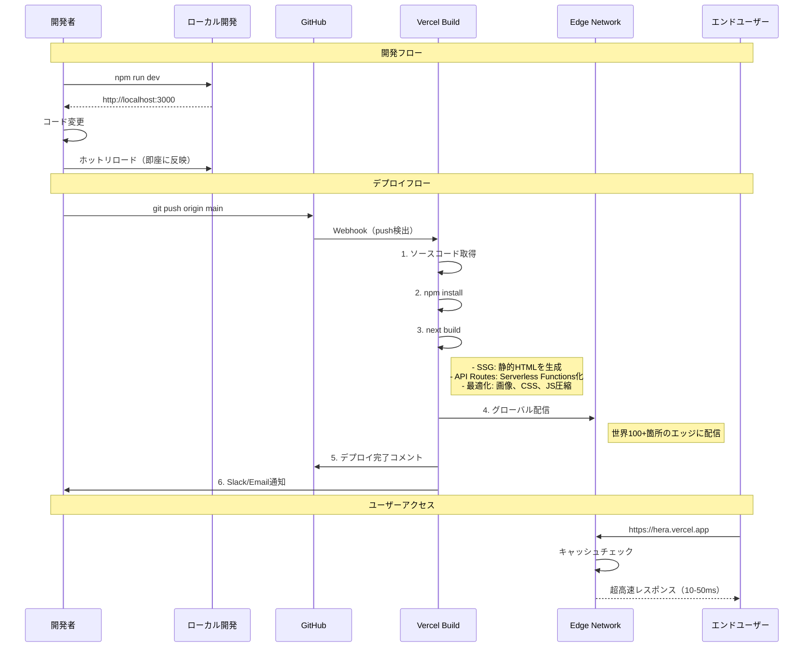

---

## 3. リクエストフロー

### 3.1 ページアクセス（SSR）

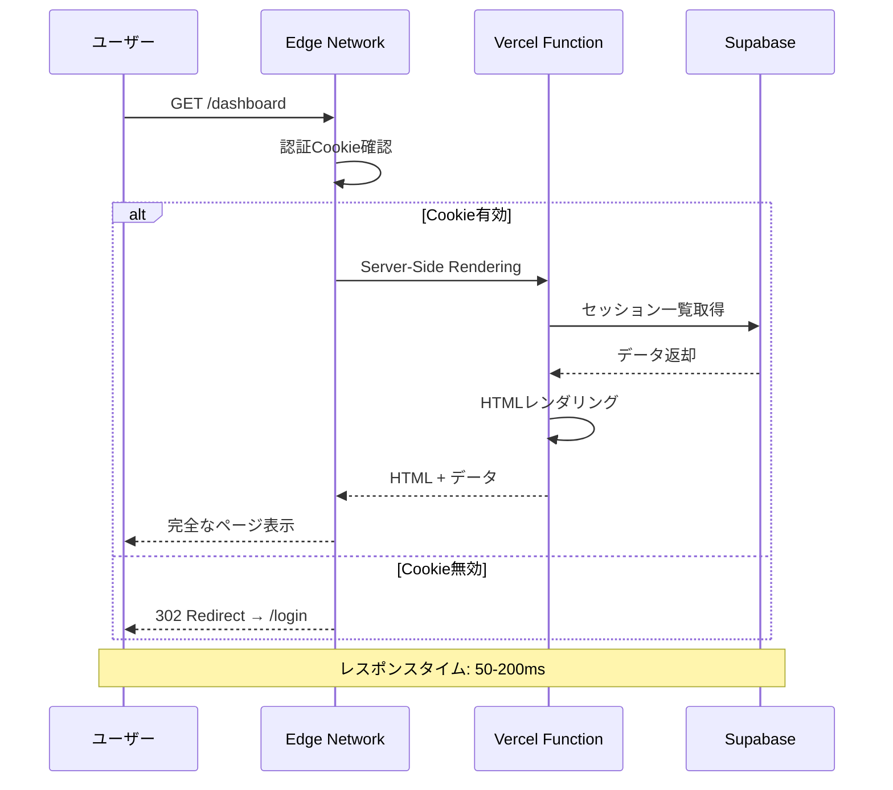

---

### 3.2 APIリクエスト（Serverless Function）

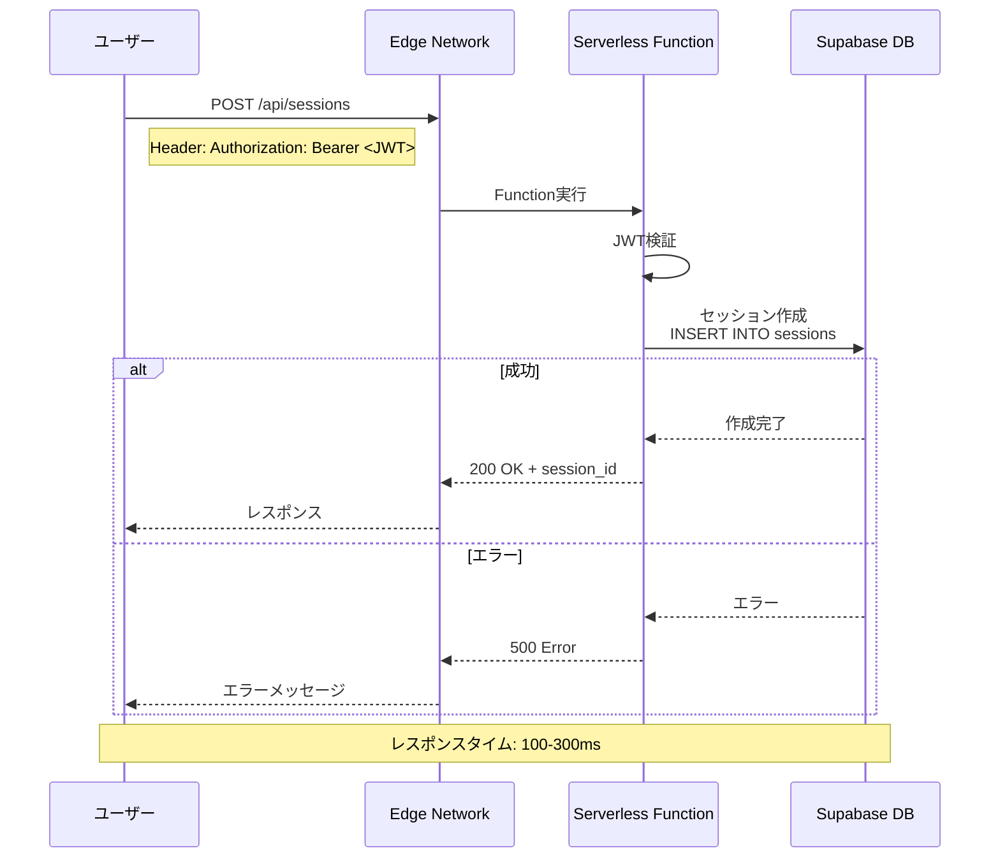

---

### 3.3 Edge Function（超高速）

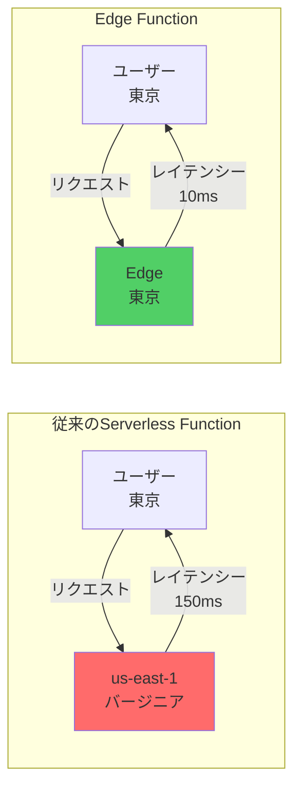

**速度比較**:
- Serverless Function: 100-300ms
- Edge Function: **10-50ms**（最大30倍高速）

---

## 4. コスト比較

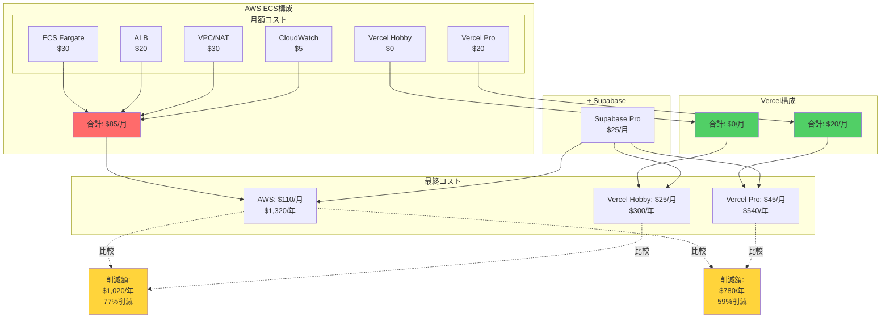

---

## 5. AWS ECS vs Vercel

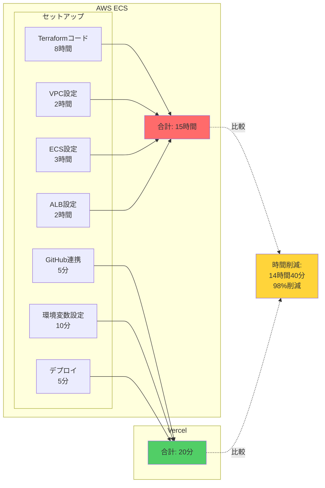

---

### 機能比較マトリクス

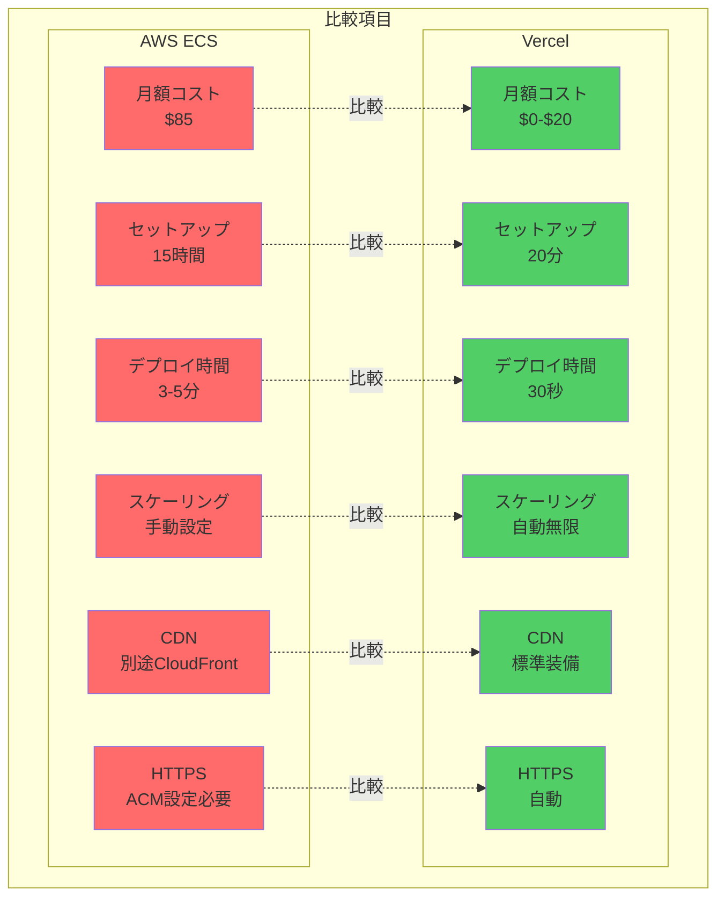

---

## 6. プレビューデプロイ

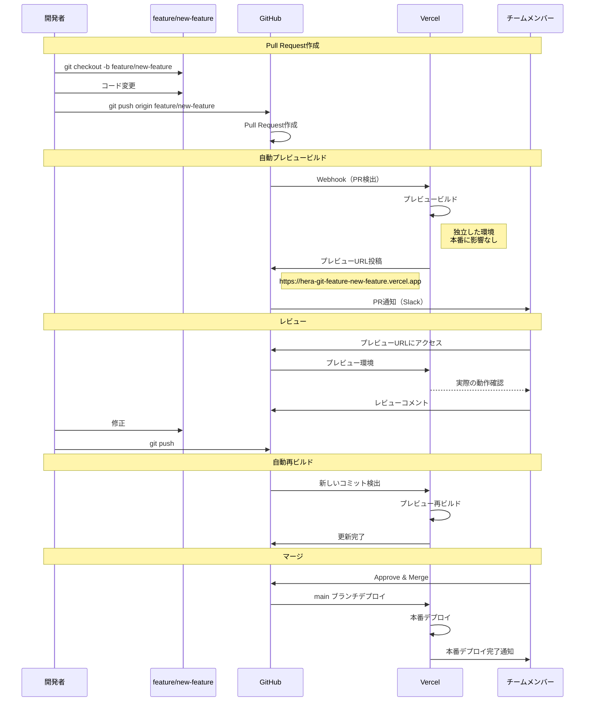

**メリット**:
- ✅ PR毎に独立した環境
- ✅ 本番に影響なし
- ✅ チーム全員が実際の動作確認
- ✅ レビューが容易

---

## 7. スケーリング

### 7.1 AWS ECS のスケーリング

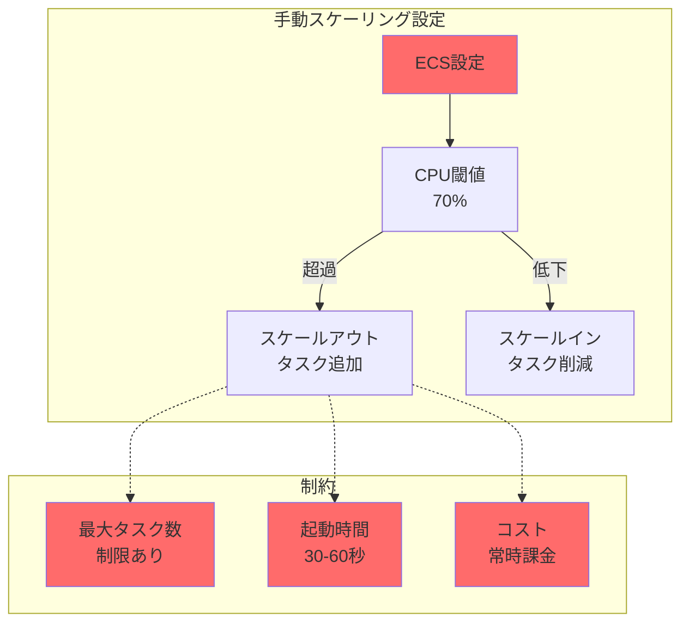

---

### 7.2 Vercel の自動スケーリング

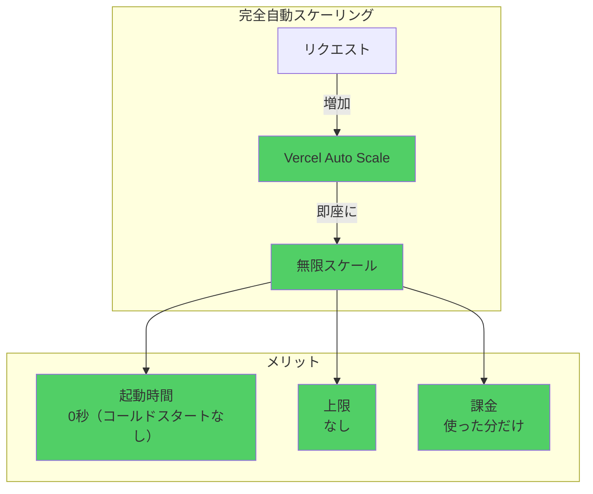

**トラフィック急増時の対応**:

| 項目 | AWS ECS | Vercel |
|------|---------|--------|
| **スケール時間** | 30-60秒 | **即座（0秒）** |
| **上限** | 設定した最大タスク数 | **無制限** |
| **設定** | 複雑（Auto Scaling設定） | **不要** |
| **コスト** | タスク数 × 時間 | **実行時間のみ** |

---

### 7.3 トラフィックシミュレーション

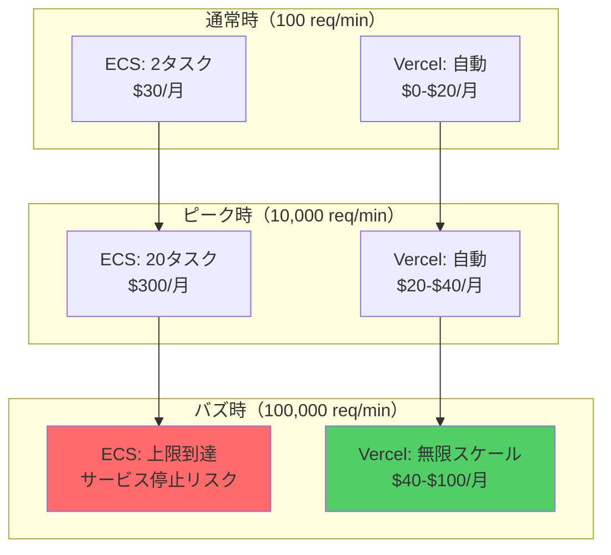

**結論**: Vercelは急激なトラフィック増加にも対応可能

---

## 8. 開発体験（DX）

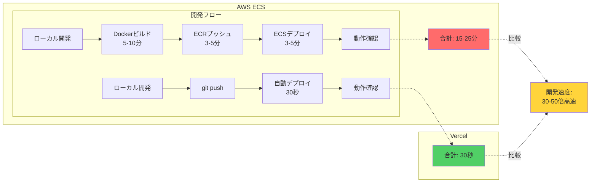

---

## 9. 監視・ログ

### 9.1 Vercel Analytics（標準装備）

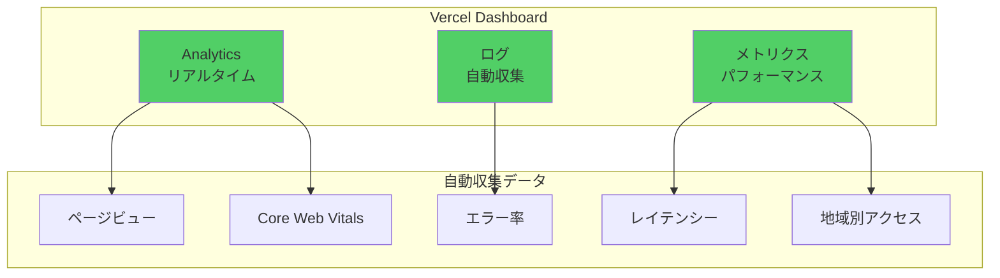

**追加設定不要**: 全て標準で含まれる

---

### 9.2 AWS ECS 監視（別途設定必要）

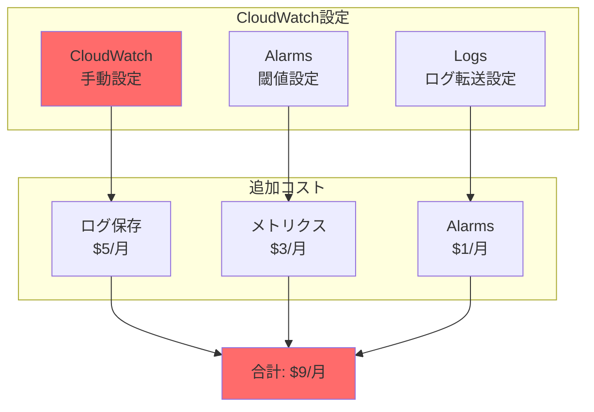

**Vercel**: $0（標準装備）
**AWS ECS**: $9/月（別途設定）

---

## 10. まとめ

### ✅ Vercel の圧倒的なメリット

| 項目 | AWS ECS | Vercel | 改善率 |
|------|---------|--------|--------|
| **月額コスト** | $85 | $0-$20 | **-76% - -100%** |
| **セットアップ** | 15時間 | 20分 | **-98%** |
| **デプロイ時間** | 3-5分 | 30秒 | **-90%** |
| **スケーリング** | 手動 | 自動無限 | ✅ |
| **CDN** | 別途 | 標準 | ✅ |
| **プレビュー** | なし | 自動 | ✅ |
| **監視** | $9/月 | $0 | **-100%** |

### 🎯 推奨

**Vercelを使うべき理由**:

1. **コスト**: 年間$780-$1,020削減
2. **速度**: デプロイ30倍高速
3. **簡単**: セットアップ98%削減
4. **スケール**: 無限自動スケーリング
5. **DX**: 圧倒的な開発体験

**AWS ECSを使うべきケース**:
- ❌ ほぼない（Vercelで十分）

---

**Vercelで、最高のHeraを構築しましょう！**
