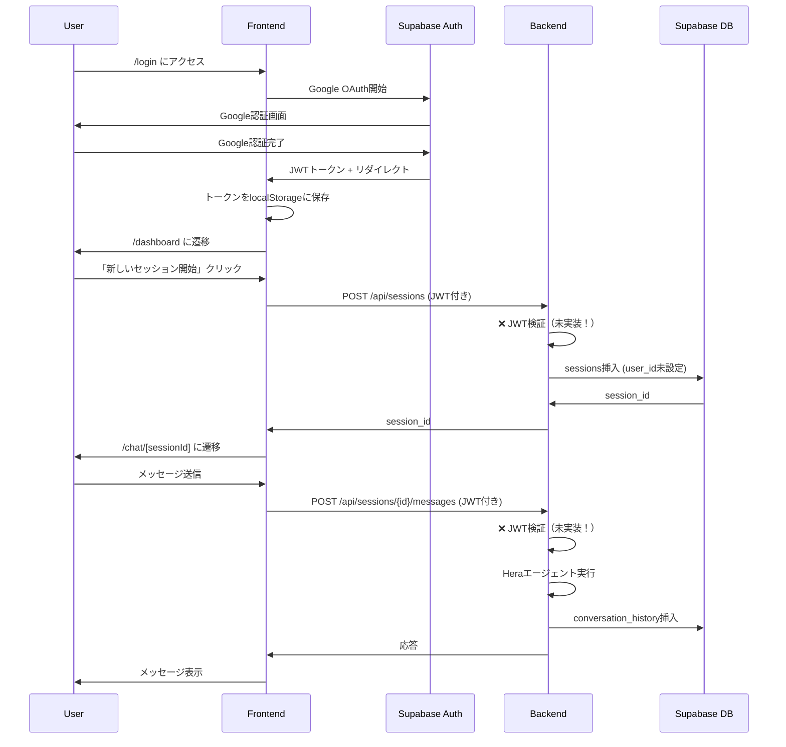
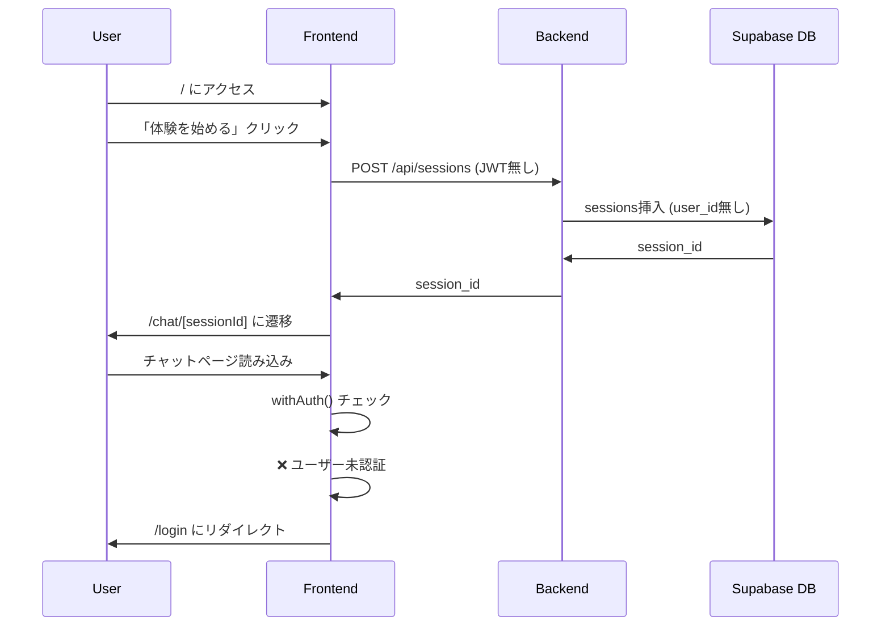

# Hera プロジェクト - 処理フロー分析レポート

## 実行日時
2025-10-30

## 分析概要
実際のデプロイは行わず、ソースコードとドキュメントのみを確認して、処理フローとデータフローの整合性を検証しました。

---

## 🔴 重大な問題（Critical Issues）

### 1. **バックエンドに認証ミドルウェアが統合されていない**

**問題の詳細:**
- `backend/utils/auth_middleware.py` は作成済み
- しかし `backend/api/app.py` にインポートされていない
- どのAPIエンドポイントにも `@require_auth` デコレーターが適用されていない

**影響:**
- フロントエンドはJWTトークンを送信しているが、バックエンドは検証していない
- 認証が機能しない
- セキュリティリスク

**ファイル確認結果:**
```python
# backend/api/app.py (行1-100)
# ❌ 以下のインポートが存在しない:
# from utils.auth_middleware import require_auth, optional_auth

# ❌ 全てのエンドポイントが認証なし:
@app.route('/api/sessions', methods=['POST'])  # 認証デコレーターなし
def create_session():
    ...
```

**修正が必要な箇所:**
```
backend/api/app.py:
- 行30: auth_middleware のインポート追加
- 行380-740: 各エンドポイントに適切な認証デコレーターを追加
```

---

### 2. **ルーティングの不整合**

**問題の詳細:**
2つの異なるエントリーポイントが存在:

1. **ホームページフロー (`app/page.tsx`)**
   - `/` → 「体験を始める」ボタン
   - 認証なしで `createSession()` 呼び出し
   - `/chat/[sessionId]` に遷移

2. **ダッシュボードフロー (`app/dashboard/page.tsx`)**
   - `/login` → Google OAuth
   - `/dashboard` → 「新しいセッションを開始」
   - 認証ありで `createSession(true)` 呼び出し
   - `/chat/[sessionId]` に遷移

**影響:**
- ユーザーの混乱
- 認証あり/なしが混在
- `/chat/[sessionId]` は `withAuth()` で保護されているため、ホームページからの遷移は失敗する

**ファイル確認結果:**
```typescript
// frontend/app/page.tsx:18
const session = await createSession(); // 認証なし（requireAuth=false）

// frontend/app/dashboard/page.tsx:36
const response = await createSession(true); // 認証あり（requireAuth=true）

// frontend/app/chat/[sessionId]/page.tsx:266
export default withAuth(ChatPage); // 認証必須
```

**問題:**
- ホームページから開始 → チャットページで認証エラー
- 2つのエントリーポイントの存在意義が不明確

---

## 🟡 中程度の問題（Medium Issues）

### 3. **Supabase統合におけるuser_id未設定**

**問題の詳細:**
- `SupabaseSessionManager.save()` はセッションを作成する際、`user_id` を設定しない
- RLSポリシーは `auth.uid() = user_id` を期待している
- 認証なしで作成されたセッションはRLSで保護されない

**影響:**
- データベースのセキュリティリスク
- RLSポリシーが機能しない可能性

**ファイル確認結果:**
```python
# backend/utils/session_manager.py:190-196
if not session_response.data:
    # セッションが存在しない場合は作成
    self.client.table('sessions').insert({
        'session_id': session_id,
        'status': 'active',
        'updated_at': datetime.now().isoformat()
        # ❌ user_id が設定されていない！
    }).execute()
```

**必要な修正:**
- セッション作成時にJWTトークンから `user_id` を抽出
- `sessions` テーブルに `user_id` を保存

---

### 4. **環境変数の不一致**

**問題の詳細:**
- `.env.example` には `SUPABASE_JWT_SECRET` が記載されている
- しかし `auth_middleware.py` では環境変数名が不明確

**ファイル確認結果:**
```python
# backend/utils/auth_middleware.py:25
supabase_jwt_secret = os.getenv('SUPABASE_JWT_SECRET')
```

```bash
# backend/.env.example:39
SUPABASE_JWT_SECRET=your_jwt_secret_here
```

**影響:**
- JWT検証が失敗する可能性

---

## 🟢 軽微な問題（Minor Issues）

### 5. **ストレージ管理の未完成**

**問題の詳細:**
- `storage_manager.py` はSupabaseStorageモードをサポートしていない可能性
- `STORAGE_MODE=supabase` の実装が不明

**確認が必要:**
```python
# backend/utils/storage_manager.py
# Supabaseストレージとの統合が実装されているか？
```

---

## 📊 処理フロー分析

### シナリオ1: 理想的な認証フロー（現在は機能しない）



**問題点:**
- JWT検証が実装されていない
- user_idが設定されない
- RLSポリシーが機能しない

---

### シナリオ2: 現在のホームページフロー（認証なし）



**問題点:**
- ホームページから開始してもログインページにリダイレクトされる
- ユーザー体験が悪い

---

## 📋 データフロー分析

### データ保存の流れ

```
1. セッション作成
   Frontend → Backend → Supabase DB (sessions)

2. ユーザープロファイル
   Frontend → Backend → Hera Agent → Backend → Supabase DB (user_profiles)

3. 会話履歴
   Frontend → Backend → Hera Agent → Backend → Supabase DB (conversation_history)

4. 家族会話
   Frontend → Backend → Family Agent → Backend → Supabase DB (family_conversations)

5. 旅行情報
   Frontend → Backend → Family Agent → Backend → Supabase DB (family_trip_info)

6. 家族計画
   Frontend → Backend → Story/Letter Generator → Backend → Supabase DB (family_plans)

7. 画像
   Frontend → Backend → Supabase Storage (session-images bucket)
```

**確認済み:**
- ✅ 7つのテーブル構造は適切
- ✅ `SupabaseSessionManager` はすべてのテーブルに対応
- ❌ user_id の設定が欠落
- ❌ RLSポリシーが機能しない可能性

---

## 🔍 Supabase統合の検証

### SupabaseSessionManager の実装確認

**ファイル:** `backend/utils/session_manager.py:166-339`

**実装状況:**

| 機能 | 実装状況 | 備考 |
|------|----------|------|
| sessions テーブル | ✅ | user_id未設定 |
| user_profiles テーブル | ✅ | 正常 |
| conversation_history テーブル | ✅ | 正常 |
| family_conversations テーブル | ✅ | 正常 |
| family_trip_info テーブル | ✅ | 正常 |
| family_plans テーブル | ✅ | 正常 |
| session_images テーブル | ❌ | 未実装 |

**コード確認:**
```python
# 行185-273: save() メソッド
# - セッションデータを適切に各テーブルに保存
# - 既存データの更新/新規挿入を正しく処理
# - JSONデータを適切にシリアライズ

# 行274-330: load() メソッド
# - 全テーブルからデータを読み込み
# - 適切にデシリアライズ
# - 順序を保持（order_index）

# 行332-334: delete() メソッド
# - カスケード削除に依存
# - 正常

# 行336-339: exists() メソッド
# - 正常
```

**結論:**
- 基本的な実装は正しい
- user_id の統合が必要
- session_images への対応が必要（または別の方法で画像を管理）

---

## 📝 API エンドポイント一覧

### 確認したエンドポイント

| エンドポイント | メソッド | 認証 | 現状 | 必要な修正 |
|---------------|----------|------|------|-----------|
| `/api/sessions` | POST | ❌ | なし | `@optional_auth` |
| `/api/sessions/<id>/messages` | POST | ❌ | なし | `@optional_auth` |
| `/api/sessions/<id>/status` | GET | ❌ | なし | `@optional_auth` |
| `/api/sessions/<id>/complete` | POST | ❌ | なし | `@optional_auth` |
| `/api/sessions/<id>/family/status` | GET | ❌ | なし | `@optional_auth` |
| `/api/sessions/<id>/family/messages` | POST | ❌ | なし | `@optional_auth` |
| `/api/sessions/<id>/photos/user` | POST | ❌ | なし | `@optional_auth` |
| `/api/sessions/<id>/photos/<filename>` | GET | ❌ | なし | `@optional_auth` |
| `/api/sessions/<id>/generate-image` | POST | ❌ | なし | `@optional_auth` |
| `/api/sessions/<id>/generate-child-image` | POST | ❌ | なし | `@optional_auth` |
| `/api/health` | GET | ❌ | なし | なし（公開OK） |

**推奨事項:**
- すべてのセッション関連エンドポイントに `@optional_auth` を適用
- 認証ありの場合は `user_id` をセッションに関連付け
- 認証なしの場合は `user_id=None` で許可（ゲストモード）

---

## 🎯 推奨される修正

### 優先度: 高（High Priority）

#### 修正1: バックエンドに認証ミドルウェアを統合

**ファイル:** `backend/api/app.py`

```python
# 行30付近に追加
from utils.auth_middleware import require_auth, optional_auth

# 各エンドポイントに適用（例）
@app.route('/api/sessions', methods=['POST'])
@optional_auth  # 認証はオプション
def create_session():
    user_id = getattr(request, 'user_id', None)  # JWTから取得
    session_id = str(uuid.uuid4())

    # user_idをセッションに保存
    save_session_data(session_id, 'user_id', user_id)
    save_session_data(session_id, 'user_profile', {})
    save_session_data(session_id, 'conversation_history', [])
    save_session_data(session_id, 'created_at', datetime.now().isoformat())

    # Supabaseにuser_idを保存するためのロジックを追加
    if isinstance(session_mgr, SupabaseSessionManager):
        session_mgr.client.table('sessions').update({
            'user_id': user_id
        }).eq('session_id', session_id).execute()

    ...
```

#### 修正2: ルーティングの統一

**オプションA: ホームページを削除してダッシュボードに統一**
- `/` → `/login` にリダイレクト
- すべてのフローで認証必須

**オプションB: ゲストモードをサポート**
- ホームページ → 認証なしで体験可能
- `/chat/[sessionId]` から `withAuth()` を削除
- 認証はオプションにする

**推奨:** オプションB（ゲストモードサポート）
- ユーザーフレンドリー
- 認証なしで試せる
- ログイン後にデータを紐付けることも可能

---

### 優先度: 中（Medium Priority）

#### 修正3: user_idの統合

**ファイル:** `backend/utils/session_manager.py`

```python
# SupabaseSessionManager.save() の修正
def save(self, session_id: str, data: Dict[str, Any], user_id: Optional[str] = None) -> None:
    """セッションデータをSupabaseに保存"""
    # セッションが存在するか確認
    session_response = self.client.table('sessions').select('id').eq('session_id', session_id).execute()

    if not session_response.data:
        # セッションが存在しない場合は作成
        self.client.table('sessions').insert({
            'session_id': session_id,
            'user_id': user_id,  # 追加
            'status': 'active',
            'updated_at': datetime.now().isoformat()
        }).execute()
    else:
        # user_idを更新（未設定の場合）
        if user_id:
            self.client.table('sessions').update({
                'user_id': user_id
            }).eq('session_id', session_id).execute()

    ...
```

---

### 優先度: 低（Low Priority）

#### 修正4: session_imagesテーブルの統合

**ファイル:** `backend/utils/session_manager.py`

```python
# save() メソッドに追加
elif key == 'session_images':
    # session_imagesテーブルに保存
    for image_type, image_url in value.items():
        image_response = self.client.table('session_images').select('id').eq('session_id', session_id).eq('image_type', image_type).execute()
        image_data = {
            'session_id': session_id,
            'image_type': image_type,
            'image_url': image_url
        }
        if image_response.data:
            self.client.table('session_images').update(image_data).eq('session_id', session_id).eq('image_type', image_type).execute()
        else:
            self.client.table('session_images').insert(image_data).execute()
```

---

## 🧪 推奨テストシナリオ

### テスト1: 認証なしフロー（ゲストモード）

```
1. / にアクセス
2. 「体験を始める」クリック
3. チャット画面表示を確認
4. メッセージ送信
5. Heraからの応答を確認
6. プロファイル情報が保存されることを確認
7. セッション完了
8. 家族エージェントとの会話
9. 旅行計画生成
```

**期待される動作:**
- すべて認証なしで完了
- データはSupabaseに保存（user_id=NULL）

---

### テスト2: 認証ありフロー

```
1. /login にアクセス
2. Google OAuth認証
3. /dashboard に遷移
4. 「新しいセッション開始」クリック
5. チャット画面表示
6. メッセージ送信
7. セッション完了
8. 家族エージェントとの会話
9. 旅行計画生成
```

**期待される動作:**
- すべて認証ありで完了
- データはSupabaseに保存（user_id=ログインユーザーのID）
- RLSポリシーが機能
- 他のユーザーのデータは見えない

---

### テスト3: データ永続化

```
1. 認証ありでセッション作成
2. プロファイル入力
3. ブラウザをリロード
4. 同じセッションIDでアクセス
5. データが復元されることを確認
```

---

### テスト4: 画像アップロード

```
1. セッション作成
2. ユーザー画像アップロード
3. パートナー画像生成
4. 子ども画像生成
5. すべての画像が表示されることを確認
6. Supabase Storageに保存されていることを確認
```

---

## 📊 現状の実装完成度

| カテゴリ | 完成度 | 詳細 |
|---------|--------|------|
| Backend - Supabase統合 | 70% | ✅ SessionManager実装済み<br>❌ user_id未対応<br>❌ 認証未統合 |
| Backend - JWT認証 | 50% | ✅ ミドルウェア実装済み<br>❌ 統合されていない |
| Frontend - Auth | 90% | ✅ ログイン画面<br>✅ ダッシュボード<br>✅ 認証コンテキスト<br>❌ ルーティング不整合 |
| Frontend - API統合 | 95% | ✅ JWT自動付与<br>✅ 既存ページ更新 |
| Database - スキーマ | 100% | ✅ 7テーブル設計完了 |
| Database - RLS | 0% | ❌ 未設定（SQLは作成済み） |
| Deployment | 80% | ✅ スクリプト作成<br>✅ ガイド作成<br>❌ 実行未確認 |

**総合完成度: 75%**

---

## 🔧 必須修正項目チェックリスト

### デプロイ前に必ず修正すべき項目

- [ ] **バックエンドに認証ミドルウェアを統合**
  - [ ] `app.py` に `auth_middleware` をインポート
  - [ ] 各エンドポイントに `@optional_auth` を適用
  - [ ] `user_id` をセッションに保存するロジック追加

- [ ] **ルーティングの統一**
  - [ ] ホームページとダッシュボードの役割を明確化
  - [ ] チャットページの認証要件を決定（認証必須 or オプション）

- [ ] **user_idの統合**
  - [ ] `SupabaseSessionManager.save()` に `user_id` パラメータ追加
  - [ ] セッション作成時に `user_id` を設定

- [ ] **環境変数の確認**
  - [ ] `.env` ファイルに必要な値がすべて設定されているか確認
  - [ ] `SUPABASE_JWT_SECRET` が正しく設定されているか確認

---

## 📈 次のステップ

### Step 1: コード修正（2-3時間）
1. バックエンドに認証ミドルウェアを統合
2. ルーティングの統一（ゲストモード対応推奨）
3. user_id の統合

### Step 2: ローカルテスト（1-2時間）
1. Supabaseプロジェクト作成
2. データベーススキーマ作成
3. ローカル環境で動作確認
4. 上記テストシナリオを実行

### Step 3: デプロイ（1-2時間）
1. Google Cloud Project作成
2. Google OAuth設定
3. Cloud Runデプロイ
4. 本番環境でテスト

---

## 💡 結論

### 良い点
- ✅ アーキテクチャ設計は優れている
- ✅ Supabase統合の基本実装は完了
- ✅ JWT認証ミドルウェアは適切に実装されている
- ✅ フロントエンドの認証フローは完成している
- ✅ デプロイスクリプトとガイドは充実している

### 改善が必要な点
- ❌ バックエンドとフロントエンドの統合が不完全
- ❌ 認証ミドルウェアが統合されていない
- ❌ ルーティングに不整合がある
- ❌ RLSのためのuser_id設定が欠落

### 推奨事項
1. **優先度:高** - 上記の必須修正項目を完了させる
2. **優先度:中** - ローカル環境で完全にテストする
3. **優先度:低** - デプロイして本番環境でテストする

### 見積もり
- **修正作業:** 2-3時間
- **ローカルテスト:** 1-2時間
- **デプロイ・本番テスト:** 1-2時間
- **合計:** 4-7時間

---

## 📞 サポート

質問や問題が発生した場合は、以下を確認してください：
1. このレポートの「必須修正項目チェックリスト」
2. `DEPLOYMENT_GUIDE.md`
3. 各ソースコードのコメント

---

**レポート作成日:** 2025-10-30
**作成者:** Claude (Anthropic)
**バージョン:** 1.0
